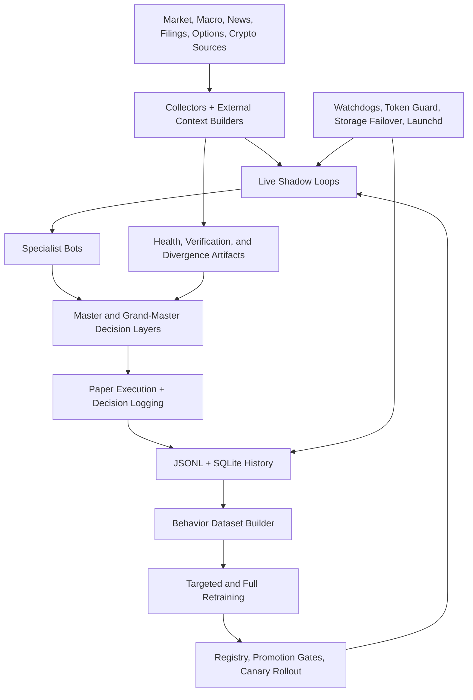

# Schwab Trading Bot

Multi-sleeve algorithmic trading research and paper-execution platform built around live market ingestion, specialist bot orchestration, behavior-model retraining, and operational safety controls across Schwab and Coinbase workflows.

## Showcase

- Showcase index: [docs/showcase/README.md](docs/showcase/README.md)
- Auto-refreshed highlights: [docs/showcase/generated/highlights_latest.md](docs/showcase/generated/highlights_latest.md)
- Data source catalog: [DATA_INGESTION_SOURCES.md](DATA_INGESTION_SOURCES.md)

## System Map



## Current Advancements

The platform now has an explicit source-of-truth contract for how commands, reports, broker truth, storage, and decisions are owned and verified. Start with [docs/architecture/SOURCE_OF_TRUTH.md](docs/architecture/SOURCE_OF_TRUTH.md), then read [docs/architecture/ADR-0001-system-source-of-truth.md](docs/architecture/ADR-0001-system-source-of-truth.md) for the design decision behind it.

Key operating upgrades:

- Aggressive sleeves now report Sortino ratio from daily PnL changes so downside volatility is the primary risk-adjusted lens for high-conviction lanes.
- Conservative sleeves now report Sharpe ratio from daily PnL changes so total volatility stays visible for capital-preservation lanes.
- Signal generation now has a canonical event stream at `governance/events/signal_generation_*.jsonl`, recording both good trade-intent signals and bad, blocked, or no-trade signals.
- `COMMANDS.md` is generated and alphabetized from `scripts/ops/commands_hygiene_bot.py`, with a command contract hash written to `governance/health/commands_contract_latest.json`.
- Report opening now uses `scripts/ops/open_report_artifact.sh` as the resilient entrypoint, including incident-report PDF regeneration with HTML/markdown fallback.
- Schwab interactive auth defaults to Chrome for the browser consent flow and records the requested/resolved browser in the auth refresh artifact.

## Operational Evidence

The important generated artifacts are:

- `governance/health/paper_performance_latest.json`: sleeve scoreboard, PnL, Sortino/Sharpe fields, chart/PDF metadata.
- `governance/events/signal_generation_*.jsonl`: good and bad signal generation audit stream.
- `governance/health/schwab_auth_refresh_latest.json`: browser handoff, token readiness, and account-probe outcome.
- `governance/health/schwab_auth_supervisor_latest.json`: token lease, callback-port, and broker-readiness posture.
- `exports/reports/incident_report_latest.pdf`: decision-oriented incident report opened through the resilient report helper.

## Showcase Projects

1. [Live Multi-Asset Paper Trading Platform](docs/showcase/projects/01-live-multi-asset-paper-platform.md)
2. [Quant Research and Model Training System](docs/showcase/projects/02-quant-research-and-model-training.md)
3. [Data Fusion and Verification Pipeline](docs/showcase/projects/03-data-fusion-and-verification-pipeline.md)
4. [Reliability, Safety, and Ops Automation](docs/showcase/projects/04-reliability-safety-and-ops-automation.md)
5. [Cross-Market Crypto and Macro Intelligence](docs/showcase/projects/05-cross-market-crypto-and-macro-intelligence.md)

## Auto-Refreshed Highlights

<!-- SHOWCASE_HIGHLIGHTS_START -->
_Generated at 2026-04-28 13:50 UTC_

- Active registry lineup: `30` of `107` bots are active.
- Live collection snapshot: `8/15` lane artifacts are reporting `running`.
- Institutional readiness: `100.00/100` with status `industry_leaning`.
- Live/runtime posture: live readiness `degraded` at `100.00/100`, runtime separation `degraded`.
- Autonomy posture: `87.27/100` with status `blocked`, playbooks `7`, open incidents `0`.
- Architecture upgrades: `10/12` ready proof surfaces, host profile `max_throughput`, portable proof `ready`.
- Crypto context: `14/14` healthy sources and `7/7` healthy news feeds.
- Correlation overlay: mode `exact`, aligned pairs `6`.
- PyTorch sidecar: `0` active assist candidates across `0` tracked runs.
- Top active lineup by test accuracy: `brain_refinery_v95_rates_regime_bond_bot` (100.0%), `brain_refinery_v99_defensive_dividend_concentration` (100.0%), `brain_refinery_v10_seasonal` (93.8%).

Full generated detail lives in [docs/showcase/generated/highlights_latest.md](docs/showcase/generated/highlights_latest.md).
<!-- SHOWCASE_HIGHLIGHTS_END -->

## Runbook

- Canonical commands: [COMMANDS.md](COMMANDS.md)
- Terminal helper: [scripts/runbook.sh](scripts/runbook.sh)
- System source-of-truth map: [docs/architecture/SOURCE_OF_TRUTH.md](docs/architecture/SOURCE_OF_TRUTH.md)
- Architecture decision record: [docs/architecture/ADR-0001-system-source-of-truth.md](docs/architecture/ADR-0001-system-source-of-truth.md)
- Report opener: [scripts/ops/open_report_artifact.sh](scripts/ops/open_report_artifact.sh)

## Switchboard And Tailoring

- `scripts/run_mode_switchboard.py` is the runtime mode switchboard. In this repo it is also the closest thing to a "brain switch" command.
- It launches one `main.py` child per mode by setting `BOT_MODE` to `shadow`, `paper`, or `live` from `SWITCHBOARD_MODES`.
- It is a mode launcher, not a one-click architecture exporter by itself.

Canonical local command on this Mac:

```bash
cd /Users/dankingsley/PycharmProjects/schwab_trading_bot
PY="$(zsh ./scripts/ops/runtime_python.sh)"
SWITCHBOARD_MODES="shadow,paper" "$PY" scripts/run_mode_switchboard.py
```

Useful variants:

```bash
SWITCHBOARD_MODES="shadow" "$PY" scripts/run_mode_switchboard.py
SWITCHBOARD_MODES="shadow,paper,live" "$PY" scripts/run_mode_switchboard.py
```

The architecture handoff packet is:
- this [README.md](README.md)
- the system map above
- [docs/architecture/SOURCE_OF_TRUTH.md](docs/architecture/SOURCE_OF_TRUTH.md)
- [docs/architecture/ADR-0001-system-source-of-truth.md](docs/architecture/ADR-0001-system-source-of-truth.md)
- [docs/showcase/README.md](docs/showcase/README.md)
- [DATA_INGESTION_SOURCES.md](DATA_INGESTION_SOURCES.md)
- [COMMANDS.md](COMMANDS.md)

That packet is the clean summary to hand to another engineer or AI tool before tailoring the platform.

### Cross-Platform Brain Switch Workflow

The switchboard script itself is portable Python, but this repo is still Mac and Apple Silicon first as shipped. A Windows or Linux move is a guided retargeting workflow, not a one-command lift-and-shift.

Use this order if you want the brain switch to work efficiently on Windows or Linux:

1. Export the handoff packet above and give it to your AI tool or engineer first.
2. Retarget the runtime backend before first launch. `main.py` imports `mlx` immediately, so Windows/Linux need a replacement backend or import shim before the switchboard can start child processes cleanly.
3. Retarget the supervisor layer. Replace macOS-only pieces such as `launchd`, `open`, `caffeinate`, `vm_stat`, and Apple-specific ops scripts with the target platform equivalents such as `systemd`, `supervisord`, Windows Task Scheduler, or a container supervisor.
4. Create a clean Python environment on the target machine and install the repo dependencies there.
5. Copy over only the portable env and config values first. Start with `MARKET_DATA_ONLY=1`, `ALLOW_ORDER_EXECUTION=0`, symbols, collector settings, and placeholder credentials. Do not begin with live execution enabled.
6. Smoke-test the entrypoint in one mode before using the switchboard. Run `main.py` with `BOT_MODE=shadow` and confirm the startup probe works.
7. Only after the single-mode smoke test passes, launch the switchboard with `SWITCHBOARD_MODES=shadow,paper`.
8. After that is stable, wire the target broker, target data sources, and target process manager.
9. Keep `live` out of the first cross-platform cut unless the paper and shadow modes are already stable and you have replaced the broker adapter, safety gates, and ops supervision for that platform.

### Linux Example

This is the safe starting sequence after you have already replaced the Apple-only backend pieces:

```bash
cd /path/to/schwab_trading_bot
python3 -m venv .venv
source .venv/bin/activate
pip install -r config/requirements.lock.txt
export MARKET_DATA_ONLY=1
export ALLOW_ORDER_EXECUTION=0
export SWITCHBOARD_MODES="shadow,paper"
python scripts/run_mode_switchboard.py
```

### Windows PowerShell Example

This is the same sequence in PowerShell after the backend and supervisor retarget is done:

```powershell
cd C:\path\to\schwab_trading_bot
py -3 -m venv .venv
.\.venv\Scripts\Activate.ps1
pip install -r config\requirements.lock.txt
$env:MARKET_DATA_ONLY="1"
$env:ALLOW_ORDER_EXECUTION="0"
$env:SWITCHBOARD_MODES="shadow,paper"
python .\scripts\run_mode_switchboard.py
```

If you are using an AI tool to tailor the repo, the fastest prompt is usually:
- "Keep `scripts/run_mode_switchboard.py` and the `BOT_MODE` contract, but retarget the runtime backend, broker adapter, env loading, and process supervision for Windows/Linux while preserving market-data-only safety defaults."

## Quick Usage

```bash
cd /Users/dankingsley/PycharmProjects/schwab_trading_bot
./scripts/runbook.sh
./scripts/runbook.sh live
./scripts/runbook.sh retrain
./scripts/ops/open_report_artifact.sh bundle
python3 scripts/ops/update_showcase_highlights.py
```

## Notes

- Use `docs/architecture/SOURCE_OF_TRUTH.md` to find the owning source for commands, reports, broker truth, signal logs, and storage.
- Use `COMMANDS.md` as the generated command surface; edit `scripts/ops/commands_hygiene_bot.py` when command truth changes.
- The showcase highlight section is generated from repo artifacts, not hand-maintained.
