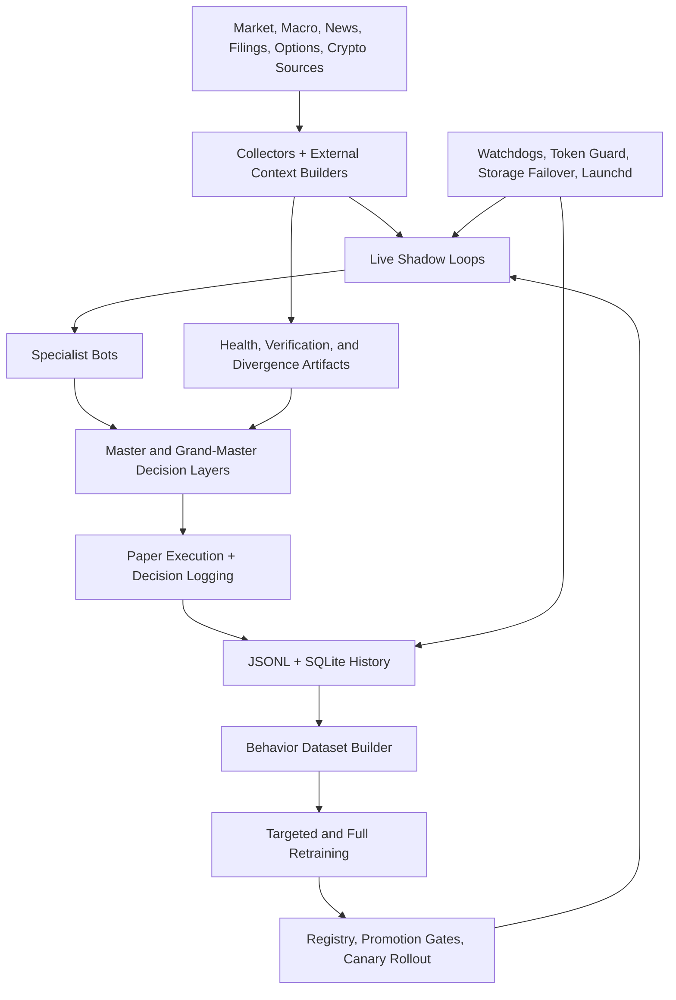

# Schwab Trading Bot

AI-assisted multi-sleeve trading research and paper-execution platform built around live market ingestion, specialist bot orchestration, behavior-model retraining, operational safety controls, and auditable runbooks.

This repository is the working system I use to build, test, document, and operate a trading automation platform with GPT/Codex-style AI engineering tools in the loop. The emphasis is practical: shipping features in a real codebase, maintaining source-of-truth docs, adding tests, debugging broker/auth flows, and keeping operator commands reproducible.

## What This Demonstrates

- Hands-on AI-assisted software engineering with GPT/Codex-style tools across implementation, debugging, documentation, testing, and GitHub workflows.
- Multi-sleeve trading research architecture spanning equities, crypto, futures, dividend, bond, macro, and defensive strategy lanes.
- Risk-adjusted performance reporting, including Sortino ratio for aggressive sleeves and Sharpe ratio for conservative sleeves.
- Good/bad signal-generation logging through auditable JSONL event streams.
- Operator runbooks generated from source-controlled command inventory instead of hand-maintained notes.
- Source-of-truth architecture docs and ADRs for commands, reports, broker truth, storage, decisions, and Codex guardrails.
- Safety-oriented operations: auth supervision, global halt controls, report fallbacks, storage routing, command validation, drift guards, and regression tests.

## System Map



## Recent Engineering Advancements

- Implemented sleeve-aware risk metrics: Sortino for aggressive sleeves and Sharpe for conservative sleeves.
- Added canonical signal-generation evidence at `governance/events/signal_generation_*.jsonl` for good trade-intent signals and blocked/weak/no-trade signals.
- Added a system source-of-truth map: [docs/architecture/SOURCE_OF_TRUTH.md](docs/architecture/SOURCE_OF_TRUTH.md).
- Added an architecture decision record for source-of-truth and signal evidence: [docs/architecture/ADR-0001-system-source-of-truth.md](docs/architecture/ADR-0001-system-source-of-truth.md).
- Added Codex project guardrails in `AGENTS.md` and `scripts/ops/codex_project_guard.py` to reduce AI-assisted project drift.
- Regenerated `COMMANDS.md` from the command inventory, keeping `Most Used` pinned first and the remaining sections alphabetized.
- Improved report opening through `scripts/ops/open_report_artifact.sh`, including incident-report PDF regeneration and fallback behavior.
- Updated Schwab interactive auth tooling so the Chrome consent handoff and token-readiness posture are visible in health artifacts.

## Operational Evidence

Important artifacts produced by the system include:

- `governance/health/paper_performance_latest.json`: sleeve scoreboard, PnL, Sortino/Sharpe fields, chart/PDF metadata.
- `governance/events/signal_generation_*.jsonl`: good and bad signal-generation audit stream.
- `governance/health/schwab_auth_refresh_latest.json`: browser handoff, token readiness, and account-probe outcome.
- `governance/health/schwab_auth_supervisor_latest.json`: token lease, callback-port, and broker-readiness posture.
- `governance/health/codex_project_guard_latest.json`: AI-assisted source-of-truth and scope-drift guard result.
- `exports/reports/incident_report_latest.pdf`: decision-oriented incident report opened through the resilient report helper.

## Runbook

- Canonical commands: [COMMANDS.md](COMMANDS.md)
- Source-of-truth map: [docs/architecture/SOURCE_OF_TRUTH.md](docs/architecture/SOURCE_OF_TRUTH.md)
- Architecture decision record: [docs/architecture/ADR-0001-system-source-of-truth.md](docs/architecture/ADR-0001-system-source-of-truth.md)
- Data source catalog: [DATA_INGESTION_SOURCES.md](DATA_INGESTION_SOURCES.md)

## Quick Usage

```bash
cd /Users/dankingsley/PycharmProjects/schwab_trading_bot
./scripts/runbook.sh
./scripts/runbook.sh live
./scripts/runbook.sh retrain
./scripts/ops/open_report_artifact.sh bundle
./scripts/ops/opsctl.sh codex-project-guard --staged --json
```

## Notes

- `COMMANDS.md` is the generated operator command surface.
- `scripts/ops/commands_hygiene_bot.py` owns command inventory changes.
- `docs/architecture/SOURCE_OF_TRUTH.md` maps each operational surface to its owning source and runtime evidence.
- The project is paper/simulation oriented by default; live execution requires explicit safety controls and credentials.
