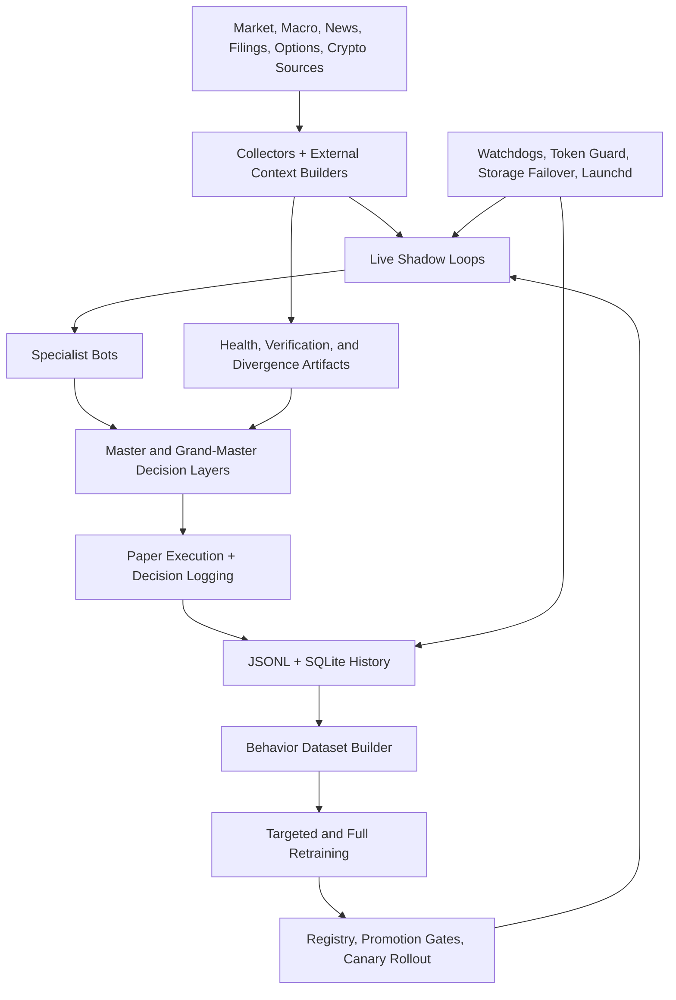

# Schwab Trading Bot

Multi-sleeve algorithmic trading research and paper-execution platform built around live market ingestion, specialist bot orchestration, behavior-model retraining, and operational safety controls across Schwab and Coinbase workflows.

## Showcase

- Showcase index: [docs/showcase/README.md](docs/showcase/README.md)
- Auto-refreshed highlights: [docs/showcase/generated/highlights_latest.md](docs/showcase/generated/highlights_latest.md)
- Data source catalog: [DATA_INGESTION_SOURCES.md](DATA_INGESTION_SOURCES.md)

## System Map



## Showcase Projects

1. [Live Multi-Asset Paper Trading Platform](docs/showcase/projects/01-live-multi-asset-paper-platform.md)
2. [Quant Research and Model Training System](docs/showcase/projects/02-quant-research-and-model-training.md)
3. [Data Fusion and Verification Pipeline](docs/showcase/projects/03-data-fusion-and-verification-pipeline.md)
4. [Reliability, Safety, and Ops Automation](docs/showcase/projects/04-reliability-safety-and-ops-automation.md)
5. [Cross-Market Crypto and Macro Intelligence](docs/showcase/projects/05-cross-market-crypto-and-macro-intelligence.md)

## Auto-Refreshed Highlights

<!-- SHOWCASE_HIGHLIGHTS_START -->
_Generated at 2026-03-22 15:34 UTC_

- Active registry lineup: `15` of `96` bots are active.
- Live collection snapshot: `2/9` lane artifacts are reporting `running`.
- Crypto context: `13/14` healthy sources and `6/7` healthy news feeds.
- Correlation overlay: mode `exact`, aligned pairs `0`.
- Top active lineup by test accuracy: `brain_refinery_v10_seasonal` (93.8%), `brain_refinery_v35_dmi_state_machine` (85.2%), `brain_refinery_v56_meta_ranker` (79.9%).

Full generated detail lives in [docs/showcase/generated/highlights_latest.md](docs/showcase/generated/highlights_latest.md).
<!-- SHOWCASE_HIGHLIGHTS_END -->

## Runbook

- Canonical commands: [COMMANDS.md](COMMANDS.md)
- Terminal helper: [scripts/runbook.sh](scripts/runbook.sh)
- Canonical reports page: [REPORTS.md](REPORTS.md)
- Report helper: [scripts/reportbook.sh](scripts/reportbook.sh)

## Quick Usage

```bash
cd /Users/dankingsley/PycharmProjects/schwab_trading_bot
./scripts/runbook.sh
./scripts/runbook.sh live
./scripts/runbook.sh retrain
./scripts/reportbook.sh bundle
./scripts/ops/opsctl.sh showcase-refresh
```

## Notes

- Use `COMMANDS.md` as the source of truth for launch, retrain, storage, and SQL commands.
- Use `REPORTS.md` as the source of truth for report generation and report bundle locations.
- The showcase highlight section is generated from repo artifacts, not hand-maintained.
