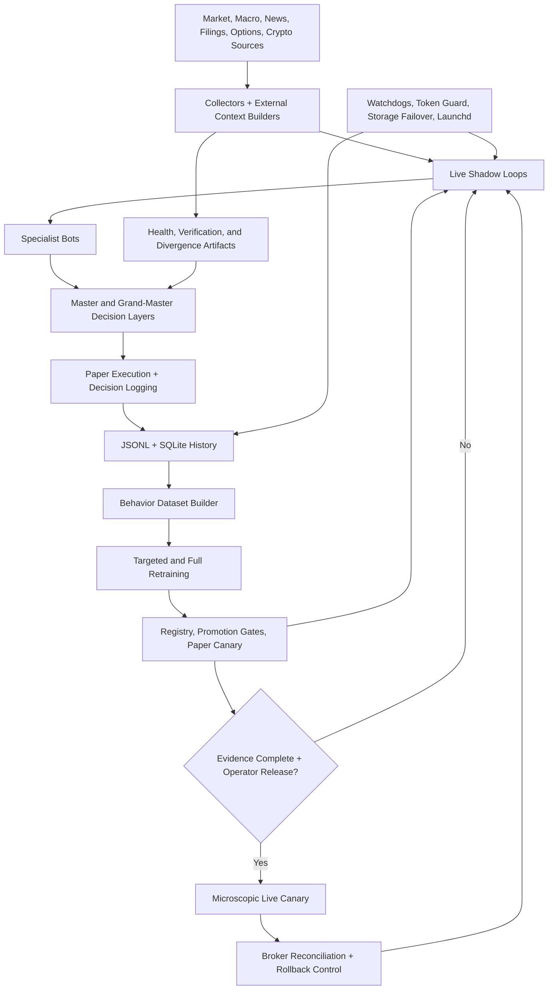

# Schwab Trading Bot

AI-assisted multi-sleeve algorithmic trading research and paper-execution platform built around live market ingestion, specialist bot orchestration, behavior-model retraining, operational safety controls, and auditable runbooks across Schwab and Coinbase workflows.

This repository is the working system used to build, test, document, and operate a trading automation platform with GPT/Codex-style engineering tools in the loop. The emphasis is practical: shipping features in a real codebase, maintaining source-of-truth docs, adding tests, debugging broker/auth flows, and keeping operator commands reproducible.

**Technical focus:** AI-assisted software engineering, GPT/Codex tools, Python, algorithmic trading, quantitative research, signal generation, market data ingestion, paper trading, risk metrics, Sharpe ratio, Sortino ratio, JSONL event streams, SQL, automation, testing, and GitHub documentation.

## Showcase

- Showcase index: [docs/showcase/README.md](docs/showcase/README.md)
- Auto-refreshed highlights: [docs/showcase/generated/highlights_latest.md](docs/showcase/generated/highlights_latest.md)
- Data source catalog: [DATA_INGESTION_SOURCES.md](DATA_INGESTION_SOURCES.md)

## What This Demonstrates

- Hands-on AI-assisted software engineering on a live Python trading automation codebase.
- Practical use of Codex/GPT workflows for refactoring, test creation, documentation, CI guardrails, and operations cleanup.
- Algorithmic trading infrastructure across signal generation, market data ingestion, paper trading, portfolio/sleeve orchestration, and risk-aware promotion gates.
- Production-style repository hygiene with source-of-truth docs, repeatable commands, smoke tests, secret scanning, and dependency checks.
- Auditable operational telemetry through JSONL event streams, generated health reports, and durable runbooks.

## System Map


```mermaid
flowchart TD
    A["Market, Macro, News, Filings, Options, Crypto Sources"] --> B["Collectors + External Context Builders"]
    B --> C["Live Shadow Loops"]
    B --> D["Health, Verification, and Divergence Artifacts"]
    C --> E["Specialist Bots"]
    E --> F["Master and Grand-Master Decision Layers"]
    F --> G["Paper Execution + Decision Logging"]
    G --> H["JSONL + SQLite History"]
    H --> I["Behavior Dataset Builder"]
    I --> J["Targeted and Full Retraining"]
    J --> K["Registry, Promotion Gates, Paper Canary"]
    K --> C
    D --> F
    L["Watchdogs, Token Guard, Storage Failover, Launchd"] --> C
    L --> H
    K --> M{"Evidence Complete + Operator Release?"}
    M -- "No" --> C
    M -- "Yes" --> N["Microscopic Live Canary"]
    N --> O["Broker Reconciliation + Rollback Control"]
    O --> C
```

## Production Readiness

As of **2026-08-15**, the system is operating as a guarded paper-trading and data-collection platform. Live market data, shadow evaluation, selective paper execution, reconciliation, monitoring, and bounded recovery are enabled; live orders remain locked. Runtime health and safety grades are not treated as proof of financial profitability.

| Surface | Current evidence | Meaning |
| --- | --- | --- |
| Formal live-money readiness | authoritative count in `governance/health/live_money_readiness_contract_latest.json` | any economic, training-quality, promotion, or runtime section below its required floor remains an explicit blocker |
| Profitability evidence firewall | authoritative structural and economic grades in `governance/health/profitability_evidence_firewall_latest.json` | all ten future-profitability hardeners are evaluated; candidate-bound evidence counts update on each refresh and cannot be relabeled |
| Six-pillar transition runway | authoritative count in `governance/health/live_canary_readiness_contract_latest.json` | every pillar keeps its own blockers and evidence floor; no headline health grade substitutes for them |
| Production-excellence proof | authoritative count in `governance/health/production_excellence_control_latest.json` | only candidate-bound, independently evidenced pillars count; elapsed time and missing evidence cannot be relabeled |
| Frozen candidate | content fingerprint, generation, accepted Git head, and scope clocks in `governance/runtime/production_candidate_state.json` | reviewed scope changes restart only the affected evidence windows; unaccepted drift fails closed |
| Recovery | `10/10` isolated, non-destructive recovery drills pass | auth, broker network, process, reboot, disk, storage, memory, database, market-data, and order-lifecycle failures are covered |
| Storage continuity | pinned local-durable route with online SQLite snapshots | snapshots can be taken while active database writers remain online |
| Ten-part resilience control | authoritative counts in `governance/health/production_resilience_control_latest.json` | implementation, unattended paper-soak readiness, and live-promotion evidence are graded separately; the control never authorizes orders |
| Organic collector mesh | `25` formal collector contracts, including the governed twelve-plane macro/micro context mesh and `10` organically tracked source/evidence additions | context, point-in-time lineage, and candidate fill evidence accrue from real producer output; collectors have no order or automatic-promotion authority |
| Capability materialization | `4/4` direct receipts over exchange calendars, point-in-time session state, a `10`-root derivative contract master, and `2` versioned stress scenarios | formerly hard capability gaps are source-backed and freshness guarded; the materializer has no fetch, execution, registry-mutation, or promotion authority |
| Collector capability routing | `25` versioned data planes, `260` logical capabilities, `171` currently mapped capabilities, `48` shared producers, and content-addressed bot subscriptions | all candidate-required capabilities are currently usable; every organized bot has a shared subscription, while unsupported optional capabilities remain explicit advisory debt rather than false live blockers |

The candidate-specific review boundary is generated from the latest accepted scope windows in `governance/runtime/production_candidate_state.json` and reported by `governance/health/production_excellence_control_latest.json`; it is never a hard-coded calendar promise or automatic permission to trade. Clearance still requires the unchanged-candidate time windows, independent fill calibration, a sealed unseen holdout, cash and passive benchmark outperformance, acceptable risk-of-ruin stress, qualified promotion candidates, positive post-cost expectancy across independent days and symbols, profitable-sleeve diversity, bounded concentration, successful paper-canary cohorts, and explicit operator release. Until all gates pass, `MARKET_DATA_ONLY=1` and `ALLOW_ORDER_EXECUTION=0` remain the intended posture.

The transition contract is:

`collect -> signal or no-trade -> paper execution and replay -> out-of-sample evidence -> broker/risk/promotion gates -> operator-approved microscopic live canary -> reconcile, expand, or roll back`

Paper and live evaluation are parallel safety lanes. A live order is never authorized merely because the same opportunity produced a paper fill, and choosing no trade is a valid outcome.

Unattended evidence maintenance uses two serialized cadences: the bounded `accrual` profile maintains organic collection every 15 minutes, and the bounded `production` profile refreshes the ten-pillar owner surfaces every 45 minutes. The production cadence covers risk inputs, reconciliation, recovery drills, remote alerts, security, immutable evidence, backup/restore, blackstart, promotion, profitability, canary, and derived readiness controls. Its training and profitability evidence is rebuilt through the dependency-closed `training-profitability` graph while holding the paper-profitability generation lock for the entire epoch, so an accrual writer cannot interleave mutable `latest` publications or create mixed-epoch proof. The same profile owns storage, live-feed, project, drift, architecture, and infrastructure-supervisor evidence, then republishes the self-model and architecture graph after supervisor convergence so stale parent state cannot survive a successful repair cycle. Replay-fill capture retains previously materialized immutable rows, limits work to unmatched orders, prunes irrelevant date partitions, and tails active observation files under a per-file byte budget. Normal dashboard reads use a separate bounded hot-state `dashboard` profile. A full dependency-closed runtime refresh remains an explicit reconciliation operation rather than a dashboard side effect. Every profile forces market-data/paper-only environment locks and has no training-launch or live-order authority.

The collector mesh now formalizes ten additional observation-only streams: bond reference, dividend/DRIP state, macro cross-asset context, central-bank/Fed-liquidity context, public-policy context, Schwab symbol news, ticker-news context, point-in-time events, feature-store lineage, and candidate fill replay. Organic readiness reaches `100` only when every stream is fresh and its real evidence target is met; no collector may rewrite historical outcomes, promote a bot, or authorize an order.

The capability layer organizes those physical producers into 25 logical planes spanning instrument identity, market state, fundamentals, events, broker and execution truth, risk, training, evidence, governance, and operational health. Logical capabilities are subscriptions, not processes: one bounded producer snapshot can satisfy many capabilities for many bots. Missing candidate-required capabilities fail readiness closed. Unsupported or temporarily unavailable optional capabilities stay visible as advisory catalog debt instead of being presented as implemented or falsely vetoing an otherwise complete candidate.

### Global Central Bank And Fed Liquidity Context

The decision-critical macro path now collects official Fed/FRED and New York Fed series for total assets, reserve balances, Treasury cash, overnight repo and reverse repo, central-bank swaps, Treasury and MBS holdings, SOFR, EFFR, OBFR, IORB, the policy corridor, NFCI, adjusted NFCI, the St. Louis Financial Stress Index, the monetary base, and M2. Official Federal Reserve and Treasury calendars/news remain event context alongside those numeric series.

The collector publishes 25 normalized features covering balance-sheet levels and impulses, the net-liquidity impulse, expansion versus tightening, funding-rate spreads, policy-corridor width, funding stress, and financial conditions. `Fed total assets - Treasury General Account - overnight reverse repo` is explicitly labeled a market-liquidity heuristic, not an official accounting identity or a standalone trade signal.

A separate governed registry now covers 32 important central banks across three tiers. BIS member-reported policy-rate history and official national central-bank total-asset data are normalized without forcing exchange-rate or multi-instrument frameworks into a fictional policy rate. The cross-source router joins each bank by jurisdiction, currency, and observation time to ECB FX references, canonical FX reconciliation, World Bank sovereign macro data, verified official events when available, detailed U.S. dollar liquidity, and macro cross-asset context.

A raw bank row cannot certify its own synchronization. Every routed bank needs a fresh point-in-time link from at least one distinct source, and every usable field carries origin, publisher reference, artifact timestamp, economic observation time, confidence, and freshness. Future values are excluded, stale dimensions are omitted, and hard provider conflicts block the affected bank route. Symbol-scoped evidence is consumed consistently by paper decisions, runtime gap fill, and behavior-dataset schema `trade_behavior_features_v6`.

Required daily, weekly, and monthly series have cadence-aware freshness limits. Observations dated after the collection as-of date are recorded as excluded and cannot become decision features. Paper runtime, runtime gap-fill, behavior-dataset construction, source verification, and training-label routing all use the same fail-closed consumer contract: the artifact must be under 24 hours old, have complete fresh required-series coverage, contain the full numeric feature schema, declare point-in-time methodology, and select no future observation. Later context sources cannot erase valid earlier features through zero-filled merges.

Run `./scripts/ops/opsctl.sh macro-context-sync --json` to refresh the full dependency order, or use `global-central-bank-sync` and `central-bank-context-sync` separately. Then run `./scripts/ops/opsctl.sh source-verification --json` to inspect the independent contracts. These contexts are observation and risk evidence only: they cannot authorize an order, promote a bot, unlock live execution, or guarantee profitability. Detailed behavior is documented in [CENTRAL_BANK_LIQUIDITY_CONTEXT.md](docs/architecture/CENTRAL_BANK_LIQUIDITY_CONTEXT.md) and [GLOBAL_CENTRAL_BANK_CONTEXT.md](docs/architecture/GLOBAL_CENTRAL_BANK_CONTEXT.md).

The synchronized decision-context layer adds six macro planes (fiscal liquidity, funding stress, cross-border capital, credit curves, market calendars, and supply/inventory) and six micro planes (positioning, securities lending, volatility surfaces, passive flows, estimate dispersion, and capacity/impact). It reuses existing official and market artifacts, adds direct Treasury TIC, EIA weekly inventory, BTS freight, and governed analyst-consensus evidence, routes valid global and symbol features into paper decisions and training, and publishes separate evidence-derived percentages. Freshness earns full credit only inside each source's actual publication cadence, then decays to a hard staleness SLO. Run `./scripts/ops/opsctl.sh decision-context-sync --json`; see [DECISION_CONTEXT_MESH.md](docs/architecture/DECISION_CONTEXT_MESH.md). The estimate plane remains capped at `B+` unless `analyst-consensus-sync` proves the exact governed membership with `16/16` fresh symbols and revision histories; public Nasdaq forecasts remain personal research/paper context until commercial or live data entitlements are separately verified.

The grade regression autopilot is targeted and idempotent: a healthy cycle is a no-op, while a degraded surface receives only its allowlisted repair. It cannot embed the full evidence graph in its frequent loop, preventing a maintenance timeout from turning a green runtime into a partially refreshed one.

Local storage uses a `125 GiB` warning target and a `135 GiB` recovery target by default, preventing repeated clear/retrigger cycles at the boundary. Cold-archive automation must use an explicitly configured non-protected route; an operator-reserved volume is rejected rather than silently selected.

### Paper Profitability Hardening

The paper path applies fourteen coordinated controls before profitability evidence is considered promotion-worthy:

1. Options and futures use explicit contract multipliers; unknown derivative valuation fails closed for new exposure.
2. Collection remains broad, but only explicit, bounded market-signal authority can enter a paper execution cohort; legacy paper flags and control identities are observation-only.
3. Eligible directional intents are coalesced through hierarchy-mapped sleeve, sub-sleeve, duplicate-signal, and correlation-cluster caps.
4. Behavior labels use forward returns after modeled round-trip costs plus path-aware MAE, MFE, no-trade, exit-timing, and post-entry regime outcomes.
5. Sleeve and regime compatibility can block a new entry without suppressing the underlying observation.
6. Evidence quality can only reduce order size; weak evidence cannot increase risk.
7. Execution plans use bounded limit-order styles, quote freshness, spread, liquidity, and session constraints; market orders are disabled on this path.
8. Predicted edge must clear a conservative multiple of round-trip costs; the bootstrap prior is paper-only and never counts as promotion evidence.
9. Correlation, directional conflict, and existing exposure impose an overlap budget before entry.
10. Persistent turnover state enforces new-entry cooldowns, daily symbol caps, and same-order reversal rejection while leaving exits open.
11. Every paper intent carries the current production-candidate identity and scope receipt.
12. Lifetime flow, current-day flow, candidate-forward flow, and active inventory are reported separately; carried inventory cannot grade the current candidate.
13. Persistent-loser retirement requires post-cost sample depth, elapsed days, a negative confidence bound, and repeated failed retests.
14. The artifact refresher rebuilds a hash-bound paper-authority registry overlay without granting unattended source mutation or live execution.

Run `./scripts/ops/opsctl.sh profitability-hardening --json` to inspect adoption. `armed` means the code and policies are installed; it does not mean fresh runtime evidence or future profitability has been proven. Live execution remains unchanged and locked.

### Training Evidence Hardening

Training now advances through explicit stages: collection floor, point-in-time labels, fresh diagnostics, overfit and balance clearance, candidate selection, resource canary, and promotion review. A bot that merely has enough observations is not automatically eligible to train. Launches fail closed unless the feature manifest, schema compatibility report, golden replay pack, and bot lifecycle board are fresh and share one evidence epoch.

Use `./scripts/ops/opsctl.sh runtime-artifact-refresh --scope training --skip-dashboard --json` to rebuild only the dependency-closed training proof graph. Use `--scope training-profitability` when training and profitability evidence must be reconciled into the same cycle. Scoped refreshes intentionally leave the full dashboard on its normal cadence; they do not enable training, promotion, allocation, or live execution.

### Candidate And Strategy Generations

Production-candidate generations and strategy generations are intentionally separate:

- A production candidate such as `pc-84eb9198c9b8-g27` is the 27th accepted freeze of code, configuration, dependencies, and evidence-window fingerprints. It is not the 27th generation of a trading strategy.
- A strategy generation is a bounded research wave created by `scripts/ops/strategy_generation_control.py`. Only parents with sufficient walk-forward, positive paper, training, and overfitting clearance may reproduce.
- Offspring are dormant, collection-only candidate manifests. They never inherit a parent's grade, execution authority, serving eligibility, or registry admission.
- The controller allows at most two offspring per generation, four active offspring globally, one active offspring per parent, 24 retained candidates, three lineage levels, one training job at a time, and a seven-day generation cooldown. Per-candidate and total artifact-byte ceilings stop retired research from quietly consuming the host.
- Policy, state, generation manifests, source modules, model artifacts, and evaluations are hash-bound. Lifecycle events use the owner-only experiment-ledger key, and refresh automation quarantines stale training left by an interrupted controller instead of restarting it blindly.
- Training uses bounded genome changes, isolated artifact names, parent warm starts, and teacher soft targets. Evaluation must be fresh, uniquely identified, signed, stored in the locked generation root, and bound to the candidate model, generation manifest, dataset, holdout, replay, evaluator identity, post-cost expectancy, drawdown, diversity, and multiple-testing result.
- A qualified challenger still has zero paper allocation, zero live-order budget, no serving or registry authority, and no right to reproduce recursively. A later generation requires an explicit human lineage-parent approval in addition to fresh evidence. Live-money promotion remains outside this controller and operator-gated.

Inspect the lineage with `./scripts/ops/opsctl.sh strategy-generation --json`. Proposal, serial training, stale-training reconciliation, evaluation, and retirement are explicit subcommands; inspection alone never creates or starts offspring.

### Hierarchical Bot Organization

The registered fleet is now projected into a canonical `sleeve -> sub-sleeve -> horizon/multi-axis regime cohort -> role` hierarchy. Regime profiles independently represent market direction, volatility, liquidity, macro, rates/credit, correlation, event phase, market session, and operational state. Each assignment carries provenance and confidence, while legacy ambiguity is represented as `unknown`, `any`, or `not_applicable` and placed in a review queue instead of being presented as verified metadata. The organization control enforces complete and unique registry coverage, composite cohorts, explicit role separation, per-cell resource ceilings, and bounded admission requirements.

The hierarchy evaluator remains execution-free, while its read-only sleeve, sub-sleeve, and correlation identities are now consumed by the separately authorized paper consensus. Paper consensus caps individual bots and correlated groups, removes duplicate signals, and abstains on missing hierarchy, insufficient diversity, or excessive disagreement. The hierarchy cannot grant authority, mutate the registry, or unlock live money; adoption evidence remains candidate-bound and post-cost.

Run `./scripts/ops/opsctl.sh bot-organization --json` to inspect the structural grade, classification-quality grade, regime coverage and specificity, review queue, capacity posture, and generated hierarchy. Regime compatibility is an optional shadow-evidence filter only; it has no paper or live execution authority. See [docs/architecture/BOT_ORGANIZATION.md](docs/architecture/BOT_ORGANIZATION.md) for the full contract.

### Bot Profitability And Scalability

The integrated `bot_profitability_scalability_v1` plane maps all eight profitability and all eight scalability controls onto the organized catalog. It learns preferences only from candidate-bound attributed paper outcomes; ranks post-cost expectancy, conservative lower bounds, drawdown, turnover, confidence, persistence, and marginal contribution; consumes the independent execution and statistical firewalls; and publishes lifecycle and capacity advice. It also enforces catalog/process separation, bounded top-K activation, immutable shared features, worker and queue budgets, checkpoint and order idempotency, hot/cold storage routing, and lazy model eviction under memory pressure.

Run `./scripts/ops/opsctl.sh bot-profitability-scalability --json` to inspect the control grade, evidence grade, evidence debt, ranked bot count, and zero-authority activation manifest. An `A+` control grade means all 16 safeguards are implemented. It does not upgrade missing economic evidence, guarantee profitability, allocate capital, or unlock live execution.

The live-money contract also publishes a separate all-`A+` ledger. The normal A/A+ clearance floor remains fail-closed, while `grade_summary.a_plus_readiness_percent`, `a_plus_gap_sections`, and each section's `a_plus_remediation` show the stricter target without relabeling elapsed time or economic results.

## Current Advancements

The platform now has an explicit source-of-truth contract for how commands, reports, broker truth, storage, and decisions are owned and verified. Start with [docs/architecture/SOURCE_OF_TRUTH.md](docs/architecture/SOURCE_OF_TRUTH.md), then read [docs/architecture/ADR-0001-system-source-of-truth.md](docs/architecture/ADR-0001-system-source-of-truth.md) for the design decision behind it.

Key operating upgrades:

- Aggressive sleeves now report Sortino ratio from daily PnL changes so downside volatility is the primary risk-adjusted lens for high-conviction lanes.
- Conservative sleeves now report Sharpe ratio from daily PnL changes so total volatility stays visible for capital-preservation lanes.
- Signal generation now has a canonical event stream at `governance/events/signal_generation_*.jsonl`, recording both good trade-intent signals and bad, blocked, or no-trade signals.
- Codex work now has project guardrails in `AGENTS.md` and `scripts/ops/codex_project_guard.py` to prevent source-of-truth drift, mixed-domain staging, and separate-domain README/docs leakage.
- `COMMANDS.md` is generated and alphabetized from `scripts/ops/commands_hygiene_bot.py`, with a command contract hash written to `governance/health/commands_contract_latest.json`.
- Report opening now uses `scripts/ops/open_report_artifact.sh` as the resilient entrypoint, including incident-report PDF regeneration with HTML/markdown fallback.
- Schwab interactive auth defaults to Chrome for the browser consent flow and records the requested/resolved browser in the auth refresh artifact.
- Frozen release bundles keep serving read-only and isolated from retraining; constrained training can defer safely without invalidating the active model.
- Startup consent uses a signed macOS notification helper with clickable `Start` and `Not Now` actions. Dismissal, timeout, helper failure, and no response all fail closed with the trading stack left off; the helper never opens a browser or changes live-execution authority.
- The external-SSD guard runs as a compiled LaunchAgent and publishes atomic transition state. A standby-drive disconnect does not restart the stack when hot storage is already local; an active-route disconnect receives a grace check and one bounded local failover, while reconnect remains standby until write certification and an explicit failback policy approve it.
- Candidate state, promotion evidence, and reconciliation artifacts use atomic or content-addressed writes so partial files cannot silently become readiness proof.
- A twelve-domain uniform hardening contract applies the same ten-control structural floor to execution, auth, sources, paper truth, ingestion, storage, runtime, training, profitability, promotion, observability, and security. CI checks that floor without claiming host-runtime evidence, and the source-mutation guard protects the evaluator and manifest. Decision-critical runtime truth fails closed, while context, training, profitability, and promotion evidence debt stays visible without being mislabeled as an operational outage.
- Canary rollout evidence now reads the schema-v2 `profile` field, binds every observation to the newest strategy/execution/risk/data/promotion/dependency scope window, preserves valid incremental scan state across metadata-only candidate generations, scans adjacent host/UTC date partitions, reports source coverage for both cohorts, removes duplicates, and requires multi-day clustered confidence before promotion.
- Independent fill calibration has a provenance-gated intake and content-addressed evidence ledger; expected-fill-model rows cannot be relabeled as external truth.
- The production hardening watch runs the lightweight accrual profile every 15 minutes and a separately cooled production-pillar profile every 45 minutes, leaving margin under the 60-minute freshness SLO. It keeps all ten pillar owners and the governance-drift producer chain online, uses a single-writer coherent epoch for training and profitability proof, runs isolated non-destructive recovery drills no more than daily, disables content-store garbage collection in unattended runs, and keeps live execution locked. Collector-contract enrichment reuses one bounded data-plane connection per pass. Expected evidence states such as calibration `needs_tuning`, a quality queue with `needs_work`, or a trained candidate held out by promotion gates remain visible without being misreported as scheduler crashes. A locally healthy storage-reserve `watch` remains a paper-safe warning, while hard pressure still fails closed. Risk-service readiness requires fresh, healthy allocator, portfolio-risk, execution-budget, and reconciliation inputs; a fresh wrapper can no longer hide stale upstream truth.
- Staged promotion candidates flow through a runtime-governed queue: training-ready bots receive held-out walk-forward work, while sample-starved bots return to labeled collection.
- Storage disaster recovery uses SQLite's online backup path for active databases and verifies the promoted model bundle needed for restart.
- The production recovery harness exercises ten bounded failure classes and records containment, duplicate-order prevention, recovery time, and evidence hashes.
- The production resilience control binds ten hardening areas into one framework-aware contract: two-tier healing, honest grade semantics, exclusive ownership, immutable releases, scheduled fault injection, bounded repair circuits, transactional order truth, measured RPO/RTO, an independent deadman, and honest profitability evidence. Production-only evidence debt remains visible without interrupting a healthy paper soak.
- Critical mutable resources have one declared owner and coordination primitive. The ownership guard hashes owner sources and fails closed on duplicate resources, missing routes, or uncoordinated mutation.
- The independent monitor runs as a separate stdlib-only launchd process, publishes atomic local heartbeat and Prometheus evidence, and requires proven off-host delivery before live promotion can be considered fully monitored.
- Paper performance now suppresses mirrored execution rows by execution/fill identity or paper-book decision identity, publishes a closed scan watermark that defers later appends, and requires a separately implemented accountant to reproduce candidate-bound P&L, notional, costs, and drawdown over that exact interval.
- The profitability firewall separates structural readiness from economic proof across twenty-two controls, including explicit paper authority, candidate accounting scope, complete experiment-family accounting, a locked holdout vault, adversarial execution stress, passive/cash benchmarks, edge-decay containment, moving-block risk-of-ruin stress, and tail-concentration limits.
- Live-money readiness now fails closed on a fresh A+ economic firewall instead of treating an A+ safety posture or runtime smoke test as proof of profitability; generated README highlights preserve the same distinction.

## Operational Evidence

The important generated artifacts are:

- `governance/health/paper_performance_latest.json`: sleeve scoreboard, PnL, Sortino/Sharpe fields, chart/PDF metadata.
- `governance/health/profitability_evidence_firewall_latest.json`: separate structural and economic grades for the baseline and ten future-profitability hardeners.
- `governance/health/profitability_independent_validator_latest.json`: independently recomputed candidate P&L, notional, drawdown, reconciliation, and risk-of-ruin evidence.
- `governance/research/profitability_holdout_vault_latest.json`: sealed holdout identity, candidate binding, access count, and tamper status.
- `governance/research/profitability_benchmark_capture_latest.json`: immutable candidate-bound passive benchmark capture state.
- `governance/research/profitability_benchmark_hurdle_latest.json`: cash and passive benchmark comparison across complete candidate sessions.
- `governance/events/signal_generation_*.jsonl`: good and bad signal generation audit stream.
- `governance/health/schwab_auth_refresh_latest.json`: browser handoff, token readiness, and account-probe outcome.
- `governance/health/schwab_auth_supervisor_latest.json`: token lease, callback-port, and broker-readiness posture.
- `governance/health/live_money_readiness_contract_latest.json`: the 14-section live-money lock, six-pillar runway, target window, and blocking evidence.
- `governance/health/runtime_artifact_refresh_latest.json`: the latest atomic evidence epoch, dependency receipts, scoped refresh result, and stale-producer rejection envelopes.
- `governance/feature_store/latest.json`: content-verified runtime rows, point-in-time event contract, and strict training-manifest readiness.
- `governance/health/bot_needs_intelligence_latest.json`: per-bot lifecycle stage board and the authoritative bounded retrain candidate set.
- `governance/health/bot_organization_latest.json`: hierarchy coverage, classification quality, legacy review debt, resource caps, and shadow-ensemble safety proof.
- `governance/bot_organization/bot_hierarchy_latest.json`: complete provenance-backed sleeve, sub-sleeve, cohort, role, and correlation-cluster assignment catalog.
- `governance/health/master_grandmaster_evidence_v2_latest.json`: compact sleeve-master and Grand Master structural, operational, and promotion-evidence truth with execution authority locked off.
- `governance/master_grandmaster/evidence_packets_v2_latest.json`: bounded per-sleeve evidence packets spanning hierarchy, multi-axis regime compatibility, correlation concentration, paper truth, and post-cost evidence.
- `governance/health/strategy_generation_control_latest.json`: reproduction-grade parent eligibility, resource caps, active offspring, and signed append-only lineage-chain health.
- `governance/strategy_generations/strategy_generation_state.json`: persistent offspring lifecycle, model hashes, evaluation results, and parent-child lineage.
- `governance/health/production_excellence_control_latest.json`: frozen-candidate integrity and the stricter ten-pillar production-evidence scoreboard.
- `governance/health/readiness_evidence_refresh_latest.json`: bounded evidence-refresh execution, timeouts, and producer failures.
- `governance/health/readiness_evidence_accrual_latest.json`: candidate-bound progress, observed rates, honest ETAs, producer prerequisites/schedules, and stalled or regressed evidence counters.
- `governance/health/readiness_blocker_rollup_latest.json`: unique causal blockers and their downstream grade/readiness surfaces.
- `governance/health/memory_pressure_intelligence_latest.json`: current host headroom, reconciled swap pressure, safe worker caps, and autonomous override posture.
- `governance/health/autonomic_resource_governor_latest.json`: current host budgets and guarded workload widths derived from memory and foreground pressure.
- `governance/health/training_quality_control_latest.json`: current diagnostic, supportability, lineage, probation, and quality-recovery posture.
- `governance/health/bot_needs_intelligence_latest.json`: fresh per-bot repair stages and the authoritative training candidate selector.
- `governance/health/training_runtime_control_latest.json`: fresh training eligibility, resource gates, cache posture, and bounded precompute targets.
- `governance/health/autonomy_control_plane_latest.json`: fresh recovery-path, incident, coverage, promotion, and canary autonomy posture.
- `governance/health/architecture_upgrade_scoreboard_latest.json`: current proof status for architecture capabilities and recovery controls.
- `governance/health/system_needs_intelligence_latest.json`: dependency-ordered actions derived after runtime and readiness evidence are refreshed.
- `governance/health/uniform_hardening_contract_latest.json`: common-control coverage, critical-runtime freshness, domain evidence debt, and bounded recovery commands for all twelve production domains.
- `governance/health/source_verification_latest.json`: source control grade, decision-critical runtime contract, and separately reported context and optional-enrichment debt.
- `governance/health/source_verification_autorefresh_latest.json`: bounded criticality-prioritized source repairs, persistent retry state, and downstream contract rechecks.
- `governance/health/independent_fill_evidence_acquisition_latest.json`: provenance checks, accepted fill ledger count, conflicts, and rejected evidence.
- `governance/health/canary_rollout_latest.json`: candidate-bound canary/baseline source coverage, cohort statistics, and conservative edge confidence bound.
- `governance/runtime/production_candidate_state.json`: accepted candidate fingerprint, generation, and per-scope evidence-window starts.
- `governance/health/paper_execution_truth_layer_latest.json`: paper execution, account-position awareness, broker reconciliation, and profitability evidence, with operational gates separable from promotion-only evidence.
- `governance/health/production_recovery_drill_harness_latest.json`: isolated recovery-drill results and tamper-evident evidence hashes.
- `governance/health/storage_disaster_recovery_latest.json`: active-route durability, online snapshot mode, and restart-critical artifact verification.
- `governance/health/control_surface_ownership_latest.json`: exclusive critical-resource ownership, coordination contracts, and source receipts.
- `governance/health/soak_reliability_sentinel_latest.json`: always-on paper-safe observation, bounded refreshes, repair circuits, and heavy-maintenance demand.
- `governance/health/live_order_ledger_control_latest.json`: SQLite, event-chain, payload, transition, and materialized broker-order state integrity.
- `governance/health/independent_runtime_monitor_latest.json`: local deadman freshness and optional off-host delivery evidence.
- `governance/health/production_resilience_control_latest.json`: the separate 10-part implementation, paper-soak, and live-promotion verdicts.
- `governance/health/storage_eject_guard_latest.json`: external-drive availability, active storage mode, last disconnect/reconnect event, failover result, and whether a stack restart was required.
- `governance/health/startup_start_prompt_latest.json`: signed startup-prompt transport, actionable-notification readiness, operator decision, and fail-closed no-response posture.
- `governance/health/codex_project_guard_latest.json`: Codex source-of-truth and scope-drift guard result.
- `governance/health/documentation_reporting_intelligence_latest.json`: README, COMMANDS.md, report-quality, and PyCharm visibility intelligence layer.
- `docs/pycharm/intelligence_layers_latest.md`: PyCharm-facing intelligence index with blue active-bot rows and operator-open paths.
- `exports/reports/incident_report_latest.pdf`: decision-oriented incident report opened through the resilient report helper.

## Showcase Projects

1. [Live Multi-Asset Paper Trading Platform](docs/showcase/projects/01-live-multi-asset-paper-platform.md)
2. [Quant Research and Model Training System](docs/showcase/projects/02-quant-research-and-model-training.md)
3. [Data Fusion and Verification Pipeline](docs/showcase/projects/03-data-fusion-and-verification-pipeline.md)
4. [Reliability, Safety, and Ops Automation](docs/showcase/projects/04-reliability-safety-and-ops-automation.md)
5. [Cross-Market Crypto and Macro Intelligence](docs/showcase/projects/05-cross-market-crypto-and-macro-intelligence.md)

## Auto-Refreshed Highlights

<!-- SHOWCASE_HIGHLIGHTS_START -->
_Generated at 2026-08-07 02:21 UTC_

- Active registry lineup: `1780` of `1781` bots are active.
- Live collection snapshot: `2/17` lane artifacts are reporting `running`.
- Institutional readiness: `99.33/100` with status `industry_leaning`.
- Live/runtime posture: live-money gate `blocked` at `12/14` required sections with live locked `True`; runtime smoke `ready` at `100.00/100`; runtime separation `ready`.
- Autonomy posture: `91.41/100` with status `blocked`, playbooks `1`, open incidents `0`.
- Architecture upgrades: `11/12` ready proof surfaces, host profile `max_throughput`, portable proof `ready`.
- Crypto context: `16/18` healthy sources and `7/7` healthy news feeds.
- Correlation overlay: mode `exact`, aligned pairs `0`.
- PyTorch sidecar: `0` active assist candidates across `0` tracked runs.
- Top active lineup by test accuracy: `brain_refinery_v95_rates_regime_bond_bot` (100.0%), `brain_refinery_v99_defensive_dividend_concentration` (100.0%), `brain_refinery_v265_crypto_risk_off_contagion_shock_guard` (97.7%).

Full generated detail lives in [docs/showcase/generated/highlights_latest.md](docs/showcase/generated/highlights_latest.md).
<!-- SHOWCASE_HIGHLIGHTS_END -->

## Runbook

- Canonical commands: [COMMANDS.md](COMMANDS.md)
- Terminal helper: [scripts/runbook.sh](scripts/runbook.sh)
- System source-of-truth map: [docs/architecture/SOURCE_OF_TRUTH.md](docs/architecture/SOURCE_OF_TRUTH.md)
- Architecture decision record: [docs/architecture/ADR-0001-system-source-of-truth.md](docs/architecture/ADR-0001-system-source-of-truth.md)
- Codex project guardrails: [AGENTS.md](AGENTS.md)
- Report opener: [scripts/ops/open_report_artifact.sh](scripts/ops/open_report_artifact.sh)

## Switchboard And Tailoring

- `scripts/run_mode_switchboard.py` is the runtime mode switchboard for launching coordinated `shadow`, `paper`, and `live` lanes.
- It launches one `main.py` child per mode by setting `BOT_MODE` to `shadow`, `paper`, or `live` from `SWITCHBOARD_MODES`.
- It is a mode launcher, not a one-click architecture exporter by itself.

Canonical local command on this Mac:

```bash
cd /Users/dankingsley/PycharmProjects/schwab_trading_bot
PY="$(zsh ./scripts/ops/runtime_python.sh)"
SWITCHBOARD_MODES="shadow,paper" "$PY" scripts/run_mode_switchboard.py
```

Useful variants:

```bash
SWITCHBOARD_MODES="shadow" "$PY" scripts/run_mode_switchboard.py
SWITCHBOARD_MODES="shadow,paper,live" "$PY" scripts/run_mode_switchboard.py
```

The architecture handoff packet is:
- this [README.md](README.md)
- the system map above
- [docs/architecture/SOURCE_OF_TRUTH.md](docs/architecture/SOURCE_OF_TRUTH.md)
- [docs/architecture/ADR-0001-system-source-of-truth.md](docs/architecture/ADR-0001-system-source-of-truth.md)
- [docs/showcase/README.md](docs/showcase/README.md)
- [DATA_INGESTION_SOURCES.md](DATA_INGESTION_SOURCES.md)
- [COMMANDS.md](COMMANDS.md)

That packet is the clean summary to hand to another engineer or AI tool before tailoring the platform.

### Cross-Platform Brain Switch Workflow

The switchboard script itself is portable Python, but this repo is still Mac and Apple Silicon first as shipped. A Windows or Linux move is a guided retargeting workflow, not a one-command lift-and-shift.

Use this order if you want the runtime mode switchboard to work efficiently on Windows or Linux:

1. Export the handoff packet above and give it to your AI tool or engineer first.
2. Retarget the runtime backend before first launch. `main.py` imports `mlx` immediately, so Windows/Linux need a replacement backend or import shim before the switchboard can start child processes cleanly.
3. Retarget the supervisor layer. Replace macOS-only pieces such as `launchd`, `open`, `caffeinate`, `vm_stat`, and Apple-specific ops scripts with the target platform equivalents such as `systemd`, `supervisord`, Windows Task Scheduler, or a container supervisor.
4. Create a clean Python environment on the target machine and install the repo dependencies there.
5. Copy over only the portable env and config values first. Start with `MARKET_DATA_ONLY=1`, `ALLOW_ORDER_EXECUTION=0`, symbols, collector settings, and placeholder credentials. Do not begin with live execution enabled.
6. Smoke-test the entrypoint in one mode before using the switchboard. Run `main.py` with `BOT_MODE=shadow` and confirm the startup probe works.
7. Only after the single-mode smoke test passes, launch the switchboard with `SWITCHBOARD_MODES=shadow,paper`.
8. After that is stable, wire the target broker, target data sources, and target process manager.
9. Keep `live` out of the first cross-platform cut unless the paper and shadow modes are already stable and you have replaced the broker adapter, safety gates, and ops supervision for that platform.

### Linux Example

This is the safe starting sequence after you have already replaced the Apple-only backend pieces:

```bash
cd /path/to/schwab_trading_bot
python3 -m venv .venv
source .venv/bin/activate
pip install -r config/requirements.lock.txt
export MARKET_DATA_ONLY=1
export ALLOW_ORDER_EXECUTION=0
export SWITCHBOARD_MODES="shadow,paper"
python scripts/run_mode_switchboard.py
```

### Windows PowerShell Example

This is the same sequence in PowerShell after the backend and supervisor retarget is done:

```powershell
cd C:\path\to\schwab_trading_bot
py -3 -m venv .venv
.\.venv\Scripts\Activate.ps1
pip install -r config\requirements.lock.txt
$env:MARKET_DATA_ONLY="1"
$env:ALLOW_ORDER_EXECUTION="0"
$env:SWITCHBOARD_MODES="shadow,paper"
python .\scripts\run_mode_switchboard.py
```

If you are using an AI tool to tailor the repo, the fastest prompt is usually:
- "Keep `scripts/run_mode_switchboard.py` and the `BOT_MODE` contract, but retarget the runtime backend, broker adapter, env loading, and process supervision for Windows/Linux while preserving market-data-only safety defaults."

## Quick Usage

```bash
cd /Users/dankingsley/PycharmProjects/schwab_trading_bot
./scripts/runbook.sh
./scripts/runbook.sh live
./scripts/runbook.sh retrain
./scripts/ops/opsctl.sh health-fast --json
./scripts/ops/opsctl.sh production-excellence --json
./scripts/ops/opsctl.sh live-money-readiness --json
./scripts/ops/opsctl.sh master-grandmaster-evidence --json
./scripts/ops/open_report_artifact.sh bundle
python3 scripts/ops/update_showcase_highlights.py
```

## Notes

- Use `docs/architecture/SOURCE_OF_TRUTH.md` to find the owning source for commands, reports, broker truth, signal logs, and storage.
- Run `./scripts/ops/opsctl.sh codex-project-guard --staged --json` before Codex-authored commits or GitHub updates.
- Use `COMMANDS.md` as the generated command surface; edit `scripts/ops/commands_hygiene_bot.py` when command truth changes.
- The showcase highlight section is generated from repo artifacts, not hand-maintained.
