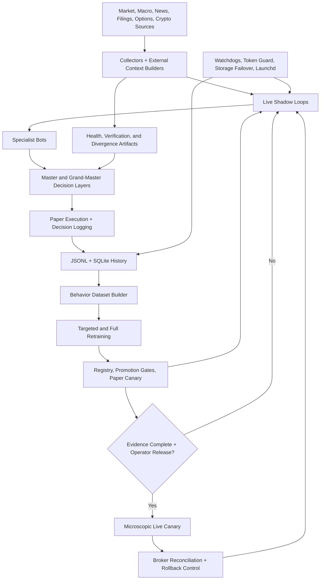

# Schwab Trading Bot

AI-assisted multi-sleeve algorithmic trading research and paper-execution platform built around live market ingestion, specialist bot orchestration, behavior-model retraining, operational safety controls, and auditable runbooks across Schwab and Coinbase workflows.

This repository is the working system used to build, test, document, and operate a trading automation platform with GPT/Codex-style engineering tools in the loop. The emphasis is practical: shipping features in a real codebase, maintaining source-of-truth docs, adding tests, debugging broker/auth flows, and keeping operator commands reproducible.

**Technical focus:** AI-assisted software engineering, GPT/Codex tools, Python, algorithmic trading, quantitative research, signal generation, market data ingestion, paper trading, risk metrics, Sharpe ratio, Sortino ratio, JSONL event streams, SQL, automation, testing, and GitHub documentation.

## Showcase

- Showcase index: [docs/showcase/README.md](docs/showcase/README.md)
- Auto-refreshed highlights: [docs/showcase/generated/highlights_latest.md](docs/showcase/generated/highlights_latest.md)
- Data source catalog: [DATA_INGESTION_SOURCES.md](DATA_INGESTION_SOURCES.md)

## What This Demonstrates

- Hands-on AI-assisted software engineering on a live Python trading automation codebase.
- Practical use of Codex/GPT workflows for refactoring, test creation, documentation, CI guardrails, and operations cleanup.
- Algorithmic trading infrastructure across signal generation, market data ingestion, paper trading, portfolio/sleeve orchestration, and risk-aware promotion gates.
- Production-style repository hygiene with source-of-truth docs, repeatable commands, smoke tests, secret scanning, and dependency checks.
- Auditable operational telemetry through JSONL event streams, generated health reports, and durable runbooks.

## System Map


```mermaid
flowchart TD
    A["Market, Macro, News, Filings, Options, Crypto Sources"] --> B["Collectors + External Context Builders"]
    B --> C["Live Shadow Loops"]
    B --> D["Health, Verification, and Divergence Artifacts"]
    C --> E["Specialist Bots"]
    E --> F["Master and Grand-Master Decision Layers"]
    F --> G["Paper Execution + Decision Logging"]
    G --> H["JSONL + SQLite History"]
    H --> I["Behavior Dataset Builder"]
    I --> J["Targeted and Full Retraining"]
    J --> K["Registry, Promotion Gates, Paper Canary"]
    K --> C
    D --> F
    L["Watchdogs, Token Guard, Storage Failover, Launchd"] --> C
    L --> H
    K --> M{"Evidence Complete + Operator Release?"}
    M -- "No" --> C
    M -- "Yes" --> N["Microscopic Live Canary"]
    N --> O["Broker Reconciliation + Rollback Control"]
    O --> C
```

## Production Readiness

As of **2026-08-06**, the system is operating as a guarded paper-trading and data-collection platform. Live market data, shadow evaluation, selective paper execution, reconciliation, monitoring, and bounded recovery are enabled; live orders remain locked. Runtime health and safety grades are not treated as proof of financial profitability.

| Surface | Current evidence | Meaning |
| --- | --- | --- |
| Formal live-money readiness | `13/14` required sections at the required floor | `paper_profitability_control` is the remaining below-floor section, currently economic-evidence grade `F` |
| Profitability evidence firewall | control grade `A+` (`20/20` implemented); current economic-evidence grade `F` | all ten future-profitability hardeners are implemented; candidate-bound evidence counts update on each refresh and cannot be relabeled |
| Six-pillar transition runway | `5/6` pillars ready | `paper_truth` remains blocked only by profitability evidence |
| Production-excellence proof | `4/10` pillars fully evidenced | elapsed soak, independent fills, qualified candidates, profitability breadth, paper-canary cohorts, and final operating proof still need evidence |
| Frozen candidate | `pc-a439f13eba9f-g19`, generation `19`, no detected drift | operations and promotion windows restarted after the accepted accounting-watermark hardener on `2026-08-07 00:12 UTC`; the strategy window retains its earlier start |
| Recovery | `10/10` isolated, non-destructive recovery drills pass | auth, broker network, process, reboot, disk, storage, memory, database, market-data, and order-lifecycle failures are covered |
| Storage continuity | pinned local-durable route with online SQLite snapshots | snapshots can be taken while active database writers remain online |

The target date of **2026-08-26** is a review boundary, not automatic permission to trade. Clearance still requires the unchanged-candidate time windows, independent fill calibration, a sealed unseen holdout, cash and passive benchmark outperformance, acceptable risk-of-ruin stress, qualified promotion candidates, positive post-cost expectancy across independent days and symbols, profitable-sleeve diversity, bounded concentration, successful paper-canary cohorts, and explicit operator release. Until all gates pass, `MARKET_DATA_ONLY=1` and `ALLOW_ORDER_EXECUTION=0` remain the intended posture.

The transition contract is:

`collect -> signal or no-trade -> paper execution and replay -> out-of-sample evidence -> broker/risk/promotion gates -> operator-approved microscopic live canary -> reconcile, expand, or roll back`

Paper and live evaluation are parallel safety lanes. A live order is never authorized merely because the same opportunity produced a paper fill, and choosing no trade is a valid outcome.

## Current Advancements

The platform now has an explicit source-of-truth contract for how commands, reports, broker truth, storage, and decisions are owned and verified. Start with [docs/architecture/SOURCE_OF_TRUTH.md](docs/architecture/SOURCE_OF_TRUTH.md), then read [docs/architecture/ADR-0001-system-source-of-truth.md](docs/architecture/ADR-0001-system-source-of-truth.md) for the design decision behind it.

Key operating upgrades:

- Aggressive sleeves now report Sortino ratio from daily PnL changes so downside volatility is the primary risk-adjusted lens for high-conviction lanes.
- Conservative sleeves now report Sharpe ratio from daily PnL changes so total volatility stays visible for capital-preservation lanes.
- Signal generation now has a canonical event stream at `governance/events/signal_generation_*.jsonl`, recording both good trade-intent signals and bad, blocked, or no-trade signals.
- Codex work now has project guardrails in `AGENTS.md` and `scripts/ops/codex_project_guard.py` to prevent source-of-truth drift, mixed-domain staging, and separate-domain README/docs leakage.
- `COMMANDS.md` is generated and alphabetized from `scripts/ops/commands_hygiene_bot.py`, with a command contract hash written to `governance/health/commands_contract_latest.json`.
- Report opening now uses `scripts/ops/open_report_artifact.sh` as the resilient entrypoint, including incident-report PDF regeneration with HTML/markdown fallback.
- Schwab interactive auth defaults to Chrome for the browser consent flow and records the requested/resolved browser in the auth refresh artifact.
- Frozen release bundles keep serving read-only and isolated from retraining; constrained training can defer safely without invalidating the active model.
- Candidate state, promotion evidence, and reconciliation artifacts use atomic or content-addressed writes so partial files cannot silently become readiness proof.
- Canary rollout evidence now reads the schema-v2 `profile` field, binds every observation to the frozen candidate window, scans adjacent host/UTC date partitions, reports source coverage for both cohorts, removes duplicates, and requires multi-day clustered confidence before promotion.
- Independent fill calibration has a provenance-gated intake and content-addressed evidence ledger; expected-fill-model rows cannot be relabeled as external truth.
- The production hardening watch runs a bounded readiness refresh every 15 minutes, refreshes health gates before derived production controls, distinguishes stalled producers from missing prerequisites or inactive schedules, rebases counters when a producer changes candidate/window binding, fails closed on true same-candidate counter regression, and rolls repeated grade symptoms up to their causal blocker.
- Staged promotion candidates flow through a runtime-governed queue: training-ready bots receive held-out walk-forward work, while sample-starved bots return to labeled collection.
- Storage disaster recovery uses SQLite's online backup path for active databases and verifies the promoted model bundle needed for restart.
- The production recovery harness exercises ten bounded failure classes and records containment, duplicate-order prevention, recovery time, and evidence hashes.
- Paper performance now suppresses mirrored execution rows by execution/fill identity or paper-book decision identity, publishes a closed scan watermark that defers later appends, and requires a separately implemented accountant to reproduce candidate-bound P&L, notional, costs, and drawdown over that exact interval.
- The profitability firewall separates structural readiness from economic proof across twenty controls, including complete experiment-family accounting, a locked holdout vault, adversarial execution stress, passive/cash benchmarks, edge-decay containment, moving-block risk-of-ruin stress, and tail-concentration limits.
- Live-money readiness now fails closed on a fresh A+ economic firewall instead of treating an A+ safety posture or runtime smoke test as proof of profitability; generated README highlights preserve the same distinction.

## Operational Evidence

The important generated artifacts are:

- `governance/health/paper_performance_latest.json`: sleeve scoreboard, PnL, Sortino/Sharpe fields, chart/PDF metadata.
- `governance/health/profitability_evidence_firewall_latest.json`: separate structural and economic grades for the baseline and ten future-profitability hardeners.
- `governance/health/profitability_independent_validator_latest.json`: independently recomputed candidate P&L, notional, drawdown, reconciliation, and risk-of-ruin evidence.
- `governance/research/profitability_holdout_vault_latest.json`: sealed holdout identity, candidate binding, access count, and tamper status.
- `governance/research/profitability_benchmark_capture_latest.json`: immutable candidate-bound passive benchmark capture state.
- `governance/research/profitability_benchmark_hurdle_latest.json`: cash and passive benchmark comparison across complete candidate sessions.
- `governance/events/signal_generation_*.jsonl`: good and bad signal generation audit stream.
- `governance/health/schwab_auth_refresh_latest.json`: browser handoff, token readiness, and account-probe outcome.
- `governance/health/schwab_auth_supervisor_latest.json`: token lease, callback-port, and broker-readiness posture.
- `governance/health/live_money_readiness_contract_latest.json`: the 14-section live-money lock, six-pillar runway, target window, and blocking evidence.
- `governance/health/production_excellence_control_latest.json`: frozen-candidate integrity and the stricter ten-pillar production-evidence scoreboard.
- `governance/health/readiness_evidence_refresh_latest.json`: bounded evidence-refresh execution, timeouts, and producer failures.
- `governance/health/readiness_evidence_accrual_latest.json`: candidate-bound progress, observed rates, honest ETAs, producer prerequisites/schedules, and stalled or regressed evidence counters.
- `governance/health/readiness_blocker_rollup_latest.json`: unique causal blockers and their downstream grade/readiness surfaces.
- `governance/health/independent_fill_evidence_acquisition_latest.json`: provenance checks, accepted fill ledger count, conflicts, and rejected evidence.
- `governance/health/canary_rollout_latest.json`: candidate-bound canary/baseline source coverage, cohort statistics, and conservative edge confidence bound.
- `governance/runtime/production_candidate_state.json`: accepted candidate fingerprint, generation, and per-scope evidence-window starts.
- `governance/health/paper_execution_truth_layer_latest.json`: paper execution, account-position awareness, broker reconciliation, and profitability truth.
- `governance/health/production_recovery_drill_harness_latest.json`: isolated recovery-drill results and tamper-evident evidence hashes.
- `governance/health/storage_disaster_recovery_latest.json`: active-route durability, online snapshot mode, and restart-critical artifact verification.
- `governance/health/codex_project_guard_latest.json`: Codex source-of-truth and scope-drift guard result.
- `governance/health/documentation_reporting_intelligence_latest.json`: README, COMMANDS.md, report-quality, and PyCharm visibility intelligence layer.
- `docs/pycharm/intelligence_layers_latest.md`: PyCharm-facing intelligence index with blue active-bot rows and operator-open paths.
- `exports/reports/incident_report_latest.pdf`: decision-oriented incident report opened through the resilient report helper.

## Showcase Projects

1. [Live Multi-Asset Paper Trading Platform](docs/showcase/projects/01-live-multi-asset-paper-platform.md)
2. [Quant Research and Model Training System](docs/showcase/projects/02-quant-research-and-model-training.md)
3. [Data Fusion and Verification Pipeline](docs/showcase/projects/03-data-fusion-and-verification-pipeline.md)
4. [Reliability, Safety, and Ops Automation](docs/showcase/projects/04-reliability-safety-and-ops-automation.md)
5. [Cross-Market Crypto and Macro Intelligence](docs/showcase/projects/05-cross-market-crypto-and-macro-intelligence.md)

## Auto-Refreshed Highlights

<!-- SHOWCASE_HIGHLIGHTS_START -->
_Generated at 2026-08-07 00:14 UTC_

- Active registry lineup: `1780` of `1781` bots are active.
- Live collection snapshot: `0/32` lane artifacts are reporting `running`.
- Institutional readiness: `99.33/100` with status `industry_leaning`.
- Live/runtime posture: live-money gate `blocked` at `13/14` required sections with live locked `True`; runtime smoke `ready` at `100.00/100`; runtime separation `ready`.
- Autonomy posture: `91.05/100` with status `blocked`, playbooks `1`, open incidents `0`.
- Architecture upgrades: `10/12` ready proof surfaces, host profile `max_throughput`, portable proof `ready`.
- Crypto context: `16/18` healthy sources and `7/7` healthy news feeds.
- Correlation overlay: mode `exact`, aligned pairs `0`.
- PyTorch sidecar: `0` active assist candidates across `0` tracked runs.
- Top active lineup by test accuracy: `brain_refinery_v95_rates_regime_bond_bot` (100.0%), `brain_refinery_v99_defensive_dividend_concentration` (100.0%), `brain_refinery_v265_crypto_risk_off_contagion_shock_guard` (97.7%).

Full generated detail lives in [docs/showcase/generated/highlights_latest.md](docs/showcase/generated/highlights_latest.md).
<!-- SHOWCASE_HIGHLIGHTS_END -->

## Runbook

- Canonical commands: [COMMANDS.md](COMMANDS.md)
- Terminal helper: [scripts/runbook.sh](scripts/runbook.sh)
- System source-of-truth map: [docs/architecture/SOURCE_OF_TRUTH.md](docs/architecture/SOURCE_OF_TRUTH.md)
- Architecture decision record: [docs/architecture/ADR-0001-system-source-of-truth.md](docs/architecture/ADR-0001-system-source-of-truth.md)
- Codex project guardrails: [AGENTS.md](AGENTS.md)
- Report opener: [scripts/ops/open_report_artifact.sh](scripts/ops/open_report_artifact.sh)

## Switchboard And Tailoring

- `scripts/run_mode_switchboard.py` is the runtime mode switchboard for launching coordinated `shadow`, `paper`, and `live` lanes.
- It launches one `main.py` child per mode by setting `BOT_MODE` to `shadow`, `paper`, or `live` from `SWITCHBOARD_MODES`.
- It is a mode launcher, not a one-click architecture exporter by itself.

Canonical local command on this Mac:

```bash
cd /Users/dankingsley/PycharmProjects/schwab_trading_bot
PY="$(zsh ./scripts/ops/runtime_python.sh)"
SWITCHBOARD_MODES="shadow,paper" "$PY" scripts/run_mode_switchboard.py
```

Useful variants:

```bash
SWITCHBOARD_MODES="shadow" "$PY" scripts/run_mode_switchboard.py
SWITCHBOARD_MODES="shadow,paper,live" "$PY" scripts/run_mode_switchboard.py
```

The architecture handoff packet is:
- this [README.md](README.md)
- the system map above
- [docs/architecture/SOURCE_OF_TRUTH.md](docs/architecture/SOURCE_OF_TRUTH.md)
- [docs/architecture/ADR-0001-system-source-of-truth.md](docs/architecture/ADR-0001-system-source-of-truth.md)
- [docs/showcase/README.md](docs/showcase/README.md)
- [DATA_INGESTION_SOURCES.md](DATA_INGESTION_SOURCES.md)
- [COMMANDS.md](COMMANDS.md)

That packet is the clean summary to hand to another engineer or AI tool before tailoring the platform.

### Cross-Platform Brain Switch Workflow

The switchboard script itself is portable Python, but this repo is still Mac and Apple Silicon first as shipped. A Windows or Linux move is a guided retargeting workflow, not a one-command lift-and-shift.

Use this order if you want the runtime mode switchboard to work efficiently on Windows or Linux:

1. Export the handoff packet above and give it to your AI tool or engineer first.
2. Retarget the runtime backend before first launch. `main.py` imports `mlx` immediately, so Windows/Linux need a replacement backend or import shim before the switchboard can start child processes cleanly.
3. Retarget the supervisor layer. Replace macOS-only pieces such as `launchd`, `open`, `caffeinate`, `vm_stat`, and Apple-specific ops scripts with the target platform equivalents such as `systemd`, `supervisord`, Windows Task Scheduler, or a container supervisor.
4. Create a clean Python environment on the target machine and install the repo dependencies there.
5. Copy over only the portable env and config values first. Start with `MARKET_DATA_ONLY=1`, `ALLOW_ORDER_EXECUTION=0`, symbols, collector settings, and placeholder credentials. Do not begin with live execution enabled.
6. Smoke-test the entrypoint in one mode before using the switchboard. Run `main.py` with `BOT_MODE=shadow` and confirm the startup probe works.
7. Only after the single-mode smoke test passes, launch the switchboard with `SWITCHBOARD_MODES=shadow,paper`.
8. After that is stable, wire the target broker, target data sources, and target process manager.
9. Keep `live` out of the first cross-platform cut unless the paper and shadow modes are already stable and you have replaced the broker adapter, safety gates, and ops supervision for that platform.

### Linux Example

This is the safe starting sequence after you have already replaced the Apple-only backend pieces:

```bash
cd /path/to/schwab_trading_bot
python3 -m venv .venv
source .venv/bin/activate
pip install -r config/requirements.lock.txt
export MARKET_DATA_ONLY=1
export ALLOW_ORDER_EXECUTION=0
export SWITCHBOARD_MODES="shadow,paper"
python scripts/run_mode_switchboard.py
```

### Windows PowerShell Example

This is the same sequence in PowerShell after the backend and supervisor retarget is done:

```powershell
cd C:\path\to\schwab_trading_bot
py -3 -m venv .venv
.\.venv\Scripts\Activate.ps1
pip install -r config\requirements.lock.txt
$env:MARKET_DATA_ONLY="1"
$env:ALLOW_ORDER_EXECUTION="0"
$env:SWITCHBOARD_MODES="shadow,paper"
python .\scripts\run_mode_switchboard.py
```

If you are using an AI tool to tailor the repo, the fastest prompt is usually:
- "Keep `scripts/run_mode_switchboard.py` and the `BOT_MODE` contract, but retarget the runtime backend, broker adapter, env loading, and process supervision for Windows/Linux while preserving market-data-only safety defaults."

## Quick Usage

```bash
cd /Users/dankingsley/PycharmProjects/schwab_trading_bot
./scripts/runbook.sh
./scripts/runbook.sh live
./scripts/runbook.sh retrain
./scripts/ops/opsctl.sh health-fast --json
./scripts/ops/opsctl.sh production-excellence --json
./scripts/ops/opsctl.sh live-money-readiness --json
./scripts/ops/open_report_artifact.sh bundle
python3 scripts/ops/update_showcase_highlights.py
```

## Notes

- Use `docs/architecture/SOURCE_OF_TRUTH.md` to find the owning source for commands, reports, broker truth, signal logs, and storage.
- Run `./scripts/ops/opsctl.sh codex-project-guard --staged --json` before Codex-authored commits or GitHub updates.
- Use `COMMANDS.md` as the generated command surface; edit `scripts/ops/commands_hygiene_bot.py` when command truth changes.
- The showcase highlight section is generated from repo artifacts, not hand-maintained.
