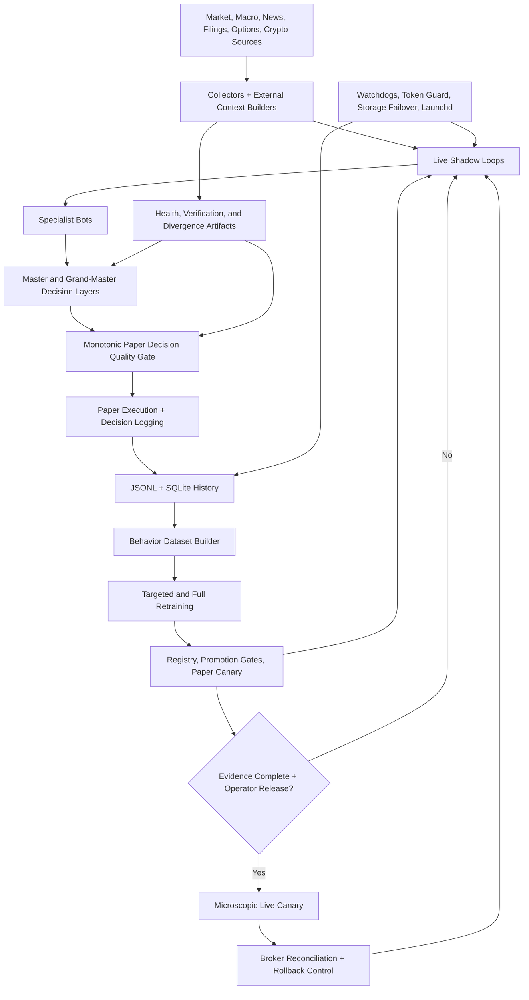

# Schwab Trading Bot

AI-assisted multi-sleeve algorithmic trading research and paper-execution platform built around live market ingestion, specialist bot orchestration, behavior-model retraining, operational safety controls, and auditable runbooks across Schwab and Coinbase workflows.

This repository is the working system used to build, test, document, and operate a trading automation platform with GPT/Codex-style engineering tools in the loop. The emphasis is practical: shipping features in a real codebase, maintaining source-of-truth docs, adding tests, debugging broker/auth flows, and keeping operator commands reproducible.

**Technical focus:** AI-assisted software engineering, GPT/Codex tools, Python, algorithmic trading, quantitative research, signal generation, market data ingestion, paper trading, risk metrics, Sharpe ratio, Sortino ratio, JSONL event streams, SQL, automation, testing, and GitHub documentation.

## Showcase

- Local Crypto workspace: [operations guide](docs/operations/CRYPTO_WORKSPACE.md). The live-feed dashboard's `/crypto` section provides cached read-only Coinbase holdings, bounded BTC day/swing historical research, modeled performance, and readiness evidence. It cannot trade, transfer, train models, admit a paper cohort, or unlock live money.
- Schwab crypto market context: the existing crypto collector adds read-only BTC/ETH futures and fund quotes with instrument identity, producer timestamps, spread and return features. Futures and fund share prices never enter spot-price agreement or Coinbase practice fills. Direct Schwab spot crypto remains unverified; market data grants no execution or training authority.

- Showcase index: [docs/showcase/README.md](docs/showcase/README.md)
- Auto-refreshed highlights: [docs/showcase/generated/highlights_latest.md](docs/showcase/generated/highlights_latest.md)
- Data source catalog: [DATA_INGESTION_SOURCES.md](DATA_INGESTION_SOURCES.md)

## What This Demonstrates

- Hands-on AI-assisted software engineering on a live Python trading automation codebase.
- Practical use of Codex/GPT workflows for refactoring, test creation, documentation, CI guardrails, and operations cleanup.
- Algorithmic trading infrastructure across signal generation, market data ingestion, paper trading, portfolio/sleeve orchestration, and risk-aware promotion gates.
- Production-style repository hygiene with source-of-truth docs, repeatable commands, smoke tests, secret scanning, and dependency checks.
- Auditable operational telemetry through JSONL event streams, generated health reports, and durable runbooks.

## System Map


```mermaid
flowchart TD
    A["Market, Macro, News, Filings, Options, Crypto Sources"] --> B["Collectors + External Context Builders"]
    B --> C["Live Shadow Loops"]
    B --> D["Health, Verification, and Divergence Artifacts"]
    C --> E["Specialist Bots"]
    E --> F["Master and Grand-Master Decision Layers"]
    F --> Q["Monotonic Paper Decision Quality Gate"]
    Q --> G["Paper Execution + Decision Logging"]
    G --> H["JSONL + SQLite History"]
    H --> I["Behavior Dataset Builder"]
    I --> J["Targeted and Full Retraining"]
    J --> K["Registry, Promotion Gates, Paper Canary"]
    K --> C
    D --> F
    D --> Q
    L["Watchdogs, Token Guard, Storage Failover, Launchd"] --> C
    L --> H
    K --> M{"Evidence Complete + Operator Release?"}
    M -- "No" --> C
    M -- "Yes" --> N["Microscopic Live Canary"]
    N --> O["Broker Reconciliation + Rollback Control"]
    O --> C
```

## Production Readiness

As of **2026-08-22**, the system is operating as a guarded paper-trading and data-collection platform. Live market data, shadow evaluation, selective paper execution, reconciliation, monitoring, and bounded recovery are enabled; live orders remain locked. Runtime health and safety grades are not treated as proof of financial profitability.

| Surface | Current evidence | Meaning |
| --- | --- | --- |
| Formal live-money readiness | authoritative count in `governance/health/live_money_readiness_contract_latest.json` | any economic, training-quality, promotion, or runtime section below its required floor remains an explicit blocker |
| Profitability evidence firewall | authoritative structural and economic grades in `governance/health/profitability_evidence_firewall_latest.json` | all ten future-profitability hardeners are evaluated; candidate-bound evidence counts update on each refresh and cannot be relabeled |
| Generation-aware developmental profitability | accepted candidate events joined to candidate- and interval-bound post-cost outcomes in `governance/health/profitability_self_assessment_latest.json` | earlier accepted soak changes may drive bounded paper-only collection, replay, fill-evidence, labeling, and containment work; mixed or unbound history remains diagnostic, never earns current scope-validation credit, and cannot change size, loosen thresholds, promote, or authorize an order |
| Cumulative-soak generation attribution | G65-to-G99 and operator-selected comparisons in `governance/research/generation_behavior_attribution_latest.json` | candidate-stamped behavior is identity- and time-bound; older unstamped rows may be shown only as explicitly non-promotion-grade time-window context, missing evidence stays missing, intervening changes and market regime remain confounders, and no comparison grants order or live authority |
| Current-generation historical fill learning | G104-owned offline challenger dataset in `governance/research/generation_fill_learning_latest.json` plus compact learning and quarantine JSONL files | exact candidate metadata or decision receipts preserve each source generation; legacy unbound rows never train, simulated expected fills are low-weight pretraining rather than empirical profitability, chronological and generation-holdout validation are required, and no historical row earns G104 forward evidence, soak credit, promotion, runtime swap, or order authority |
| Six-pillar transition runway | authoritative count in `governance/health/live_canary_readiness_contract_latest.json` | every pillar keeps its own blockers and evidence floor; no headline health grade substitutes for them |
| Sealed live-execution rehearsal | `14/14` structural controls and ten negative-path probes in `governance/health/live_execution_rehearsal_control_latest.json` | binds candidate, account, broker snapshot, policy, quote, intent, and broker payload; live mutations are one-shot and ambiguous outcomes require reconciliation; the rehearsal uses no broker client or order authority and does not substitute for live-release evidence |
| Production-excellence proof | authoritative count in `governance/health/production_excellence_control_latest.json` | only candidate-bound, independently evidenced pillars count; elapsed time and missing evidence cannot be relabeled |
| Hierarchical institutional decision flow | v4 policy in `config/institutional_decision_flow_v1.json`, hash-bound per-profile playbooks, ten-stage outcome traces, position-aware action semantics, candidate-bound quantitative evidence, execution-lane receipt validation, and a shared live-feed operator summary | every sleeve resolves its objective, horizon, entry, exit, sizing, regime, cost, validation, transition, and stage-priority contract once; paper and future live consume that same thesis, missing or adverse evidence remains explicit, playbook drift fails closed, and the layer never grants promotion or order authority |
| Candidate-bound quantitative challengers | eight-method policy in `config/quantitative_challengers_v1.json` and report in `governance/research/quantitative_challenger_latest.json` | sequential inference, SPA/Reality Check, Bayesian Sharpe utility, constrained Kelly, entropy pooling, optimal stopping, CPCV/triple barriers, and cost-aware expert aggregation use only current-candidate post-cost series; results are read-only research metadata with zero action, sizing, allocator, label, promotion, or order authority |
| Alpha concept laboratory and sleeve toolbox | 16 deterministic engines, 128 canonical concepts across 16 families, and explicit routes for all 111 sleeves in `governance/research/alpha_concept_report_latest.json` and `governance/research/sleeve_alpha_toolbox_latest.json` | existing diagnostics plus time-ordered conformal calibration, Page-CUSUM drift, residual redundancy, regime lower bounds, and cost-stress survival fail closed on missing current-candidate evidence; full route coverage is not alpha evidence and grants no runtime authority |
| Institutional capability contract | six separate implementation, paper-soak, candidate-evidence, and live-promotion pillars in `governance/health/institutional_capability_control_latest.json` | a planning target of `15-30` authoritative provider families replaces vanity source counts; shared snapshots and derived features do not earn extra readiness credit, while optional paid depth is conditional on an activated strategy family |
| Authoritative systems contract | exactly 39 public primary references mapped to 18 executable local controls in `governance/health/authoritative_systems_control_latest.json` | structural A+ and external-evidence counts are separate; synthetic probes cannot imply native protocol access, trusted provenance, independent pricing proof, profitability, promotion, or live-order authority |
| Research data platform | ten bounded contracts, 10 canonical products, and 15 decision-family mappings in `governance/health/research_data_platform_control_latest.json` | catalog, licensing, point-in-time queries, bitemporal revisions, alpha lifecycle, source value, portfolio advice, simulation events, feed SLOs, and reproducibility share receipts while implementation, earned evidence, profitability, and live authority remain separate |
| Institutional research extensions | eight executable advisory controls and ten official public firm references in `governance/health/institutional_research_extensions_control_latest.json` | factor attribution, incident ownership, material-change review, candidate risk schedules, speed-cost abstention, DAG checkpoints, immutable dataset versions, and cross-engine valuation are routed consistently; structural `8/8` does not manufacture candidate evidence or order authority |
| Investor-readiness proof | 20-control status counts in `governance/health/investor_readiness_control_latest.json` | implementation, organic candidate/live evidence, and external attestations remain separate; no blended percentage or self-issued review is allowed |
| Frozen candidate | content fingerprint, per-file manifests, generation, accepted Git head, scope clocks, and hash-chained change evidence in `governance/runtime/production_candidate_state.json` | the declared runtime-source inventory must have complete scope coverage; new, modified, and deleted source is detected dynamically, unaccepted drift pauses clean evidence and blocks commits, and only explicit operator-reviewed acceptance creates the next generation |
| Scope-aware candidate validation | canonical tiers in `config/candidate_scope_validation_v1.json` and current receipt in `governance/health/continuous_soak_integrity_control_latest.json` | operations require 72 hours plus three completed XNYS sessions; data/dependencies require 120 plus five; promotion requires 336 plus ten; strategy/execution/risk retain 720 plus twenty; both measures must pass and no grade grants live authority |
| Microscopic canary contract | advisory stages in `config/live_canary_micro_policy_v1.json` plus a short-lived candidate-bound runtime allowlist | live entries fail closed on absent, expired, stale-candidate, out-of-stage, or deprecated-symbol admission; the contract never creates an allowlist or grants execution authority |
| Post-canary closeout and graduation | append-only receipts in `governance/evidence/live_canary_closeout_receipts.jsonl` plus `governance/health/live_canary_graduation_latest.json` | each allowlist permits at most one new entry while preserving verified reduce-only exits; broker order state, exact account position, isolated cash movement, costs, identity, regime, and safety evidence must reconcile before a closeout counts, and neither a first fill nor a profitable trade can automatically unlock another order, stage, or capital tier |
| Symbol lifecycle | canonical replacements in `config/symbol_lifecycle_v1.json` | collection normalizes renamed tickers, while live submission rejects deprecated symbols instead of silently changing an order |
| Recovery | `10/10` isolated, non-destructive recovery drills pass | auth, broker network, process, reboot, disk, storage, memory, database, market-data, and order-lifecycle failures are covered |
| Storage continuity | pinned local-durable route with online SQLite snapshots | snapshots can be taken while active database writers remain online |
| Ten-part resilience control | authoritative counts in `governance/health/production_resilience_control_latest.json` | implementation, unattended paper-soak readiness, and live-promotion evidence are graded separately; the control never authorizes orders |
| Organic collector mesh | `34` formal collector contracts, including the governed twelve-plane macro/micro context mesh, `10` organically tracked source/evidence additions, and `8` capability-proof research contexts | context, point-in-time lineage, and candidate fill evidence accrue from real producer output; collectors have no order or automatic-promotion authority |
| Public economic source registry | `35` direct source contracts plus `32` expanded official central-bank members, routed across real producers, capabilities, decision planes, and families | inventory is machine validated and source failures are isolated; source count is never treated as alpha, readiness, profitability, or promotion evidence |
| Capability materialization | `4/4` direct receipts over exchange calendars, point-in-time session state, a `10`-root derivative contract master, and `4` versioned stress-scenario identities | formerly hard capability gaps are source-backed and freshness guarded; the materializer has no fetch, execution, registry-mutation, or promotion authority |
| Decision-aligned ingestion routing | `25` versioned data planes, `260` logical capabilities, `15` decision families, family-specific paper/live evidence tiers, quality-scored shared producers, independent failovers, and signed bot/runtime route receipts | every organized bot and runtime sleeve receives a bounded data plan matched to its decision playbook; paper qualification debt, live enrichment debt, and optional research context remain separate, while routing has no signal, order, or promotion authority |
| CPU and MLX workload isolation | locked policy in `config/cpu_workload_policy_v1.json`, launcher workload markers, Apple Silicon profile evidence, and pressure-aware MLX routing | the M1 Max keeps one of eight P cores reserved, exposes seven bounded shared critical workers and two support workers, protects execution/decision classes from support-lane demotion, and never claims unsupported macOS hard affinity; MLX efficiency changes require output parity plus measured latency/memory improvement and never count as profitability proof |

The candidate-specific review boundary is generated from the latest accepted scope windows in `governance/runtime/production_candidate_state.json` and reported by `governance/health/production_excellence_control_latest.json`; it is never a hard-coded calendar promise or automatic permission to trade. Clearance still requires the unchanged-candidate time windows, independent fill calibration, a sealed unseen holdout, cash and passive benchmark outperformance, acceptable risk-of-ruin stress, qualified promotion candidates, positive post-cost expectancy across independent days and symbols, profitable-sleeve diversity, bounded concentration, successful paper-canary cohorts, and explicit operator release. Until all gates pass, `MARKET_DATA_ONLY=1` and `ALLOW_ORDER_EXECUTION=0` remain the intended posture.

`governance/health/source_mutation_guard_latest.json` is the durable source-integrity receipt. The guard derives protected paths from the candidate scope policy and accepted manifests, so a newly added or deleted runtime file cannot escape a static list. Periodic readiness refreshes and the system drift mesh republish the receipt. The repair autopilot may refresh evidence, but it may never accept source drift, rewrite a candidate event, or restore soak credit without an explicit reviewed candidate acceptance.

The headline main-soak counter includes cumulative segmented wall-clock history and preserves per-scope ages across accepted resets, so reviewed hardening work does not erase the system's total soak exposure. The same artifact publishes a separate scope-aware promotion receipt. The cumulative count supports diagnostics and operational-maturity review, but it is not heartbeat, uninterrupted-uptime proof, or promotion credit. The current candidate must satisfy every applicable elapsed-time and completed-XNYS-session tier; strategy, execution, and risk still require the full `720` hours. `./scripts/ops/opsctl.sh generation-behavior-attribution --from-generation 65 --to-generation 99 --json` compares accepted generations while labeling candidate-stamped and legacy time-window evidence separately; the comparison is associational, never causal proof.

`./scripts/ops/opsctl.sh generation-fill-learning --target-generation 104 --apply --json` builds the G104-owned historical-fill challenger dataset. Older fills retain their original verified source generation; unbound history is quarantined instead of inferred from dates. The resulting dataset is eligible only for offline challenger learning after point-in-time validation, feature lineage, and training-quality gates pass. See [GENERATION_FILL_LEARNING.md](docs/architecture/GENERATION_FILL_LEARNING.md).

The connected read-only canary rehearsal now refreshes tax, release, and order-ledger observations before fetching the time-sensitive account and quote evidence. Owner refresh failures remain explicit blockers; a fresh report cannot certify an unreleased worktree. Existing evidence expiry, operator approval, trading locks, and release requirements are unchanged. See [LIVE_CANARY_RUNBOOK.md](docs/operations/LIVE_CANARY_RUNBOOK.md).

The separate read-only buy-and-hold test scope includes `SCHD` and `O`. Rehearsal reports identify test membership without changing live stage eligibility: `O` can be inspected with `--symbol O` but remains blocked for live-canary admission. This adds no orders, ex-dividend trading, strategy activation, or limit changes.

The transition contract is:

`collect -> signal or no-trade -> paper execution and replay -> out-of-sample evidence -> broker/risk/promotion gates -> operator-approved microscopic live canary -> broker/position/cash closeout -> reconciled round trips and economic gates -> operator-reviewed stage or capital proposal, or rollback`

Paper and live evaluation are parallel safety lanes. A live order is never authorized merely because the same opportunity produced a paper fill, and choosing no trade is a valid outcome.

The current paper-promotion experiment is deliberately narrower than the research fleet. The broad fleet keeps collecting and producing shadow decisions, while only one manually selected stage may add paper exposure: currently `dividend / SCHD / sleeve::dividend_income::portfolio_consensus::v1`. The final trader boundary rejects any out-of-cohort entry but leaves verified reduce-only exits open. Promotion accounting separates all candidate research from the active stage, models fills from observed touch with explicit carry and cost decomposition, compares returns with cash, `SGOV`, and passive exposure, requires purged and embargoed out-of-sample evidence, and labels post-cost BUY/SELL/HOLD alternatives at 5m, 1h, and 1d. This changes the affected clean candidate window without erasing cumulative segmented soak history and does not enable live execution.

The future live lane consumes only a fresh promoted intent. It first reconstructs unresolved durable order state from broker truth, verifies current account positions, builds a short-lived release envelope sealed to the accepted candidate, pinned account, broker snapshot, risk policy, quote, intent, and exact broker request, then runs the final firewall before the ledger records a submit attempt. Place, cancel, and replace mutations are never blindly retried after possible dispatch; an absent or ambiguous response becomes reconciliation work. Reads may use bounded transient retries. In-place replacement remains disabled until amendment lineage is independently implemented and reviewed, so the initial canary uses cancel, reconcile, and a newly sealed intent. Run `./scripts/ops/opsctl.sh live-execution-rehearsal --json` for brokerless structural validation, then `./scripts/ops/opsctl.sh live-canary-dress-rehearsal --symbol SCHD --json` for a Schwab-connected read-only account, quote, cash, collateral, exact-payload, and reconciliation rehearsal. Neither command can mutate broker state or grant order authority. After any terminal canary fill, refresh Schwab account truth, preview `./scripts/ops/opsctl.sh live-canary-closeout --intent-id INTENT_ID --json`, append only an eligible receipt with `--capture`, and review `./scripts/ops/opsctl.sh live-canary-graduation --json`. The first entry spends the allowlist's only new-entry permit; a verified reduce-only exit remains available. Stage review requires at least three fully reconciled round trips across three independent days and two source-backed regimes with positive post-cost results, acceptable fill deviation, and bounded losses. Higher capital tiers add actual-fee, positive lower-confidence-bound, and benchmark-excess requirements. Every transition remains operator-reviewed and requires a newly sealed policy/release/allowlist boundary; no control scales capital or issues a follow-on order automatically. See [LIVE_EXECUTION_PATH.md](docs/architecture/LIVE_EXECUTION_PATH.md) and [LIVE_CANARY_RUNBOOK.md](docs/operations/LIVE_CANARY_RUNBOOK.md).

Before an approved paper intent reaches idempotency and queue publication, the institutional decision-quality layer resolves a versioned family and profile strategy definition for its sleeve. The receipt binds horizon, portfolio role, edge thesis, entry, exit, sizing, regime, costs, uncertainty, capacity, validation, shorting, and allowed position transitions, then checks data, signed consensus and regime, post-cost edge, execution feasibility, portfolio fit, quantitative evidence, and non-bypassable risk. A candidate-bound adapter attaches only current-generation direct sample, payoff, selection-bias, decay, and tail evidence; lifetime snapshots and stale artifacts cannot qualify a new generation. Paper may use a small bounded evidence probe when confidence-bound edge is not yet materialized and may collect missing or proxy-only evidence without fabricating a pass; direct adverse evidence can only tighten size. Future live requires the current strategy hash, direct passing family-required evidence, and fresh account-position-aware action semantics. Promotion and live execution revalidate the same receipt, evaluation digest, action, quantity, lifecycle eligibility, and freshness before the existing live firewalls run. Activation is documented as an accepted in-soak hardening event: cumulative segmented soak hours remain in the headline history, while changed scopes begin a new clean evidence segment for honest promotion accounting. See [INSTITUTIONAL_DECISION_FLOW.md](docs/architecture/INSTITUTIONAL_DECISION_FLOW.md).

An adjacent candidate-bound challenger report computes eight genuinely distinct research diagnostics outside the hot path: always-valid sequential sign evidence, family-level SPA/Reality Check, probabilistic Sharpe with Bayesian posterior utility, drawdown-constrained Kelly diagnostics, entropy-pooled downside scenarios, holdout optimal stopping, purged/embargoed CPCV with triple barriers, and transaction-cost-aware online expert aggregation. The runtime may display their availability and support counts, but those fields are intentionally excluded from active evidence axes, decision utility, quantity, labels, allocation, promotion, and order submission. A method can graduate only through a separately reviewed policy change after point-in-time, leakage-safe, candidate-forward, post-cost evidence. Run `./scripts/ops/opsctl.sh quantitative-challengers --json`; an `8/8` implementation count is not an `8/8` evidence result and does not imply future profitability.

The alpha concept laboratory adds sixteen measurement capabilities without multiplying runtime bots. Its finite ontology routes `128` materially useful concepts across forecast validation, feature integrity, causal transport, factor residuals, cross-sectional and time-series alpha, events, macro, derivatives, microstructure, portfolio capacity, adaptation, point-in-time data, tail risk, economic attribution, and conditional alternative data. The cold-lane diagnostics include information-coefficient term structure, effective breadth and transfer coefficient, hierarchical Bayesian skill, subsample stability selection, economic and factor decomposition, leave-one-environment-out DML, capacity/impact curves, decision-to-markout execution attribution, effective-dated security-master audits, time-ordered split conformal calibration, Page-CUSUM change detection, residual redundancy components, regime-stratified lower bounds, cost-stress survival, and cost-aware value-of-information ranking. Exact-candidate schema-v2 materialization now retains sleeve and strategy identity, records BUY/SELL/HOLD counterfactual paths, validates the post-cost additive identity, and runs purged and embargoed MLX walk-forward diagnostics. Counterfactual forecast evidence cannot count as realized profitability, capacity refuses volume proxies, and cross-sleeve allocation remains blocked until positive independent residual evidence clears multiple-testing, regime, cost, and capacity gates. The sleeve toolbox resolves every declared sleeve to an explicit policy family and routes each required evidence axis without generic fallback; no route is counted as alpha until current-candidate post-cost evidence passes. Run `./scripts/ops/opsctl.sh alpha-concepts --json` and `./scripts/ops/opsctl.sh sleeve-alpha-toolbox --json`; implementation and route coverage remain separate from candidate evidence and economic support. See [ALPHA_CONCEPT_MEASUREMENT.md](docs/architecture/ALPHA_CONCEPT_MEASUREMENT.md) and [GENERATION_BEHAVIOR_ATTRIBUTION.md](docs/architecture/GENERATION_BEHAVIOR_ATTRIBUTION.md).

The profitability crisis drill adds deterministic collapse-and-recovery diagnostics for the 2008 global financial crisis, the March 2020 pandemic liquidity break, and the 2023 U.S. regional-bank failures. Official event histories anchor each scenario, while the normalized spreads, volatility, depth, latency, and return paths are explicitly labeled diagnostic parameters rather than reconstructed historical ticks. Every phase compares BUY, HOLD, and SELL_SHORT after modeled costs, exercises the current new-exposure gate, verifies that existing longs retain a reduce-only exit path, requires severe phases to block new longs, and requires a healthier recovery phase to reopen a positive post-cost BUY opportunity. Run `./scripts/ops/opsctl.sh profitability-crisis-drill --json` or select one scenario with `--scenario SCENARIO_ID`. An `A+` here grades the drill contract only: the artifact is diagnostic, cannot tune thresholds on its own, and is never organic profitability, promotion, or live-release evidence.

The bounded adversarial profitability pack extends that coverage with fourteen deterministic scenarios: regime-transition whipsaw, net-alpha break-even costs, full-fleet capital capacity, liquidity evaporation after a partial fill, correlation/crowding collapse, gradual strategy decay, point-in-time revision leakage, recovery re-entry timing, benchmark opportunity cost, horizon ownership conflicts, corporate actions and calendar boundaries, volatility-dependent missing data, false model consensus, and portfolio path dependency. Its capacity scenario resolves all `111` runtime sleeves, marks the `25` control-only sleeves not applicable, and builds twenty-two capital tiers from the `$200` canary through a `$1,000,000,000` long-range research endpoint for the `86` trading sleeves under six market states, including flash-crash dislocation and crowded exits. The `879` hot strategies and the `12,000`-strategy research library inherit only their sleeve's diagnostic curve until candidate-forward strategy-specific fills and costs justify a narrower one. Run `./scripts/ops/opsctl.sh profitability-adversarial-drill --json` or select one module with `--scenario capacity`. The suite starts no daemon, makes no network or broker request, submits no order, cannot tune thresholds, and cannot certify deployable capital or future profit. See [PROFITABILITY_ADVERSARIAL_DRILLS.md](docs/architecture/PROFITABILITY_ADVERSARIAL_DRILLS.md).

The paper behavior intervention pack turns twelve bounded defensive responses into an auditable candidate-bound proposal: stale-data and post-cost-edge abstention, evidence and horizon gates, liquidity/drawdown/loss-streak/crowding throttles, regime hysteresis, staged recovery, partial-fill inventory protection, winner-add discipline, and candidate-maturity scaling. Fourteen scenarios and seventeen cases must all earn `A+` before the existing paper-profitability controller may admit the proposal as an expiring `paper_probation` overlay. The drill cannot write runtime state, submit an order, enlarge an entry, create or reverse an action, or alter live execution; the runtime revalidates candidate identity and preserves `HOLD`, `SELL`, and reduce-only exits. Run `./scripts/ops/opsctl.sh paper-behavior-intervention-drill --json`. Synthetic drill improvement is mechanics evidence only; candidate-forward intervention-tagged post-cost fills must earn any economic claim. See [PAPER_BEHAVIOR_INTERVENTION_DRILLS.md](docs/architecture/PAPER_BEHAVIOR_INTERVENTION_DRILLS.md).

The unified trading behavior drill program now runs the crisis, adversarial profitability, and intervention suites under one candidate and policy receipt. It applies preflight authority checks, serialized bounded execution, mid-run candidate mutation detection, same-input regression comparison, compact run history, and one admission decision before the paper-profitability single writer can act. Run `./scripts/ops/opsctl.sh trading-behavior-drill-program --json`; see [TRADING_BEHAVIOR_DRILL_PROGRAM.md](docs/architecture/TRADING_BEHAVIOR_DRILL_PROGRAM.md).

The institutional-capability controller evaluates six practical local analogs: reproducible research, market-data lineage, independent execution evidence, selection-bias control, resource and role isolation, and market-access risk controls. It does not claim equivalence with an institutional firm and does not require thousands of feeds. The provider mesh should reuse a compact set of authoritative observations across sleeves, then derive features with explicit lineage; a derived feature is not a new source. Licensed order-book depth, news, estimates, borrow, venue replay, or other paid data remains a conditional entitlement with a named consumer and measured benefit. Run `./scripts/ops/opsctl.sh institutional-capabilities --json` and see [INSTITUTIONAL_CAPABILITY_CONTROL.md](docs/architecture/INSTITUTIONAL_CAPABILITY_CONTROL.md).

The sleeve strategy specialization layer materializes a deterministic contract for every active runtime and collection strategy, plus an on-demand research library of exactly `12,000` strategies across `111` sleeves. Every sleeve has `108` or `109` objective-appropriate hypotheses; the existing `879` contracts remain hot and the other `11,121` remain cold, dormant, and zero-authority. A read-only primary catalog consolidates those identities into `1,989` canonical records: the `879` native hot identities plus `1,110` cold parent families. Every original strategy ID remains a child receipt, variant evidence is never pooled, and all `12` configured conditions remain visible even when a condition was not materialized by the bounded 12,000-row generator. Each parent owns the thesis, signal, label, horizon, benchmark, and shared failure contract; each child owns its exact overlay, receipt, regime annotation, and evidence. The canonical `sleeve_economic_context_v1` contract requires every trading sleeve to earn positive objective-specific economic value after costs in its supported market context before separate capital consideration. It does not require all sleeves to activate or profit simultaneously: nonmatching sleeves collect, quarantine, or retire, while control-only sleeves retain no trading-profit objective. Fresh regime evidence can alter ranking and reviewed research admission, but cannot mutate intent, size, risk limits, history, promotion, or live authority. The scorecard calls a strategy good only after candidate-bound robust post-cost and objective-specific evidence, calls it bad only after mature adverse evidence, and labels missing evidence unknown rather than bad. Broad Grand Master votes remain `ensemble_champion` instead of receiving false named-strategy credit. Run `./scripts/ops/opsctl.sh sleeve-strategy-specialization --json` for control health, `./scripts/ops/opsctl.sh strategy-families --sleeve crypto_spot --limit 40` for the consolidated view, or `./scripts/ops/opsctl.sh strategy-library --sleeve crypto_spot --limit 40` for exact child variants. See [SLEEVE_STRATEGY_SPECIALIZATION.md](docs/architecture/SLEEVE_STRATEGY_SPECIALIZATION.md).

The strategy market-fit infrabot adds a bounded full-catalog check without making the cold library executable. Four infrastructure roles inspect all `12,000` contracts in batches, maintain five exact existing strategies across five signal families as shadow-only challengers, detect market-regime/ranking drift, and stop market-fit scores from being presented as profit. A fresh `thin` regime may rank research provisionally but cannot admit a challenger even to shadow observation; `proven_working_now` still requires candidate-bound positive post-cost evidence, a positive clustered lower confidence bound, and cost/liquidity/capacity clearance. The unattended path runs at low priority, caches unchanged source signatures, has no paper or live order authority, and does not reset the soak. Run `./scripts/ops/opsctl.sh strategy-market-fit --force` for a full scan. See [STRATEGY_MARKET_FIT_INFRABOT.md](docs/architecture/STRATEGY_MARKET_FIT_INFRABOT.md).

The authoritative systems layer converts 39 official public references into 18 local controls. The original execution and evidence contracts now sit beside ITCH/OUCH-inspired sequence integrity, Iceberg-inspired atomic archive snapshots, a TLA+ order-safety specification with bounded Python verification, SLSA-shaped build provenance, FINOS CDM-inspired trade lifecycles, Strata-inspired independent risk reconciliation, CVXPortfolio-inspired constrained multi-period advice, Great Expectations-inspired declarative checkpoints, a Trexquant-inspired research-data control plane, and the eight institutional research extensions derived only from public material. These are locally owned patterns, not installed exchange gateways or institutional services. Synthetic probes prove structure only; TLC receipts, signed CI attestations, real external oracle observations, candidate-bound portfolio outcomes, source-value evidence, and institutional-extension evidence remain explicit debt. The layer adds no order authority. Run `./scripts/ops/opsctl.sh authoritative-systems --json`; see [AUTHORITATIVE_SYSTEMS_CONTROL.md](docs/architecture/AUTHORITATIVE_SYSTEMS_CONTROL.md).

The research data platform gives every sleeve route a bounded catalog identity while preserving the existing route's authority. Ten contracts cover product ownership and lineage, permitted use, deterministic point-in-time queries, bitemporal revisions, evidence-gated alpha lifecycle transitions, candidate-bound source value, constrained portfolio advice, common simulation events, per-product feed SLOs, and content-addressed reproducibility. Every decision family receives point-in-time feature and candidate-outcome product identities, but missing terms reviews or candidate outcomes remain visible evidence debt instead of fabricated readiness. Run `./scripts/ops/opsctl.sh research-data-platform --json`; see [RESEARCH_DATA_PLATFORM.md](docs/architecture/RESEARCH_DATA_PLATFORM.md).

The institutional research extension layer adds eight advisory controls using only official public design provenance from Point72/Cubist, AQR, Man Group/AHL, Two Sigma, D. E. Shaw Research, and Goldman Sachs. Candidate-bound factor diagnostics, named pipeline incidents, material-change classes, risk schedules, execution speed-cost frontiers, receipt-invalidating research DAGs, immutable time-travel manifests, and distinct-engine valuations are attached to decision routes as metadata only. ArcticDB is not installed or adopted as a production dependency; its current production licensing requires separate review. The livefeed and self-model report structural `8/8` separately from organically earned evidence, preserve cumulative soak history, require affected scopes to accrue forward, and retain zero signal, sizing, paper-order, live-order, or promotion authority. Run `./scripts/ops/opsctl.sh institutional-research-extensions --json`; see [INSTITUTIONAL_RESEARCH_EXTENSIONS.md](docs/architecture/INSTITUTIONAL_RESEARCH_EXTENSIONS.md).

The advisory microscopic-canary ladder starts with one share and one position at a time under the lower of the production firewall and the `$200` plan limits. The current stage-one plan binds `SCHD` to the operator-verified Roth IRA policy; existing Roth cash is the only assumed funding source, and a Roth-specific attestation adds retirement loss-capacity, contribution-capacity, and cross-account wash-sale review. That `$200` is an execution-validation envelope, not an income target or permanent portfolio size. Future deposits may increase account equity, but account growth alone cannot increase strategy weight; every increase still requires post-cost, drawdown, risk-of-ruin, capacity, diversification, paper/live-divergence, clean-window, and explicit operator-release gates. Daily and cumulative realized-loss budgets are candidate-bound, and cumulative state survives a live-process restart. Opaque Schwab account hashes are discovered only for operator-verified last-four aliases, stored in the macOS Keychain, and selected in memory by the canary account policy; raw account numbers and hashes do not enter tracked config or health artifacts. Each allowlist must name the exact accepted candidate, designated account policy, route, account-reference digest, and operator-attestation digest; expire in the future; stay inside its approved stage; and pass production-excellence and transition-integrity gates. A live entry additionally requires fresh broker-visible and operator-confirmed settled cash, restriction review, an affirmative risk decision, fresh Schwab quote provenance, a one-share cent-valid limit order, clean order state, a matching immutable release manifest, tax review, and an open XNYS session outside auction buffers. Account binding, candidate acceptance, the preflight receipt, and the allowlist cannot arm execution or turn off market-data-only mode. See [LIVE_CANARY_RUNBOOK.md](docs/operations/LIVE_CANARY_RUNBOOK.md).

The investor-readiness layer implements the 20 engineering controls needed to organize an investable evidence package: broker-verifiable results, net-of-cost accounting, drawdown and statistical controls, capacity, diversification, immutable records, bounded automation, resilience, defensibility, qualified sleeve selection, experiment lineage, soak completion, paper/live divergence, predetermined scaling, tear sheets, independent reviews, a data-room index, and legal-structure review. It generates a strictly labeled paper tear sheet and indexes missing evidence instead of inventing it. The framework is documented in [INVESTOR_READINESS_FRAMEWORK.md](docs/operations/INVESTOR_READINESS_FRAMEWORK.md) and never grants live execution, allocation, promotion, marketing, customer-funds, legal, or profitability authority.

Unattended evidence maintenance uses two serialized cadences: the bounded `accrual` profile maintains organic collection every 15 minutes, and the bounded `production` profile refreshes the ten-pillar owner surfaces every 45 minutes. The production cadence covers risk inputs, reconciliation, recovery drills, remote alerts, security, immutable evidence, backup/restore, blackstart, promotion, profitability, canary, and derived readiness controls. Its training and profitability evidence is rebuilt through the dependency-closed `training-profitability` graph while holding the paper-profitability generation lock for the entire epoch, so an accrual writer cannot interleave mutable `latest` publications or create mixed-epoch proof. The same profile owns storage, live-feed, project, drift, architecture, and infrastructure-supervisor evidence, then republishes the self-model and architecture graph after supervisor convergence so stale parent state cannot survive a successful repair cycle. Replay-fill capture retains previously materialized immutable rows, limits work to unmatched orders, prunes irrelevant date partitions, and tails active observation files under a per-file byte budget. Normal dashboard reads use a separate bounded hot-state `dashboard` profile. A full dependency-closed runtime refresh remains an explicit reconciliation operation rather than a dashboard side effect. Every profile forces market-data/paper-only environment locks and has no training-launch or live-order authority.

The collector mesh now formalizes ten additional observation-only streams: bond reference, dividend/DRIP state, macro cross-asset context, central-bank/Fed-liquidity context, public-policy context, Schwab symbol news, ticker-news context, point-in-time events, feature-store lineage, and candidate fill replay. Organic readiness reaches `100` only when every stream is fresh and its real evidence target is met; no collector may rewrite historical outcomes, promote a bot, or authorize an order.

Eight additional research-context collectors cover cross-asset breadth, tape liquidity, options Greeks and volatility surfaces, futures curves, earnings events, portfolio factor risk, FINRA fixed-income TRACE aggregates, and BIS global liquidity. They run through one bounded refresh process, reuse shared decision/account/source snapshots, publish independent capability receipts, and omit unsupported dimensions instead of zero-filling them. A collector can be healthy while an unproven capability remains unavailable; stale, tampered, or authority-bearing snapshots are rejected by runtime training. BIS is credential-free, while FINRA remains optional and requires a public OAuth bearer in `FINRA_API_ACCESS_TOKEN`. Run `./scripts/ops/opsctl.sh research-context-sync --all --json` to refresh the set.

The capability layer organizes those physical producers into 25 logical planes spanning instrument identity, market state, fundamentals, events, broker and execution truth, risk, training, evidence, governance, and operational health. Its v2 route policy maps every bot and runtime sleeve to the same 15 families used by the institutional decision flow. Paper requires the compact capability set needed to qualify a bounded decision; live additionally requires family enrichment, a higher quality floor, and independent failover evidence. Producers are selected by authority, collector quality, freshness, proof, source coverage, error budget, and payload integrity. Logical capabilities remain subscriptions rather than processes, and every binding and decision-route summary carries a signed receipt. The shared transport enforces bounded payloads, transient-only retries, `Retry-After`, redacted URLs, watermarks, dead letters, and payload digests across both sync and bounded async callers.

### Global Central Bank And Fed Liquidity Context

The decision-critical macro path now collects official Fed/FRED and New York Fed series for total assets, reserve balances, Treasury cash, overnight repo and reverse repo, central-bank swaps, Treasury and MBS holdings, SOFR, EFFR, OBFR, IORB, the policy corridor, NFCI, adjusted NFCI, the St. Louis Financial Stress Index, the monetary base, and M2. Official Federal Reserve and Treasury calendars/news remain event context alongside those numeric series.

The collector publishes 25 normalized features covering balance-sheet levels and impulses, the net-liquidity impulse, expansion versus tightening, funding-rate spreads, policy-corridor width, funding stress, and financial conditions. `Fed total assets - Treasury General Account - overnight reverse repo` is explicitly labeled a market-liquidity heuristic, not an official accounting identity or a standalone trade signal.

A separate governed registry now covers 32 important central banks across three tiers. BIS member-reported policy-rate history and official national central-bank total-asset data are normalized without forcing exchange-rate or multi-instrument frameworks into a fictional policy rate. The cross-source router joins each bank by jurisdiction, currency, and observation time to ECB FX references, canonical FX reconciliation, World Bank sovereign macro data, verified official events when available, detailed U.S. dollar liquidity, and macro cross-asset context.

A raw bank row cannot certify its own synchronization. Every routed bank needs a fresh point-in-time link from at least one distinct source, and every usable field carries origin, publisher reference, artifact timestamp, economic observation time, confidence, and freshness. Future values are excluded, stale dimensions are omitted, and hard provider conflicts block the affected bank route. Symbol-scoped evidence is consumed consistently by paper decisions, runtime gap fill, and behavior-dataset schema `trade_behavior_features_v6`.

Required daily, weekly, and monthly series have cadence-aware freshness limits. Observations dated after the collection as-of date are recorded as excluded and cannot become decision features. Paper runtime, runtime gap-fill, behavior-dataset construction, source verification, and training-label routing all use the same fail-closed consumer contract: the artifact must be under 24 hours old, have complete fresh required-series coverage, contain the full numeric feature schema, declare point-in-time methodology, and select no future observation. Later context sources cannot erase valid earlier features through zero-filled merges.

Run `./scripts/ops/opsctl.sh macro-context-sync --json` to refresh the full dependency order, or use `global-central-bank-sync` and `central-bank-context-sync` separately. Then run `./scripts/ops/opsctl.sh source-verification --json` to inspect the independent contracts. These contexts are observation and risk evidence only: they cannot authorize an order, promote a bot, unlock live execution, or guarantee profitability. Detailed behavior is documented in [CENTRAL_BANK_LIQUIDITY_CONTEXT.md](docs/architecture/CENTRAL_BANK_LIQUIDITY_CONTEXT.md) and [GLOBAL_CENTRAL_BANK_CONTEXT.md](docs/architecture/GLOBAL_CENTRAL_BANK_CONTEXT.md).

The synchronized decision-context layer adds six macro planes (fiscal liquidity, funding stress, cross-border capital, credit curves, market calendars, and supply/inventory) and six micro planes (positioning, securities lending, volatility surfaces, passive flows, estimate dispersion, and capacity/impact). It reuses existing official and market artifacts, adds direct Treasury TIC, EIA weekly inventory, BTS freight, and governed analyst-consensus evidence, routes valid global and symbol features into paper decisions and training, and publishes separate evidence-derived percentages. Freshness earns full credit only inside each source's actual publication cadence, then decays to a hard staleness SLO. Run `./scripts/ops/opsctl.sh decision-context-sync --json`; see [DECISION_CONTEXT_MESH.md](docs/architecture/DECISION_CONTEXT_MESH.md). The estimate plane remains capped at `B+` unless `analyst-consensus-sync` proves the exact governed membership with `16/16` fresh symbols and revision histories; public Nasdaq forecasts remain personal research/paper context until commercial or live data entitlements are separately verified.

The optional public-financial collector adds seven official evidence families: SEC issuer fundamentals, OFR systemic stress, FDIC bank-failure events, Federal Register financial-policy activity, ECB euro funding conditions, New York Fed primary-dealer balance-sheet/funding data, and FDIC quarterly aggregate bank financials. Existing Treasury auction collection now rejects future rows and exposes bid-to-cover demand, indirect demand, dealer absorption, and issuance pressure. A machine-readable taxonomy routes every emitted feature by evidence type, entity and geographic scope, market domain, cadence, semantic direction, decision plane, decision family, and authority. Runtime and training consumers enforce those family routes, unclassified features are quarantined, supplemental failures cannot lower the five-source baseline status, and missing values are omitted rather than zero-filled. Run `./scripts/ops/opsctl.sh economic-source-inventory --list` for the complete source map and `public-financial-sync --json` to refresh the collector; see [ECONOMIC_SOURCE_REGISTRY.md](docs/architecture/ECONOMIC_SOURCE_REGISTRY.md) and [PUBLIC_FINANCIAL_CONTEXT.md](docs/architecture/PUBLIC_FINANCIAL_CONTEXT.md).

The grade regression autopilot is targeted and idempotent: a healthy cycle is a no-op, while a degraded surface receives only its allowlisted repair. Missing or incomplete restore receipts invoke the native, resource-gated retained-archive verifier before storage resilience and ingestion assessments; successful recovery preserves the original proof age and does not constitute a new backup. Owner deferrals remain visible. It cannot embed the full evidence graph in its frequent loop, preventing a maintenance timeout from turning a green runtime into a partially refreshed one.

The lock watchdog preserves kernel-lock file inodes, including idle files without PID text and files with historical PID metadata. Kernel locks release when their handles close; unlinking their path can let two scheduled owners acquire different inodes. The watchdog probes actual ownership, reports unknown probes conservatively, and never unlinks an ambiguous lock marker. Cold evidence compression also stops if its held lock path disappears or changes inode.

The existing lifecycle backup compactor now uses the same lossless verification engine with gzip. It selects only named registry backups under `governance/lifecycle`, retains the newest 12 and the normal 24-hour/current-day exclusions, and requires stable idle sources, full decompressed SHA-256 verification, durable receipts, no-clobber archive publication, a shared storage lock, and fresh resource admission. Its native retention owner remains responsible for scheduling; a resource deferral is not successful compaction or full reserve readiness.

The native decision-log compactor preserves older logs with known incomplete or mismatched SQL checkpoints, including across UTC day rollover. It rechecks checkpoint identity before release, verifies every restored gzip byte against the original SHA-256, and requires a stable idle source and durable proof. Matching existing archives may be reused; conflicting archives are never overwritten. Current-day eligibility remains restricted, and neither a skipped file nor a deferred batch clears ingestion debt.

Storage quota accounting includes both canonical and local fallback SQLite shards, counting distinct resident copies while deduplicating aliases and hard links. Compressed-history deductions include safe gzip aliases using the tier inventory's resolved-path deduplication; raw targets cannot gain an archive exemption. This preserves archive capacity accounting and existing quota thresholds while preventing cold-history links from creating false live-log quota pressure.

Native workload-specific admission now separates observation, compression recovery, bounded maintenance and single-target training headroom. Fresh whole-host measurements and independent clear-time spans can admit bounded work despite overlapping CPU activity flags; stale readings and real pressure revoke extra capacity. Supervised maintenance holds a lifetime kernel lock, rechecks adaptive admission every five seconds, and preserves heavy-work quiet windows. The infrastructure launcher refreshes a bounded non-apply assessment before requesting expensive repairs. SQL reserves, data verification, training eligibility and trading gates remain independent. See [Workload Admission](docs/architecture/WORKLOAD_ADMISSION.md).

The shared cold/lifecycle compression guard automatically permits extra CPU headroom only during local reserve rebuilding below 125 GiB on hosts with at least eight logical CPUs. With fresh ready sensors, clear thermal/memory checks, no creative session/cooldown or protective/support hold, and host saturation at most 70, this lane allows foreground CPU below 150%, system CPU below 200%, their sum below 300%, and five-minute load at most 0.85 per logical CPU. CPU percentages count one core as 100%. The worker remains paced to 25% of one core, rechecks admission every second, and retains all operator holds, scratch/emergency reserves and verification requirements. Other workloads and storage-readiness thresholds are unchanged.

The guarded storage-maintenance lane explicitly accepts the retention work that ordinary one-pass SQL writers defer. Hot-retention calls in that lane use 1,000-row batches, at most 5,000 rows and 120 seconds per database, with no inline vacuum or archive expiry. Each archive batch budgets its payload, indexes and WAL above a 64 GiB free-space floor before source release. Ingestion success cannot hide a failed retention batch. The native compatibility-cache rebuild independently verifies every restored cold row, the staged database copy and source stability, preserves IDs and schema objects, and switches under the SQL writer lock. A shared storage lock, staged-space reservation and cooperative 1,800-second operation budget protect this path; interrupted work is not a completed rebuild. Source inspection is read-only and limited to 60 seconds, and optimization cannot modify the source database. These are native scheduling fixes, not Codex automations or trading authorization.

Storage-maintenance children have a 1,800-second process-group deadline with bounded cleanup, including stopped children. A timeout cannot reuse partial success or an older health receipt. The separate retention command disables both primary and archive vacuuming during routine passes; existing expiry policy is unchanged. Bounded compression selection skips busy or uncheckpointed archives before spending its wave budget, then rechecks idleness before replacement. Native SQLite compression limits each batch to 4 GiB and reserves a full 1,200-second verification window inside a 1,300-second child timeout. Isolated copying, compression and full-file verification do not hold the global SQL writer; only publication requests an owned hold, at most 60 seconds for handoff and 30 seconds for final checks and replacement, plus a 60-second expiry cushion. The actual writer lock, source identity, idle-file, reserve and durable-proof checks remain mandatory; an existing hold or failed handoff preserves the original. The shared recovery pass defers that batch when the complete work window will not fit. Cache rebuilds retain their separate full-operation handoff and require explicit matching-token authority to participate in an existing hold.

Explicit repair requests may opt into a bounded maintenance-slot wait with `MAINTENANCE_SLOT_LEASE_WAIT_SECONDS` (0 by default, at most 120 seconds). Waiting never displaces an owner or replaces its lock inode. Admission, holds, cooldowns and resource checks run afresh only after the kernel lease is acquired; the caller must budget the wait separately from child execution.

The cold archive has a dataset/month index (`ARCHIVE_INDEX.md`) and sorted CSV/JSON catalogs at its existing root. Successful native compaction refreshes this metadata within a five-second/15,000-entry scan; `cold-archive-compactor --index-only --apply` offers a 20-second/50,000-entry refresh. Partial scans are explicit. No archive moves, extra database service, symlink traversal, content re-verification or deletion authority are introduced. Dates come from filenames, and historical compression receipts are distinguished from current restore proof.

Full cold-row restoration checks can use the already-installed native MessagePack encoder to avoid repeatedly JSON-escaping payload strings. Explicit scalar types, binary/text distinction, 64-bit floats and row boundaries remain checked independently for source and restoration. Receipts identify the row encoding, with a domain-separated SHA-256 for the new format. Missing/native-unavailable MessagePack retains the original typed-JSON encoding; there is no new service or automatic dependency install, and no sampling or verification deadline relaxation.

Hot-cache rebuilds create the source's exact explicit indexes before copying rows, allowing SQLite to maintain them while each wide row is loaded. This avoids separate overflow-page scans for expression indexes and columns after large payloads. Partial, unique, collation and ordering definitions remain unchanged, and receipts identify `maintained_during_row_copy`. Source stability, full restoration, database integrity, page ceilings and live reserve checks still govern replacement.

Local storage uses a `125 GiB` warning target and a `135 GiB` recovery target by default, preventing repeated clear/retrigger cycles at the boundary. Cold-archive automation must use an explicitly configured non-protected route; an operator-reserved volume is rejected rather than silently selected. The normal guarded self-healing pass also invokes cold evidence compression toward its configured recovery target, so pressure relief at 64 GiB does not end reserve rebuilding.

The existing DuckDB analytics mirror reads stream and symbol summaries from one SQLite snapshot, closes that source connection, and publishes both tables in one DuckDB transaction. A failed refresh rolls back to the previous complete mirror. It remains an analytical cache maintained by the native operations coordinator, not an authoritative ledger or a new database service.

The database direction is to keep SQLite and DuckDB/Parquet for local operations and analytics, evaluate PostgreSQL for demonstrated concurrent-writer or multi-host needs, and defer Redis/NoSQL until a measured cache bottleneck justifies its freshness and invalidation responsibilities. PostgreSQL evaluation is not installation or migration; current capacity constraints prohibit unadmitted new services and migration copies. See [Database Direction](docs/architecture/STORAGE_AND_INGESTION_CONTRACT.md#database-direction) for the evaluation and authority boundaries.

The existing 15-minute native self-healing job now includes `cold-evidence-compactor` before heavy maintenance when internal storage is under pressure. Only idle, week-old JSONL/log history inside the fixed local quarantine cold root qualifies. Fitting smaller files rebuild scratch headroom before large files; full restored-byte SHA-256 proofs and durable receipts precede replacement. Work is limited to one paced worker, a 16 GiB minimum emergency reserve, fresh resource checks, and bounded shared deadlines. The pass then applies `local-storage-reserve-guard --reserve-only --skip-governor-reconcile`; this does not trim logs or bypass SQL admission. Existing minute-scale guarded backlog recovery can resume when the measured reserve and its other gates permit it. Database files, active paths, protected volumes, trading approvals, and promotion authority are unchanged.

SQL ingestion enforces storage admission inside both writer entry points, not only the scheduled launcher. Direct recovery requests and maintenance tokens cannot bypass a fresh disk check, the storage owner's published thresholds, or an explicit writer pause. Rejection publishes `sql_link_storage_admission_latest.json` without overwriting active-writer progress; the coordinator stops catch-up waves and reports `deferred_storage_pressure`, never successful drain credit.

The sharded writer rechecks admission before each new child, corruption retry, primary merge, and the following maintenance phase. Already-running children finish under their existing bounds; a storage-paused cycle retains committed progress and its focused request, excludes unstarted shards from completion counts, and exits deferred without starting later work. These checks do not reserve or predict an individual transaction's disk growth. Native cold SQLite recovery defaults to `--filesystem-compressor auto`, preferring the pinned local Applesauce backend when installed, then afsctool, then built-in ditto. Streaming compression admits inactive files below the pinned CLI's 4 GiB limit with a 3.5 GiB compressed-data ceiling, additional scratch reservation, a sampled 256 MiB child RSS ceiling and a quarter-core aggregate CPU budget shared by its threads (50 ms sampling bursts). Legacy backends retain their 2 GiB ceiling. Writer handoff, isolated physical copies, full restored hashes, SQLite checks and verified physical savings remain mandatory. External recovery preserves at least 64 GiB free; local emergency recovery preserves at least 16 GiB. No-copy-savings outcomes remain failures.

The compatibility-cache rebuild now distinguishes a pessimistic size estimate from a hard SQLite allocation ceiling. When capacity is tighter than the estimate, fresh local/external headroom may admit a capped attempt only when the observed hot payload fits. SQLite's verified `max_page_count` limits the staged main database; export reserves include that ceiling plus 256 MiB overhead. Live space checks, a 32 GiB local floor, a 64 GiB external floor, guarded copy chunks and unchanged source/restore checks remain mandatory. Exceeding the cap preserves the source and cannot earn recovery credit; the ceiling is not a promise that all tables and indexes will fit.

Storage-pressure recovery starts at the same boundary that pauses SQL writers. Its bounded sequence verifies rotated telemetry, compresses inactive cold SQLite copies with the selected verified backend, and offloads closed compressed history with durable restore proof and atomic original-path links. Explicit optional backends are checked before requesting a writer hold. These actions preserve data and reserve limits; a successful recovery wave is not proof of full platform readiness. See [Storage And Ingestion](docs/architecture/STORAGE_AND_INGESTION_CONTRACT.md).

Closed-history offload includes dated decision and governance JSONL gzip archives older than 24 hours, with destination headroom checked again before every adaptive move. Current-day, recent, raw, and undated files remain excluded. The collector storage guard updates registry policy and creates a backup only when that policy changes; fresh timestamps and disk measurements remain in its health receipt instead of creating a full registry backup on every assessment.

Storage recovery distinguishes a completed memory observation from permission to repair. A valid storage-pressure assessment does not consume the repair failure budget; stale, malformed, timed-out, or failed observations cannot admit recovery. Legacy misclassified observation circuits receive one fresh recheck with their prior state retained, while mutating repair circuits remain authoritative.

Bounded storage recovery also distinguishes disk-only yellow pressure from resident memory pressure. Admission requires the raw source observation to be no older than 90 seconds, disk-only reasons, at least 85% reported free memory, at most 8 GiB swap and 1 GiB resident compressor use, and zero throttled pages. This does not clear the yellow host verdict, release training or SQL writers, or relax archive capacity and maintenance holds.

The promotion packet builder's explicit `--bootstrap-local-signing-key` flow publishes a complete, owner-only (`0600`) key without overwriting existing keys. Protected routes, symlink keys, nonregular files, and oversized keys fail closed. Packet signatures establish local artifact integrity only: a signed idle-scope packet is not trained-candidate evidence, promotion approval, or permission for live execution.

Training price recovery scans are bounded by decompressed bytes, rows, and time and are deferred until needed by full-source readers. Incremental and seed scans share the worker deadline with a publication reserve and report partial coverage. The snapshot builder alone publishes its verified rows/manifest; the epoch coordinator records failure in a separate `.refresh_failure.json` receipt instead of replacing the last verified manifest with timeout or lock-status stdout. A retained manifest, changed mtime, or failed refresh cannot earn current-epoch evidence credit.

Risk-evidence refresh scheduling uses the One Numbers measurement timestamp, not file modification time. The requested interval is capped at half the execution breaker's freshness budget, including off-hours; missing, invalid, future, or pre-auth measurements request a guarded rebuild. Resource and maintenance admission still apply, so this schedule is not a freshness guarantee or execution unlock. Paper reporting publishes unmeasured day/week changes as `null` (unavailable), including downstream truth ledgers, operator summaries, and period charts. Historical inventory remains visible without becoming a current-period return.

The process watchdog also respects the SQL writer owner's storage pause and maintenance hold before attempting restarts. Existing restart history is retained; deferred work is never relabeled as healthy ingestion.

Native full storage recovery also offloads old named registry backups, retaining the newest backup per producer family locally. Full copy hashes and durable restore receipts precede original-path archive links. Closed gzip history keeps a 24-hour automatic offload age; an explicit operator `--closed-history-min-age-hours` changes only offload eligibility, never current-day/raw-file eligibility, retention expiry, storage reserves or trading gates. Linked history requires the archive drive to remain attached.

Catch-up evidence now rejects checkpoints that the writer would reset after source replacement, truncation or timestamp rewind; the file selector also treats those sources as pending. During an already-admitted material raw-live focus, each requested shard can reserve one existing source slot for a sub-threshold tail older than 30 minutes. Tiny tails alone cannot activate that priority override, and source-slot, worker and storage bounds remain unchanged.

The existing data shard also accepts the exact cold-archive compaction manifest path observed by the backlog census, without opening arbitrary archive history or merging it into the primary cache. Allocator, archive, regime, research and risk receipts already owned by the governance shard participate in bounded priority selection; existing governance exclusions and specialized routes remain authoritative. A selected receipt is not evidence that its referenced archive has been restored or verified.

Routine JSONL ordering now reserves one existing second-position slot per lane for the oldest pending source whose valid checkpoint observation or unchanged source timestamp is at least 30 minutes old, even when the first-ranked source is also overdue. The first-priority file and separate core/deferred/cold quotas remain unchanged; this observation age is a scheduling signal, not measured ingestion latency. The census exposes it separately as `checkpoint_service_age_seconds`; reset, invalid, EOF or journal-advanced checkpoints cannot supply stale observation age. API/ingress handoffs use this signal to retain one overdue source inside each already-selected lane's existing path cap, without adding a shard or displacing its only slot. Backlog counts, global priority activation, writer, byte, reserve and trading limits remain unchanged.

SQL ingestion journals and their derived indexes are recovery inputs, not source payloads. The shared writer filter excludes the two owned journal path families even under explicit focus, matching the backlog census boundary. Their original files and checkpoint recovery remain intact; normal events, archive receipts and ingestion health snapshots remain eligible. This prevents journal writes from recursively generating more SQL ingestion work without changing measured backlog counts or deleting history.

Native write-path recovery now distinguishes fresh writer admission, verified path health, and historical record reconciliation. Existing SQL and artifact-refresh schedules run bounded per-path requests, owner fsync/read-back checks, exact record-hash reconciliation and independent 60-second probation. Unresolved history survives daily rollover; six unsuccessful checks escalate with backoff. Missing historical payloads and unsupported proofs remain unresolved. No trade replay, new scheduler, reserve relaxation or trading release is implied. See [Write-Path Recovery](docs/architecture/WRITE_PATH_RECOVERY.md).

Routine NVIDIA covered-call roll-window notifications use six-hour reminders and stable material-change signatures. Quote noise and daily DTE changes no longer trigger repeats; contract, coverage, quantity, risk-category and urgency changes remain visible immediately. This changes notification delivery only, not the underlying health severity or trading controls.

The walk-forward seed producer preserves the existing queue inode and modification time when a bounded-buffer, full-byte comparison finds unchanged content and a stable source identity. Changed queues still publish atomically after fsync. This prevents redundant source generations without granting ingestion or coverage credit.

Health histories that do not match the fast-health shard's normal filters retain their normal governance owner during focused drains. Once material raw-live work is already admitted, a small overdue receipt in deferred accounting can use governance's existing single tail slot. Separate checkpoint service age can schedule this slot even while a receipt keeps appending; it does not redefine event lateness. Only sources accepted by normal governance filters qualify; no new shard, sentinel replacement, standalone deferred activation or larger work budget is introduced.

Loop-state channel files also retain their normal governance or crypto-governance owner during focused drains; runtime channels remain with runtime owners. Existing deferred accounting can supply an overdue loop-state file to that owner's already-budgeted tail slot after material admission. Normal filter checks, selected-shard scope and source/byte/worker limits remain intact.

Each sequential SQL writer pass lazily reuses one integrity-checked ops receipt connection. The existing full SQLite quick check still runs when it opens, with receipt commits at each file/checkpoint and close at pass end. Connection, write and commit failures remain counted and invalidate receipt reuse for that pass; primary source records retain their existing independent commit behavior. Dry runs do not open the receipt connection. This removes repeated full-database scans per source without disabling integrity checks or changing shared database connection policy.

The ingestion definition now separates source payloads, append-only evidence, versioned JSON snapshots, durable queues, analytical mirrors and sealed history. `ingestion-storage-control --verify-new-ingestion --since ISO_UTC --json` adds bounded, indexed, read-only checks of newly committed primary/shard rows, stored payload hashes and JSON parsing. It publishes a separate verification receipt with fixed time bounds and explicit incomplete coverage. Primary/shard copies are not added as unique events, and successful stored-row checks do not prove source completeness, merge equivalence or trading readiness. See [Storage And Ingestion](docs/architecture/STORAGE_AND_INGESTION_CONTRACT.md#verify-new-ingestion).

Shared SQLite connections now respect caller lock budgets, reject stale resource evidence for aggressive settings, and preserve committed WAL visibility in read-only probes. Integrity checks have cooperative query deadlines; routine planner maintenance uses bounded optimization instead of default full ANALYZE. The native sharded writer follows successful measured progress with fresh backlog checks and bounded follow-up passes; the legacy writer remains one-pass. Existing storage and writer holds stay intact. These are connection/maintenance upgrades, not a database migration or SQLite binary replacement. See [Storage And Ingestion](docs/architecture/STORAGE_AND_INGESTION_CONTRACT.md).

Scheduled sharded drains use 5-15 second follow-up delays, at most eight cycles and a 180-second next-cycle admission window inside the existing job deadline. Missing or stale measurements, failed cycles, no progress and near-empty debt stop follow-through. `scheduled_sql_drain_latest.json` records the measured decision; incoming live data can still raise the queue between passes. Maintenance explicitly covers the full shard set without consuming a focused ingestion request. Running shadow loops check the existing memory/swap cache budgets every five seconds and trim existing entries; processes started before this change need one controlled reload. This does not purge macOS compressed memory or guarantee its immediate release.

Outside hard protection, the runtime governor requests its already-admitted accelerator budget above 1,000 core or 2,500 total pending rows, or when a nonempty core tail exceeds 60 seconds. This aligns small-debt handling with scheduled follow-through instead of waiting for the prior 5,000-row trigger. Hard-pressure behavior and fresh host-selected worker ceilings remain unchanged; an accelerator request is still not evidence of actual execution.

The existing 15-minute recovery owner now offers `--storage-recovery-only --rebuild-reserve` before its heavy-work gate: start below 125 GiB and aim for 135 GiB, retaining the independent 64 GiB writer floor, host admission, cooldowns and verification. Full storage readiness remains separate from pressure relief. Archive inventory and vacuum explicitly close SQLite handles, and filesystem probe failures are distinguished from confirmed unsupported formats. No reserve, history-verification, training, promotion or trading gate is weakened.

Compatibility-cache recovery previews select an available full timestamp-leading index, reuse row counts, and measure encoded payload bytes without scanning text overflow pages on modern SQLite. The 60-second inspection deadline and all staging reserves remain unchanged. Storage-backpressure receipts retain at most 4,000 characters per diagnostic stream; structured child status and failure evidence remain intact.

The native priority drainer routes aged `governance/storage_recovery/` receipts to its existing governance shard. Recovery proofs remain ingestible during heavy newer traffic without adding a writer or bypassing source, row-budget, resource or storage admission checks.

Frequent accrual and dashboard refreshes follow feature-manifest publication with a generation-locked training evidence refresh, using a 240-second work budget plus a bounded lock wait. Its separate `training_accrual_refresh_latest.json` receipt reports incomplete evidence without granting training or execution authority. Paper replay discovers routed plain/gzip logs under shared time, row, and decompressed-byte bounds; duplicate rows, unreadable sources, incomplete scans, and intent-only fallbacks cannot satisfy the unchanged 20-record evidence floor.

Native daily-verification remediation also retries ingestion backpressure. Promotion quality resolves a historical ingestion failure only after a completed daily run and a strictly newer, typed healthy hot-lane observation no older than five minutes. Missing, stale, future, overloaded, or partial evidence cannot clear it; the original daily result remains intact. This uses existing native maintenance, not a separate automation, and grants no archive-completeness, promotion, or execution credit.

Paper performance now explains its evidence gap through `outcome_evidence_diagnostics`: source-read failures, malformed rows, pre-candidate history, missing/mismatched candidate identity, active-cohort exclusions, and fresh runtime holds remain distinct. Failed paper-trade journal appends raise an explicit persistence error rather than returning a successful evidence row. No historical trade is relabeled, missing results are not treated as break-even, and reporting cannot release an execution hold or authorize a trade.

Profitability control freshness uses the report's timezone-aware producer timestamp, not its file modification time. Missing, future, or stale producer timestamps fail closed. A profitability evidence hold is reported separately from execution-owner holds: it grants no new entry or sizing authority, but is not proof that independently authorized, bounded paper probation is blocked. Execution, storage, session, candidate, and promotion gates remain unchanged.

Scheduled hardening observes independent profiles even after one fails, preserves the failed cycle exit, and disables optional watcher repairs for that cycle. Its OS-owned singleton lock does not expire by file age. Within an evidence profile, failed or expired selected dependencies block consumers without rewriting their last artifact; independent branches continue. `./scripts/ops/opsctl.sh readiness-evidence-refresh --profile production --status --json` reads the lock-bound progress journal and the requested profile's own completion receipt without running producers. Completion time owns cooldown eligibility; running, interrupted, unpublished, and stale evidence cannot imply readiness.

### Paper Profitability Hardening

The paper path applies sixteen coordinated controls before profitability evidence is considered promotion-worthy:

1. Options and futures use explicit contract multipliers; unknown derivative valuation fails closed for new exposure.
2. Collection remains broad, but only explicit, bounded market-signal authority can enter a paper execution cohort; legacy paper flags and control identities are observation-only.
3. Eligible directional intents are coalesced through hierarchy-mapped sleeve, sub-sleeve, duplicate-signal, and correlation-cluster caps.
4. Behavior labels use forward returns after modeled round-trip costs plus path-aware MAE, MFE, no-trade, exit-timing, and post-entry regime outcomes.
5. Sleeve and regime compatibility can block a new entry without suppressing the underlying observation.
6. Weak, incomplete, stale, or candidate-mismatched evidence can only reduce or block new-entry size.
7. Execution plans use bounded limit-order styles, quote freshness, spread, liquidity, and session constraints; market orders are disabled on this path.
8. Predicted edge must clear a conservative multiple of round-trip costs; the bootstrap prior is paper-only and never counts as promotion evidence.
9. Correlation, directional conflict, and existing exposure impose an overlap budget before entry.
10. Persistent turnover state enforces new-entry cooldowns, daily symbol caps, and same-order reversal rejection while leaving exits open.
11. Every paper intent carries the current production-candidate identity and scope receipt.
12. Lifetime flow, current-day flow, candidate-forward flow, and active inventory are reported separately; carried inventory cannot grade the current candidate.
13. A persistent paper recovery balance survives refreshes and candidate rollovers; active-book improvement and candidate-attributed post-cost PnL must agree before legacy negative PnL is considered recovered. Recovery never forces trades, martingales, averages down, or increases size because of a loss.
14. Persistent-loser retirement requires post-cost sample depth, elapsed days, a negative confidence bound, and repeated failed retests.
15. The artifact refresher rebuilds a hash-bound paper-authority registry overlay without granting unattended source mutation or live execution.
16. Candidate-bound sleeve and strategy scaling applies only to `BUY` entries: probation starts at `0.25`, validated evidence returns to `1.00`, and independently supported tiers may rise only to `1.05` or `1.10`. `SELL` and reduce-only exits remain at full requested size, paper-debt and quarantine caps always win, and live execution receives no scaling authority.

Run `./scripts/ops/opsctl.sh paper-profitability-control --apply --json` to inspect the paper recovery balance, recovery velocity, candidate attribution, per-sleeve and per-strategy scaling tiers, entry caps, and live-proof blockers. The live feed exposes the same contract as `[profit-scaling]`. Run `./scripts/ops/opsctl.sh profitability-hardening --json` to inspect broader adoption. `armed` means the code and policies are installed; it does not mean fresh runtime evidence or future profitability has been proven. Live execution remains unchanged and locked.

### Training Evidence Hardening

`./scripts/ops/opsctl.sh training-dataset-preflight --materialize --json` prepares research datasets for the ten registered crypto runtime strategies by default, without launching a trainer. Explicit `--include-bot-ids` selections additionally support `brain_refinery_v35_dmi_state_machine`, `brain_refinery_v100_stock_crypto_overlap_context`, and `brain_refinery_v103_crypto_throttle_relief_momentum`. Their data adapters reuse the production training options, including callbacks, mode/symbol filters, stride, and confidence thresholds; synthetic fallback remains disabled. A batch is limited to ten bots, and smaller selections can reduce retained snapshot memory. Unselected or unsupported strategies remain unassessed. It uses a verified snapshot, retains row-aligned source and label receipts, and reports class coverage and purged chronological splits. Collection targets stay fixed as observations accumulate; diagnostic freshness comes from producer time, never file modification time.

After resource admission and explicit materialization, `./scripts/ops/opsctl.sh training-dataset-evaluate --json` evaluates the current selected preflight cohort. Adding `--prepare` instead refreshes and prepares the default ten-strategy cohort. Neither path changes the production training roster or grants training admission to a bot with insufficient data.

`./scripts/ops/opsctl.sh training-research-batch --json` queues all 13 supported research strategies in one resumable cohort. One isolated worker prepares and evaluates one bot at a time, retaining the existing 2,000-sample and 32 MiB encoded-row caps. Resource admission runs before each worker and again before a fit; each worker has a 120-second process-tree deadline and at most two attempts per cohort. The default invocation budget is 600 seconds (`--seconds` accepts 150-1800). Repeat the same command to resume pending work; `--status --json` is read-only. Completion means every selected bot was assessed or failed explicitly, not that every bot trained or improved.

Batch results and source/snapshot/label-policy bindings live under `governance/training/research_batches/`, with a compact health receipt at `governance/health/training_research_batch_latest.json`. Resume verifies individual receipt hashes, skips completed fits, and never consumes or overwrites the shared preflight/evaluation latest files. Changed or expired inputs require a fresh verified snapshot and `--new-run`; old receipts remain preserved. This command uses the saved snapshot without forcing a refresh, does not change existing daily/weekly schedules, and creates no Codex automation. Larger cohorts do not enlarge training windows, relax evidence gates, replace deployed weights, or make reused holdouts independent evidence.

Memory attribution distinguishes swap/logical-compression allocation from resident pressure. The memory-efficiency and runtime-throttle owners corroborate both source timestamps (at most 120 seconds old), green memory readings, the swap governor's unrelieved normal tier, at least 85% reported available memory, at most 1 GiB resident compressor use, zero throttled pages, and at least 32 GiB local disk headroom before treating allocation alone as non-pressure. Raw counters remain visible; missing, stale, contradictory, or genuinely pressured measurements retain the existing restrictions. WindowServer is macOS system work, Codex remains counted as an interactive application, and research-batch workers and the production-hardening watcher have explicit platform classifications. Thermal, workload, quality, and execution gates remain independent.

`./scripts/ops/opsctl.sh governor-refresh --json` runs the same bounded control pass as the existing native runtime-smooth job, now at a 20-second interval with no Codex automation. Actual start spacing includes scheduler and execution delays. Resource sampling continues during support pauses; memory efficiency, throttle, the support gate, memory intelligence, and autonomic budgets then refresh in dependency order. The shared work budget is 18 seconds, with process-tree cleanup, a 60-second outer lifecycle deadline and a non-stealable kernel lock. Runtime throttle publishes the decision actually applied from one sampled observation and measures its effects on the next pass. Healthy recovery credits require observations at least a minute apart; adverse evidence resets recovery on the current pass. Training/paper views refresh at five-minute intervals and whole-system advisory health at fifteen minutes, starting only with their full allowance plus cleanup reserve. Heavy adaptive repairs stay with production hardening. `governor_refresh_latest.json` retains failed-owner debt, bounded retry timing, actual observation ages, per-step and fast-pass elapsed times; completion describes the refresh pass, not admission or model quality. Existing capacity ceilings, foreground reserves and execution locks remain unchanged.

Adaptive safety uses fresh memory and local-disk observations to project 40-second headroom against the existing warning floors, tightening controls before a rapidly falling reserve crosses them. Projections require independent 5-120 second source intervals and material drops; no disk census or new sensor loop is added. Hardware probes time out after one second and missing/invalid required evidence fails closed. Thermal/performance warnings also propagate protective holds. Clear observations must span 60 seconds before an adaptive hold clears, and allocation-only relief cannot cancel it. Six seconds of the native work budget are reserved for a bounded protective fallback after a fast-owner failure, using only a process census instead of retrying failed hardware probes. `runtime-throttle --apply --protective-hold --json` is the restrictive fallback command. Receipts distinguish attempted/applied protection from a successful refresh; actual pressure remains separate from the effective safety level. This does not raise hardware ceilings or relax trading or training-quality limits.

Governor decisions preserve source timestamps and per-input expiry through derived reports. Future/missing evidence, copied old measurements and repeated reads cannot earn fresh or consecutive-healthy credit. A newer applied runtime release supersedes its old inherited pause lease; explicit unowned operator holds remain in force. Expired pauses request fresh evidence rather than claiming recovery. Fast observers use observability priority (default nice 10) and are not support-pause targets; bulk workloads retain their CPU policy. Niceness and QoS influence scheduling, but the platform does not claim hard P-core affinity or add worker capacity.

The memory-efficiency owner publishes one sampled decision with a read-back-verified override hash. An unchanged protective profile still counts as applied; a blocked workload verdict does not stop downstream monitoring when that application is verified. Missing input, write failure, timeout, or mismatched publication still invokes protective fallback. Regression repairs share one work deadline with ten seconds reserved for cleanup and assessment; the native default is 840 seconds inside its 900-second lifecycle. Promotion assessment refreshes before lineage, and routine incident repair updates evidence without rendering a PDF. None of these changes grants training, promotion, or execution authority.

Routine accrual and dashboard refreshes update both the two-hour operational coverage and the separate 24-hour training coverage before publishing the feature-store manifest. The training report is the manifest's preferred input, so refreshing only the operational report cannot repair it. Failed selected dependencies still block consumers. The existing native governor also republishes the read-only grade regression assessment every five minutes under a five-second child bound, including while heavy maintenance is deferred. A newly published blocked verdict completes observation only; it does not clear the blocker, refresh upstream proof, run repairs, or grant trading authority.

Snapshot preparation retains the strategies' required feature union within its 32 MiB encoded-row budget while hashing every source byte and preserving identity fields. `./scripts/ops/opsctl.sh training-dataset-evaluate --prepare --json` obtains resource admission, refreshes the snapshot under a 150-second bound (reuse at most 15 minutes), then materializes datasets within two minutes. Its single-thread logistic diagnostic selects among four fixed regularization strengths using nested purged intervals inside training only; outer validation/test metrics do not influence selection. Producer and latest-observation timestamps both expire. Existing guarded daily/weekly retraining jobs run this preparation/evaluation step automatically. These research results do not replace runtime models, satisfy trade-profitability evidence, or bypass training/promotion gates; reused holdouts do not establish independent edge. Candidate history readers verify compressed `.gz` and `.raw-training.gz` partitions, including hash-bound recovery boundaries, before using historical identities.

Overdue One Numbers risk reports use the same bounded host-admission checks when launching and when the runtime controller considers pausing them. Admission uses the scheduler's configured refresh interval capped at half the breaker freshness budget, instead of waiting for the full freshness deadline. The native refresh job keeps a single writer, low priority, and a 900-second process-tree deadline; refreshed producer measurements are still required before the paper-execution breaker can clear.

Native soak recovery can run two short, re-scored single-writer drain passes toward a 5,000-row backlog target, stopping when clear or when progress stalls. Its 75-second writer wait and 180-second child-work limits remain inside the scheduled lifecycle guard. Priority routing includes training, walk-forward, and system-intelligence governance tails; aged material sources precede newer high-volume sources within the existing bounded shard focus. Ingesting quarantined evidence never changes its training or profitability eligibility, and paper/live safety thresholds are unchanged.

Runtime drains reserve one existing file slot in each regular/crypto shard for its oldest tail once it is 30 minutes old, increasing to four existing slots when measured core/total debt is at most 5,000/15,000 rows and hot age is at most 240 seconds. Tiny stale tails do not receive raw-live material-work priority. Explicit per-shard filters include loop-state tails and preserve file, line, worker, storage, and protected-window limits.

The native SQL writer job refreshes a focused backlog plan before each scheduled pass, with a ten-second observation deadline and preserved requests on failed or stale observations. The guard covers up to 512 sources by default and uses separate observer-owned append-checkpoint caches instead of rereading complete journals every time; initial cache builds still scan full history, incomplete final records do not advance checkpoints, and larger source counts remain explicitly bounded. The installed writer cadence is 60 seconds, subject to runtime and scheduler delays. A storage pause offers the existing self-healing owner a 90-second compression-only recovery pass with fresh admission, four-file/25-second compactor batches, existing locks and cooldowns, and reserve-owner reconciliation. This is platform automation, not a Codex automation; it never bypasses the 64 GiB writer floor or grants trading authority.

Backlog planning and a separately ten-second-bounded accelerator status refresh also run before a storage-paused exit, after the operator-hold check. Recovery that clears the pause gets another fresh plan before writer admission. Scheduled handoffs honor their requested 120-second TTL instead of silently retaining a five-minute minimum. `backlog-pcore-accelerator --runtime-only --json` skips inventory scans and cannot apply configuration. Its `activation_contract` distinguishes a current request, observed running worker budget, stale evidence, and a live storage hold; configured lane counts are not proof of running work. Successful SQL storage admission replaces old deferral receipts without changing writer-progress evidence.

Grade repairs refresh a failed 14-day paper-replay dependency before rebuilding the signed packet and lineage. Replay retains its real-row minimum and bounded scanner; insufficient evidence remains degraded. Promotion readiness is refreshed before the packet, while coverage-stage assessment and the bounded incident timeline precede the final autonomy assessment. This path does not stage candidates, launch training, promote models, or execute orders. Repair diagnostic tails are capped at 4,000 characters per stream to avoid embedding full child reports repeatedly; canonical owner artifacts retain the full evidence.

The same native repair pass now refreshes walk-forward validation and its gate before readiness. Validation reads plain/gzip training logs from protected-route-checked local and configured external log directories, with a 20-second, 64 MiB decompressed, 2,000-file budget. Duplicate copies cannot increase run counts; conflicting or partial scans cannot pass. All pre-repair runs remain excluded even when no newer run exists. Promotion requires a complete scan published within 15 minutes and retains the configured four-bot minimum, regardless of how few bots currently qualify. Diagnostic research fits do not become walk-forward or paper-execution evidence.

The process watchdog recognizes the native SQL writer launcher during admission and preparation. Between scheduled runs it accepts only a valid native lifecycle receipt plus actual successful completed-shard progress, for at most twice the configured interval plus 30 seconds (150 seconds on the installed one-minute cadence). Failed, partial, timed-out, future-dated or stale evidence cannot earn this grace; repeated deferrals cannot extend the last successful progress timestamp. This avoids restarting a healthy one-pass service while keeping the backlog visible and stale-worker recovery intact.

Multi-wave drains stop when neither pending debt nor measured work advances. An `applied`/partial status or a previous writer's cumulative row counter cannot count as progress or keep an empty retry loop running.

The JSONL writer counts only the new tail after its validated ingestion cursor, using fixed-size buffers. Source rotation, truncation, revision mismatch, legacy cursors, and invalid line boundaries retain the full-count fallback; unreadable counts fail rather than reporting an empty queue. This avoids repeatedly scanning already-ingested multi-gigabyte logs before each drain.

Collector observation refreshes use one kernel-held lock, complete-row resume cursors, a shared 90-second cooperative read budget, 256 MiB per pass, and 4 MiB per source including decoded gzip bytes. The native evidence graph persists counters with `data-collection-observation-rollup --apply --state-only`, under its existing 180-second child timeout, without changing the registry or training exclusions. Partial archive scans remain visibly degraded lower bounds and cannot release training exclusions or certify full history. Collection health, training qualification, and live authority remain separate. Native grade repair also rebuilds the existing promotion evidence packet once before its assessment and lineage consumers; it does not bootstrap signing keys, promote candidates, or approve trading.

`./scripts/ops/opsctl.sh training-label-audit` now includes an untruncated `all_bot_label_inventory`: each registered bot has an outcome authority, contract-integrity verdict, measured-label status, and explicit missing-evidence reasons. A declared contract never substitutes for measured labels. Operational bots require verified control outcomes; research bots require out-of-sample experiment evidence. The audit reads existing diagnostics without refreshing their producer timestamps or rewriting source data.

`./scripts/ops/opsctl.sh historical-sleeve-labeling --run --seconds 120` performs one resumable historical labeling batch. Add `--full --seconds 7200` for the compressed full-inventory runner, with a separate resume pointer and immutable completed-source receipts. It scans declared retained decision, execution, channel, research JSONL/gzip, compatible SQLite payload tables including committed WAL, and configured Parquet exports without a rolling lookback. Output under `governance/training/historical_sleeve_labels/` is bound to source, implementation, and sleeve-policy hashes. Every canonical sleeve is reported, including those with no attributed records. Original history is never rewritten. Both runners honor preparation/storage, Mac-fluidity, maintenance, memory, disk, and time guards.

The full backfill uses one cooperatively paced worker with a 25%-of-one-core CPU-time budget. An unavailable OS priority call is recorded and does not prevent this unprivileged pacing mode; it never bypasses resource admission. After an implementation change, use `--new-inventory` so previous evidence remains immutable.

Historical annotations distinguish each sleeve's economic objective and missing payoff evidence. All 111 sleeves have explicit primary/secondary research windows in `config/historical_sleeve_research_horizons_v1.json`; the full runner publishes an all-sleeve `research_horizons.md` table. These predeclared windows are not validated optimal holding periods, execution changes, or a training-readiness countdown. Supplemental gross-price labels use elapsed UTC horizons with same-instrument/candidate lineage and fresh quote timestamps. They are not post-cost returns or training-ready targets. Missing cashflows, derivative legs, control/OOS outcomes, unavailable formats/routes, and unfinished sources remain completion blockers. The command does not train models, refresh candidate validation, or unlock trading. Repeat to resume; `--new-inventory` preserves old runs after implementation or policy changes.

Shared runtime datasets validate the entire feature-to-outcome observation window and bind its snapshot IDs, times, and prices into lineage. Optional per-sample evidence includes gross observed returns, sampled path extrema/drawdown, cadence gaps, anchor regime/session, and a feature-vector digest; outcome fields never enter predictor vectors and are not trade P&L. Rejected candidates have exact counts and bounded, unlabeled examples. The crypto preflight preserves natural class distributions before splitting, exports explicit split/eligibility arrays, and excludes purged rows from sample, class-balance, and sequence floors. These changes apply when existing observations are reprocessed; they do not claim that all historical archives have been relabeled or that a bot may train or trade.

The preflight streams and hashes its snapshot with a 1 GiB source limit, 32 MiB retained encoded-row limit, 2 MiB per-line limit, 30,000 retained-row ceiling, and a 45-second read deadline. Retained encoded bytes are not a process-RSS guarantee. A breached budget, changing snapshot, malformed row, or digest/count mismatch publishes an explicit blocked receipt and never a partial dataset. Large historical backfills remain separate resource-admitted work.

Training now advances through explicit stages: collection floor, point-in-time labels, fresh diagnostics, overfit and balance clearance, candidate selection, resource canary, and promotion review. A bot that merely has enough observations is not automatically eligible to train. Launches fail closed unless the feature manifest, schema compatibility report, golden replay pack, and bot lifecycle board are fresh and share one evidence epoch.

Use `./scripts/ops/opsctl.sh runtime-artifact-refresh --scope training --skip-dashboard --json` to rebuild only the dependency-closed training proof graph. Use `--scope training-profitability` when training and profitability evidence must be reconciled into the same cycle. Scoped refreshes intentionally leave the full dashboard on its normal cadence; they do not enable training, promotion, allocation, or live execution.

The native grade repair owner uses `--scope lineage-inputs --max-run-seconds 165 --skip-dashboard` when snapshot coverage or feature-store lineage is missing. This five-producer graph shares the training/profitability generation lock, waits at most five seconds for it, and bounds snapshot rebuilding to 120 seconds. Insufficient outer repair time defers the complete attempt. Reassessment cannot turn missing replay rows or incomplete coverage into qualifying evidence.

Native storage recovery records measured per-owner reclamation separately from net local free-space change. Successful empty cleanup passes acquire exponential per-owner backoff, capped at one hour; they do not open failure circuits or certify recovery. Actual reclaimed bytes reset that no-progress backoff. Every invocation still checks the existing resource, reserve and ownership gates.

Closed-history offload may use `BOT_DEEP_COLD_OFFLOAD_ROOT` independently of `BOT_SECOND_COLD_ROOT`, which remains the APFS compression/cache-export destination. The selected LaCie route is cold archives only, not active SQLite. Missing external mounts cannot fall back to creating folders on the internal disk. Filesystems without exclusive rename or hard links use exclusive-create publication with scratch and streaming reserve checks, complete SHA-256 verification, and durable restore receipts before source replacement. Linked archives require the destination drive to remain attached.

The native eject guard matches the configured BOT_LOGS volume UUID, never another drive merely containing a platform folder or a recycled disk identifier. Targeted UUID discovery avoids enumerating other volumes. A local-storage override vetoes automatic failback on remount; a failed route switch suppresses feed restarts and the post-transition mutation cascade. A mounted standby drive is not proof that the platform or storage reserves are fully healthy.

### Candidate And Strategy Generations

Production-candidate generations and strategy generations are intentionally separate:

- A production candidate such as `pc-84eb9198c9b8-g27` is the 27th accepted freeze of code, configuration, dependencies, and evidence-window fingerprints. It is not the 27th generation of a trading strategy.
- A strategy generation is a bounded research wave created by `scripts/ops/strategy_generation_control.py`. Only parents with sufficient walk-forward, positive paper, training, and overfitting clearance may reproduce.
- Offspring are dormant, collection-only candidate manifests. They never inherit a parent's grade, execution authority, serving eligibility, or registry admission.
- The controller allows at most two offspring per generation, four active offspring globally, one active offspring per parent, 24 retained candidates, three lineage levels, one training job at a time, and a seven-day generation cooldown. Per-candidate and total artifact-byte ceilings stop retired research from quietly consuming the host.
- Policy, state, generation manifests, source modules, model artifacts, and evaluations are hash-bound. Lifecycle events use the owner-only experiment-ledger key, and refresh automation quarantines stale training left by an interrupted controller instead of restarting it blindly.
- Training uses bounded genome changes, isolated artifact names, parent warm starts, and teacher soft targets. Evaluation must be fresh, uniquely identified, signed, stored in the locked generation root, and bound to the candidate model, generation manifest, dataset, holdout, replay, evaluator identity, post-cost expectancy, drawdown, diversity, and multiple-testing result.
- A qualified challenger still has zero paper allocation, zero live-order budget, no serving or registry authority, and no right to reproduce recursively. A later generation requires an explicit human lineage-parent approval in addition to fresh evidence. Live-money promotion remains outside this controller and operator-gated.

Inspect the lineage with `./scripts/ops/opsctl.sh strategy-generation --json`. Proposal, serial training, stale-training reconciliation, evaluation, and retirement are explicit subcommands; inspection alone never creates or starts offspring.

### Hierarchical Bot Organization

The registered fleet is now projected into a canonical `sleeve -> sub-sleeve -> horizon/multi-axis regime cohort -> role` hierarchy. Regime profiles independently represent market direction, volatility, liquidity, macro, rates/credit, correlation, event phase, market session, and operational state. Each assignment carries provenance and confidence, while legacy ambiguity is represented as `unknown`, `any`, or `not_applicable` and placed in a review queue instead of being presented as verified metadata. The organization control enforces complete and unique registry coverage, composite cohorts, explicit role separation, per-cell resource ceilings, and bounded admission requirements.

The hierarchy evaluator remains execution-free, while its read-only sleeve, sub-sleeve, and correlation identities are now consumed by the separately authorized paper consensus. Paper consensus caps individual bots and correlated groups, removes duplicate signals, and abstains on missing hierarchy, insufficient diversity, or excessive disagreement. The hierarchy cannot grant authority, mutate the registry, or unlock live money; adoption evidence remains candidate-bound and post-cost.

Run `./scripts/ops/opsctl.sh bot-organization --json` to inspect the structural grade, classification-quality grade, regime coverage and specificity, review queue, capacity posture, and generated hierarchy. Regime compatibility is an optional shadow-evidence filter only; it has no paper or live execution authority. See [docs/architecture/BOT_ORGANIZATION.md](docs/architecture/BOT_ORGANIZATION.md) for the full contract.

The same native refresh audits all seven bot-definition areas: purpose, scope, exact decision rules, abstention, boundaries, training and accountability. Source-bound operating definitions cover each component's actual job: collection wrapper, registry-declared slot, runtime-data model program or synthetic research program. `bot-organization --json --require-definition-complete` checks this operating scope; the separate `--require-trading-mandate-complete` preserves the original stricter trading requirements and unresolved gaps. `--bot-definition BOT_ID --json` expands all 32 fields, exact source parameters and shared trainer defaults. Normal refresh detects drift without repinning; only explicit reviewed `--materialize-operating-definitions` authoring replaces bindings. Complete operating definitions do not create trading implementations, verify runtime conformance, earn economic evidence, change gates or start workers. The readable result is `exports/reports/operator/bot_definition_audit_latest.md`; see [Bot Organization](docs/architecture/BOT_ORGANIZATION.md#seven-area-definition-audit).

Each definition area now has named, numbered subsections: 32 total, mapped one-to-one to the existing required fields. Per-bot output retains exact contract values with subsection labels; the native hierarchy and audit report expose subsection completion counts. Missing or changed declarations fail validation without changing trading or economic requirements.

Bot processes now have profile-specific, source-bound stage definitions: inputs, outputs, owner, dependencies, failure/retry semantics, source-reference gaps and required completion evidence. The existing per-bot command expands the process graph; fleet reports retain compact summaries. Process policy and resolver changes require explicit reviewed materialization. Defined stages and referenced functions are not verified executions or earned economic evidence; see [Bot Processes](docs/architecture/BOT_ORGANIZATION.md#bot-process-definitions).

### System Responsibility And Authority

The platform now separates complexity from ambiguity with an executable responsibility catalog. Fifteen roles span data, decision, control, execution, truth, and operations planes; 23 concrete components and 23 mutable state domains declare purpose, inputs, outputs, write authority, triggers, freshness SLOs, failure behavior, resource budgets, escalation owners, evidence, and forbidden actions. Redundant observers remain available, but every mutable domain has one logical writer.

Paper and live execution have distinct exclusive gateways and single-flight leases. Risk may veto but cannot originate signals; strategy and coordinator bots may recommend but cannot submit orders; truth reconciliation is append-only; infrastructure repair cannot change trade logic; dashboards cannot manufacture canonical facts. Unknown or ambiguous actions fail closed, and the Grand Master cannot grant itself execution or promotion authority.

Run `./scripts/ops/opsctl.sh system-role-contract --json` to inspect coverage and conflicts or pass `--component`, `--action`, and `--state-domain` to evaluate a specific action. The resulting artifact is required by the unattended soak, sentinel, dashboard, daily verifier, self-model, and live firewall. See [docs/architecture/SYSTEM_ROLE_CONTRACTS.md](docs/architecture/SYSTEM_ROLE_CONTRACTS.md) for the full operating contract. An `A+` is structural authority evidence, not profitability proof or a live-money unlock.

Infrastructure now has ten explicit responsibility domains: ingestion quality, runtime liveness, storage durability, compute admission, artifact freshness, broker truth, research lineage, observability, security/authority, and incident recovery. Each names an existing owner, inputs, outputs, permitted action requests, success measures, completion evidence and escalation conditions, inheriting the owner's current SLO and resource controls. Definitions do not grant authority, spawn workers or certify recovery.

Native status labels now separate configuration, source-bound definitions, observed execution and economic evidence. Dashboard artifact labels include their observation age; livefeed freshness never comes from mtime. Every bot-organization assignment has scoped `status_labels`, and paper-hold reports distinguish storage, admission and market-session causes. Write-path recovery exposes historical failure debt separately from fresh SQL errors and unmet verification requirements. These labels do not clear holds or certify profitability. See [Status Labels](docs/architecture/STATUS_LABELS.md) for coverage and the next write-recovery improvements.

The native `sleeve-alpha-toolbox` also publishes five priority research definitions: swing trend, intraday momentum, relative value, macro/sector rotation, and quality/income. Each has a hypothesis, input and abstention requirements, benchmarks, cost stress and rejection criteria. The catalog recommends three concurrent family reviews with five deferred families available for later research; it does not schedule those reviews or change worker budgets. One primary hypothesis per bot, untouched evaluation, trial accounting and independent post-cost contribution remain required. Existing execution definitions and their resolved digests are unchanged. See [Priority Research Families](docs/architecture/INSTITUTIONAL_DECISION_FLOW.md#priority-research-families).

### Bot Profitability And Scalability

The integrated `bot_profitability_scalability_v1` plane maps all eight profitability and all eight scalability controls onto the organized catalog. It learns preferences only from candidate-bound attributed paper outcomes; ranks post-cost expectancy, conservative lower bounds, drawdown, turnover, confidence, persistence, and marginal contribution; consumes the independent execution and statistical firewalls; and publishes lifecycle and capacity advice. It also enforces catalog/process separation, bounded top-K activation, immutable shared features, worker and queue budgets, checkpoint and order idempotency, hot/cold storage routing, and lazy model eviction under memory pressure.

Run `./scripts/ops/opsctl.sh bot-profitability-scalability --json` to inspect the control grade, evidence grade, evidence debt, ranked bot count, and zero-authority activation manifest. An `A+` control grade means all 16 safeguards are implemented. It does not upgrade missing economic evidence, guarantee profitability, allocate capital, or unlock live execution.

Run `./scripts/ops/opsctl.sh sleeve-scalability-selector --json` to ask which sleeve is best-supported for the current candidate, Schwab account, route, market regime, capital tier, and order size. The selector aggregates candidate-bound bot evidence into sleeve-level conservative edge, persistence, drawdown, capacity, regime-fit, and independent-breadth scores; then evaluates a bounded low-correlation subset search for either one sleeve or a diversified set. It tracks twelve earned scalability goals from one-sleeve proof through a large-institutional `$1B` capacity research endpoint. Missing or stale evidence, unknown correlation, account/route mismatch, insufficient capacity headroom, and unavailable operating-class controls produce an explicit abstention. Every result is advisory: it cannot apply weights, increase capital, progress a stage, issue an allowlist, or create an order.

The same selector tracks an organic capital-growth path from the original `$200` seed through twenty-two audited targets ending at `$1,000,000,000`. Only broker-reconciled, closed-round-trip, post-cost canary profit counts toward that path; deposits, unrealized gains, unattributed income, and another account's results are excluded. Each account policy key owns an isolated P&L, drawdown, evidence, and graduation ledger. The selector publishes current progress, the next target, a bounded reinvestment-and-reserve proposal, and a separately optimized sleeve or low-correlation portfolio with progressively larger capacity headroom. Personal, advanced-personal, professional, institutional, and large-institutional operating classes are distinct; only the personal class is currently enabled, and later classes remain blocked on independent validation, financial controls, multi-account and multi-broker operations, compliance, custody, risk oversight, business continuity, market-impact governance, staffing separation, and external audit evidence. Reaching a target only makes an operator review possible and never changes a capital limit or submits an order automatically.

The scale policy is portable across classified Roth, traditional IRA, taxable, and cash account policies and across hosts, but authority is deliberately not portable. Raw account identifiers, credentials, OAuth tokens, and Keychain bindings never enter the portable policy. A new computer must rebuild dependencies, verify policy hashes, rediscover aliases, rebind the Keychain, obtain fresh OAuth, reconcile broker capabilities, reissue account preflight, recalibrate execution, and pass the canary dress rehearsal. It cannot reactivate live execution automatically.

The live-money contract also publishes a separate all-`A+` ledger. The normal A/A+ clearance floor remains fail-closed, while `grade_summary.a_plus_readiness_percent`, `a_plus_gap_sections`, and each section's `a_plus_remediation` show the stricter target without relabeling elapsed time or economic results.

## Current Advancements

The platform now has an explicit source-of-truth contract for how commands, reports, broker truth, storage, and decisions are owned and verified. Start with [docs/architecture/SOURCE_OF_TRUTH.md](docs/architecture/SOURCE_OF_TRUTH.md), then read [docs/architecture/ADR-0001-system-source-of-truth.md](docs/architecture/ADR-0001-system-source-of-truth.md) for the design decision behind it.

Key operating upgrades:

- Aggressive sleeves now report Sortino ratio from daily PnL changes so downside volatility is the primary risk-adjusted lens for high-conviction lanes.
- Conservative sleeves now report Sharpe ratio from daily PnL changes so total volatility stays visible for capital-preservation lanes.
- Signal generation now has a canonical event stream at `governance/events/signal_generation_*.jsonl`, recording both good trade-intent signals and bad, blocked, or no-trade signals.
- Codex work now has project guardrails in `AGENTS.md` and `scripts/ops/codex_project_guard.py` to prevent source-of-truth drift, mixed-domain staging, and separate-domain README/docs leakage.
- `COMMANDS.md` is generated and alphabetized from `scripts/ops/commands_hygiene_bot.py`, with a command contract hash written to `governance/health/commands_contract_latest.json`.
- Report opening now uses `scripts/ops/open_report_artifact.sh` as the resilient entrypoint, including incident-report PDF regeneration with HTML/markdown fallback.
- Schwab interactive auth defaults to Chrome for the browser consent flow and records the requested/resolved browser in the auth refresh artifact.
- Frozen release bundles keep serving read-only and isolated from retraining; constrained training can defer safely without invalidating the active model.
- Startup consent uses a signed macOS notification helper with clickable `Start` and `Not Now` actions. Dismissal, timeout, helper failure, and no response all fail closed with the trading stack left off; the helper never opens a browser or changes live-execution authority.
- The external-SSD guard runs as a compiled LaunchAgent and publishes atomic transition state. A standby-drive disconnect does not restart the stack when hot storage is already local; an active-route disconnect receives a grace check and one bounded local failover, while reconnect remains standby until write certification and an explicit failback policy approve it.
- Candidate state, promotion evidence, and reconciliation artifacts use atomic or content-addressed writes so partial files cannot silently become readiness proof.
- A twelve-domain uniform hardening contract applies the same ten-control structural floor to execution, auth, sources, paper truth, ingestion, storage, runtime, training, profitability, promotion, observability, and security. CI checks that floor without claiming host-runtime evidence, and the source-mutation guard protects the evaluator and manifest. Decision-critical runtime truth fails closed, while context, training, profitability, and promotion evidence debt stays visible without being mislabeled as an operational outage.
- Canary rollout evidence now reads the schema-v2 `profile` field, binds every observation to the newest strategy/execution/risk/data/promotion/dependency scope window, preserves valid incremental scan state across metadata-only candidate generations, scans adjacent host/UTC date partitions, reports source coverage for both cohorts, removes duplicates, and requires multi-day clustered confidence before promotion.
- Independent fill calibration has a provenance-gated intake and content-addressed evidence ledger; expected-fill-model rows cannot be relabeled as external truth.
- The production hardening watch runs the lightweight accrual profile every 15 minutes and a separately cooled production-pillar profile every 45 minutes, leaving margin under the 60-minute freshness SLO. It keeps all ten pillar owners and the governance-drift producer chain online, uses a single-writer coherent epoch for training and profitability proof, runs isolated non-destructive recovery drills no more than daily, disables content-store garbage collection in unattended runs, and keeps live execution locked. Collector-contract enrichment reuses one bounded data-plane connection per pass. Expected evidence states such as calibration `needs_tuning`, a quality queue with `needs_work`, or a trained candidate held out by promotion gates remain visible without being misreported as scheduler crashes. A locally healthy storage-reserve `watch` remains a paper-safe warning, while hard pressure still fails closed. Risk-service readiness requires fresh, healthy allocator, portfolio-risk, execution-budget, and reconciliation inputs; a fresh wrapper can no longer hide stale upstream truth.
- Staged promotion candidates flow through a runtime-governed queue: training-ready bots receive held-out walk-forward work, while sample-starved bots return to labeled collection.
- Storage disaster recovery uses SQLite's online backup path for active databases and verifies the promoted model bundle needed for restart.
- Recovery evidence separates selected-file restores, metadata-only observations, isolated control drills, and full-platform restore proof. Oversized un-restored files and simulated timings receive no production restore credit. Producer timestamps gate platform and refresh-runner evidence; stale writer proof requests observation before maintenance.
- Snapshot/reclaim admission accounts for simultaneous copies and shared-volume scratch. Failed snapshots preserve successful recovery history. Training snapshots publish unique row generations before atomically switching the authoritative manifest, then update the compatibility alias. Bad base digests are rejected before parsing; base and seed readers share the scan deadline. Bounded cleanup retains the current and previous generation plus a one-hour reader grace window. Incomplete generations cannot silently replace trusted training evidence. These implementation controls do not close the 26-area release checklist or establish production recovery proof.
- Explicit `token-refresh-interactive` sessions retain their bounded browser callback and post-refresh truth-verification window. The auth supervisor defers competing repairs during that window rather than killing a valid sign-in after its generic two-minute helper timeout. This preserves the operator workflow without accepting old broker truth or unlocking live execution.
- Snapshot coverage reads reverse tails with a shared 64 MiB/30-second budget, 32 MiB per-file limit, and 2 MiB line limit. Historical fallback rows are diagnostic inventory only, never fresh coverage. Future or malformed coverage indexes fail closed. Coherent training/profitability refreshes have a shared 20-minute step/retry budget and a separate progress receipt; the production coordinator grants the owner 25 minutes including lock wait and cleanup. Interrupted or incomplete evidence stays visible, with no training or live-release authority.
- `state-snapshot-drill --capacity-only --json` measures the configured restore budget. The selected-file drill uses read-only compact SQLite snapshots, verified same-volume APFS restore clones, and hash-verified gzip retention on the explicitly configured BOT_LOGS archive route. It preserves the configured local reserve and at least 64 GiB on a distinct archive volume, includes compression scratch, and never falls back to an unreserved physical copy. A clone is not independent-media disaster recovery. Capacity alone, metadata observations, and deferred attempts cannot earn restore readiness. See [STATE_SNAPSHOT_RESTORE.md](docs/operations/STATE_SNAPSHOT_RESTORE.md).
- Failed replacement drills preserve complete prior restore proof and publish their own attempt receipt. `state-snapshot-drill --recover-latest-verified --json` can recover an overwritten receipt by rechecking retained archive hashes against a complete, unexpired manifest; it preserves the original proof timestamp and does not claim a new restore. Recovery follows expiry-aware owned maintenance holds, active operator stops, and resource guards.
- Ingestion drain estimates use actual successful same-cycle shard inserts without adding duplicate compatibility-cache merges. Completed-cycle duration stops at completion; stale or future measurements cannot certify throughput. Older writer formats retain an explicitly labeled merge-only fallback.
- An explicitly approved `--operator-approved-recovery` invocation can run one paced archive-compaction or compact-restore worker through the support pause for at most 30 minutes. Fresh memory, thermal, load, foreground, maintenance, disk, and operator-stop checks remain mandatory. Archive compaction starts with smaller, idle, older-than-24-hour archived governance logs, verifies full restored hashes before removing raw copies, and stops at 84 GiB free while preserving 64 GiB during work. No scheduler enables this flag automatically, and it grants no backfill, training, or trading authority.
- Paper-performance publication and profitability qualification are separate: an unchanged, hash-matched, fresh/stable report can synchronize while no-execution evidence keeps qualification blocked. Hash mismatch, stale input, unstable reads, or other incomplete source contracts still fail synchronization.
- Tiered ingestion storage now keeps active decision tails hot, groups sealed small files into bounded family/partition compaction waves, ranks completed segments for warm or cold movement, and separates SQLite and stale-stage ownership. Snapshot retention, zero references, SHA-256, restore proof, and an orphan grace period are required before retirement review; the planner itself cannot move, throttle, or delete data. See [TIERED_INGESTION_STORAGE.md](docs/architecture/TIERED_INGESTION_STORAGE.md).
- CPU workload isolation now gives each launcher an explicit execution, decision, collection, research, storage, or observability class. On macOS this is enforced with locked `nice` ceilings/floors, bounded worker pools, Darwin background removal for critical work, and honest restart-debt reporting rather than a false hard-affinity claim. The policy does not restart the soak, widen workers, pause paper trading, change size, or grant order authority. See [CPU_WORKLOAD_POLICY.md](docs/architecture/CPU_WORKLOAD_POLICY.md).
- The production recovery harness exercises ten bounded failure classes and records containment, duplicate-order prevention, recovery time, and evidence hashes.
- The production resilience control binds ten hardening areas into one framework-aware contract: two-tier healing, honest grade semantics, exclusive ownership, immutable releases, scheduled fault injection, bounded repair circuits, transactional order truth, measured RPO/RTO, an independent deadman, and honest profitability evidence. Production-only evidence debt remains visible without interrupting a healthy paper soak.
- Critical mutable resources have one declared owner and coordination primitive. The ownership guard hashes owner sources and fails closed on duplicate resources, missing routes, or uncoordinated mutation.
- The independent monitor runs as a separate stdlib-only launchd process, publishes atomic local heartbeat and Prometheus evidence, and requires proven off-host delivery before live promotion can be considered fully monitored.
- Paper performance now suppresses mirrored execution rows by execution/fill identity or paper-book decision identity, publishes a closed scan watermark that defers later appends, and requires a separately implemented accountant to reproduce candidate-bound P&L, notional, costs, and drawdown over that exact interval.
- The profitability firewall separates structural readiness from economic proof across twenty-two controls, including explicit paper authority, candidate accounting scope, complete experiment-family accounting, a locked holdout vault, adversarial execution stress, passive/cash benchmarks, edge-decay containment, moving-block risk-of-ruin stress, and tail-concentration limits.
- The candidate-bound profitability self-assessment reports eight implementation lanes separately from economic proof, hashes its source receipts, rejects cross-candidate evidence, and publishes exact collection or repair needs to the self-model and live feed. Run `./scripts/ops/opsctl.sh profitability-self-assessment --json`; `assessment_status=ready` means the assessor is healthy, while `overall_status=collecting` means profitability is still unproven. See [PROFITABILITY_SELF_ASSESSMENT.md](docs/architecture/PROFITABILITY_SELF_ASSESSMENT.md).
- Live-money readiness now fails closed on a fresh A+ economic firewall instead of treating an A+ safety posture or runtime smoke test as proof of profitability; generated README highlights preserve the same distinction.

## Operational Evidence

Adaptive ops recovery runs through the system's LaunchAgent every 60 seconds. Storage and soak launchers take a quick policy snapshot; one locked refresh cascade updates dependencies in order with a 210-second budget and a 240-second scheduler deadline. Stricter storage and foreground-app intake limits and training pauses remain authoritative. A handoff-only preflight releases verified completed writer locks before maintenance admission; active writers remain protected. Health freshness uses bounded, complete JSONL tails instead of full governance-log scans. Missing producer timestamps, failed commands, timeouts, and skipped steps remain visible. Inspect `./scripts/ops/opsctl.sh adaptive-ops-policy --json` or use `--apply` for a bounded refresh. Teacher qualification debt stays visible while teaching is disabled; collection health never grants paper or live execution authority.

OneNumbers compacts only its temporary master-control projection, retaining all report fields, rows, and canary counts without changing source evidence. An overdue low-priority builder may progress through a support-pause latch for less than 15 minutes only with fresh resource admission, normal memory, no thermal warnings, and no foreground pause request. Scheduled maintenance admission remains mandatory. Unavailable process inspection preserves repair deadlines and child cleanup instead of launching competing builders. CPU-only simulation, plotting, and PyTorch imports remain usable when MLX is unavailable; GPU model construction still fails explicitly. Headless verification uses `MPLBACKEND=Agg`; native APFS and process-inspection integration tests report unavailable host capabilities as skips, not successful verification.

Storage refreshes propagate through plumbing and architecture snapshots as well as soak gates. Named stale profitability, sleeve-selection, and master-evidence reports are refreshed with their status-only owners before the dashboard, within the same budget. SQLite passthrough databases retain ownership of their WAL/SHM sidecars; the storage router never redirects those files independently. Route verification reports any remaining split-sidecar links as conflicts, including dangling links. Preserve and inspect existing journal data before repairing a conflict.

The important generated artifacts are:

- `governance/health/paper_performance_latest.json`: sleeve scoreboard, PnL, Sortino/Sharpe fields, chart/PDF metadata.
- `governance/health/profitability_self_assessment_latest.json`: current-candidate identity, eight-lane implementation and evidence states, historical-ledger separation, and bounded next actions.
- `governance/health/profitability_evidence_firewall_latest.json`: separate structural and economic grades for the baseline and ten future-profitability hardeners.
- `governance/health/profitability_independent_validator_latest.json`: independently recomputed candidate P&L, notional, drawdown, reconciliation, and risk-of-ruin evidence.
- `governance/research/profitability_holdout_vault_latest.json`: sealed holdout identity, candidate binding, access count, and tamper status.
- `governance/research/profitability_benchmark_capture_latest.json`: immutable candidate-bound passive benchmark capture state.
- `governance/research/profitability_benchmark_hurdle_latest.json`: cash and passive benchmark comparison across complete candidate sessions.
- `governance/events/signal_generation_*.jsonl`: good and bad signal generation audit stream.
- `governance/health/schwab_auth_refresh_latest.json`: browser handoff, token readiness, and account-probe outcome.
- `governance/health/schwab_auth_supervisor_latest.json`: token lease, callback-port, and broker-readiness posture.
- `governance/health/live_money_readiness_contract_latest.json`: the 14-section live-money lock, six-pillar runway, target window, and blocking evidence.
- `governance/health/runtime_artifact_refresh_latest.json`: the latest atomic evidence epoch, dependency receipts, scoped refresh result, and stale-producer rejection envelopes.
- `governance/feature_store/latest.json`: content-verified runtime rows, point-in-time event contract, and strict training-manifest readiness.
- `governance/health/bot_needs_intelligence_latest.json`: per-bot lifecycle stage board and the authoritative bounded retrain candidate set.
- `governance/health/bot_organization_latest.json`: hierarchy coverage, classification quality, legacy review debt, resource caps, and shadow-ensemble safety proof.
- `governance/bot_organization/bot_hierarchy_latest.json`: complete provenance-backed sleeve, sub-sleeve, cohort, role, and correlation-cluster assignment catalog.
- `governance/health/master_grandmaster_evidence_v2_latest.json`: compact sleeve-master and Grand Master structural, operational, and promotion-evidence truth with execution authority locked off.
- `governance/master_grandmaster/evidence_packets_v2_latest.json`: bounded per-sleeve evidence packets spanning hierarchy, multi-axis regime compatibility, correlation concentration, paper truth, and post-cost evidence.
- `governance/health/strategy_generation_control_latest.json`: reproduction-grade parent eligibility, resource caps, active offspring, and signed append-only lineage-chain health.
- `governance/strategy_generations/strategy_generation_state.json`: persistent offspring lifecycle, model hashes, evaluation results, and parent-child lineage.
- `governance/health/production_excellence_control_latest.json`: frozen-candidate integrity and the stricter ten-pillar production-evidence scoreboard.
- `governance/health/investor_readiness_control_latest.json`: the 20-control investor evidence state with separate implementation, organic/live, and external-review outcomes.
- `exports/reports/investor/paper_performance_tear_sheet_latest.md`: paper/hypothetical tear sheet with candidate, current-day, lifetime, and active-inventory scopes kept separate.
- `exports/investor_data_room/index_latest.json`: content-hashed evidence index that leaves absent live records and independent attestations explicitly missing.
- `governance/health/readiness_evidence_refresh_latest.json`: bounded evidence-refresh execution, timeouts, and producer failures.
- `governance/health/readiness_evidence_accrual_latest.json`: candidate-bound progress, observed rates, honest ETAs, producer prerequisites/schedules, and stalled or regressed evidence counters.
- `governance/health/readiness_blocker_rollup_latest.json`: unique causal blockers and their downstream grade/readiness surfaces.
- `governance/health/memory_pressure_intelligence_latest.json`: current host headroom, reconciled swap pressure, safe worker caps, and autonomous override posture.
- `governance/health/autonomic_resource_governor_latest.json`: current host budgets and guarded workload widths derived from memory and foreground pressure.
- `governance/health/training_quality_control_latest.json`: current diagnostic, supportability, lineage, probation, and quality-recovery posture.
- `governance/health/bot_needs_intelligence_latest.json`: fresh per-bot repair stages and the authoritative training candidate selector.
- `governance/health/training_runtime_control_latest.json`: fresh training eligibility, resource gates, cache posture, and bounded precompute targets.
- `governance/health/autonomy_control_plane_latest.json`: fresh recovery-path, incident, coverage, promotion, and canary autonomy posture.
- `governance/health/architecture_upgrade_scoreboard_latest.json`: current proof status for architecture capabilities and recovery controls.
- `governance/health/system_needs_intelligence_latest.json`: dependency-ordered actions derived after runtime and readiness evidence are refreshed.
- `governance/health/uniform_hardening_contract_latest.json`: common-control coverage, critical-runtime freshness, domain evidence debt, and bounded recovery commands for all twelve production domains.
- `governance/health/source_verification_latest.json`: source control grade, decision-critical runtime contract, and separately reported context and optional-enrichment debt.
- `governance/health/source_verification_autorefresh_latest.json`: bounded criticality-prioritized source repairs, persistent retry state, and downstream contract rechecks.
- `governance/health/independent_fill_evidence_acquisition_latest.json`: provenance checks, accepted fill ledger count, conflicts, and rejected evidence.
- `governance/health/canary_rollout_latest.json`: candidate-bound canary/baseline source coverage, cohort statistics, and conservative edge confidence bound.
- `governance/runtime/production_candidate_state.json`: accepted candidate fingerprint, generation, and per-scope evidence-window starts.
- `governance/research/generation_behavior_attribution_latest.json`: cumulative-soak generation comparison, evidence tiers, deduplication counters, behavior deltas, paper-outcome joins, and causal limitations.
- `governance/research/sleeve_alpha_toolbox_latest.json`: explicit all-sleeve policy-family resolution, required-axis diagnostic routes, candidate evidence gaps, and zero-authority receipts.
- `governance/health/paper_execution_truth_layer_latest.json`: paper execution, account-position awareness, broker reconciliation, and profitability evidence, with operational gates separable from promotion-only evidence.
- `governance/health/production_recovery_drill_harness_latest.json`: isolated recovery-drill results and tamper-evident evidence hashes.
- `governance/health/storage_disaster_recovery_latest.json`: active-route durability, online snapshot mode, and restart-critical artifact verification.
- `governance/health/control_surface_ownership_latest.json`: exclusive critical-resource ownership, coordination contracts, and source receipts.
- `governance/health/soak_reliability_sentinel_latest.json`: always-on paper-safe observation, bounded refreshes, repair circuits, and heavy-maintenance demand.
- `governance/health/live_order_ledger_control_latest.json`: SQLite, event-chain, payload, transition, and materialized broker-order state integrity.
- `governance/health/live_execution_rehearsal_control_latest.json`: broker-free sealed-path controls, negative-path probes, runtime locks, and explicit zero-authority evidence.
- `governance/health/independent_runtime_monitor_latest.json`: local deadman freshness and optional off-host delivery evidence.
- `governance/health/production_resilience_control_latest.json`: the separate 10-part implementation, paper-soak, and live-promotion verdicts.
- `governance/health/storage_eject_guard_latest.json`: external-drive availability, active storage mode, last disconnect/reconnect event, failover result, and whether a stack restart was required.
- `governance/health/startup_start_prompt_latest.json`: signed startup-prompt transport, actionable-notification readiness, operator decision, and fail-closed no-response posture.
- `governance/health/codex_project_guard_latest.json`: Codex source-of-truth and scope-drift guard result.
- `governance/health/documentation_reporting_intelligence_latest.json`: README, COMMANDS.md, report-quality, and PyCharm visibility intelligence layer.
- `docs/pycharm/intelligence_layers_latest.md`: PyCharm-facing intelligence index with blue active-bot rows and operator-open paths.
- `exports/reports/incident_report_latest.pdf`: decision-oriented incident report opened through the resilient report helper.

## Showcase Projects

1. [Live Multi-Asset Paper Trading Platform](docs/showcase/projects/01-live-multi-asset-paper-platform.md)
2. [Quant Research and Model Training System](docs/showcase/projects/02-quant-research-and-model-training.md)
3. [Data Fusion and Verification Pipeline](docs/showcase/projects/03-data-fusion-and-verification-pipeline.md)
4. [Reliability, Safety, and Ops Automation](docs/showcase/projects/04-reliability-safety-and-ops-automation.md)
5. [Cross-Market Crypto and Macro Intelligence](docs/showcase/projects/05-cross-market-crypto-and-macro-intelligence.md)

## Auto-Refreshed Highlights

<!-- SHOWCASE_HIGHLIGHTS_START -->
_Generated at 2026-08-07 02:21 UTC_

- Active registry lineup: `1780` of `1781` bots are active.
- Live collection snapshot: `2/17` lane artifacts are reporting `running`.
- Institutional readiness: `99.33/100` with status `industry_leaning`.
- Live/runtime posture: live-money gate `blocked` at `12/14` required sections with live locked `True`; runtime smoke `ready` at `100.00/100`; runtime separation `ready`.
- Autonomy posture: `91.41/100` with status `blocked`, playbooks `1`, open incidents `0`.
- Architecture upgrades: `11/12` ready proof surfaces, host profile `max_throughput`, portable proof `ready`.
- Crypto context: `16/18` healthy sources and `7/7` healthy news feeds.
- Correlation overlay: mode `exact`, aligned pairs `0`.
- PyTorch sidecar: `0` active assist candidates across `0` tracked runs.
- Top active lineup by test accuracy: `brain_refinery_v95_rates_regime_bond_bot` (100.0%), `brain_refinery_v99_defensive_dividend_concentration` (100.0%), `brain_refinery_v265_crypto_risk_off_contagion_shock_guard` (97.7%).

Full generated detail lives in [docs/showcase/generated/highlights_latest.md](docs/showcase/generated/highlights_latest.md).
<!-- SHOWCASE_HIGHLIGHTS_END -->

## Runbook

- Canonical commands: [COMMANDS.md](COMMANDS.md)
- Terminal helper: [scripts/runbook.sh](scripts/runbook.sh)
- System source-of-truth map: [docs/architecture/SOURCE_OF_TRUTH.md](docs/architecture/SOURCE_OF_TRUTH.md)
- Source organization and guarded storage recovery: [docs/operations/SOURCE_AND_STORAGE_MAINTENANCE.md](docs/operations/SOURCE_AND_STORAGE_MAINTENANCE.md)
- Corrected defects, verification, and remaining closure requirements: [docs/operations/PLATFORM_HARDENING_LEDGER.md](docs/operations/PLATFORM_HARDENING_LEDGER.md)
- Full release-completion criteria across storage, runtime, safety, research, and deployment: [docs/operations/PLATFORM_COMPLETION_CHECKLIST.md](docs/operations/PLATFORM_COMPLETION_CHECKLIST.md)
- Detailed source owners, 157 acceptance requirements, failure scenarios, evidence, and approval boundaries: [docs/operations/PLATFORM_COMPLETION_WORK_PACKAGES.md](docs/operations/PLATFORM_COMPLETION_WORK_PACKAGES.md)
- Storage routes, ingestion durability, and lifecycle ownership: [docs/architecture/STORAGE_AND_INGESTION_CONTRACT.md](docs/architecture/STORAGE_AND_INGESTION_CONTRACT.md)
- Architecture decision record: [docs/architecture/ADR-0001-system-source-of-truth.md](docs/architecture/ADR-0001-system-source-of-truth.md)
- Codex project guardrails: [AGENTS.md](AGENTS.md)
- Supervised live-canary procedure: [docs/operations/LIVE_CANARY_RUNBOOK.md](docs/operations/LIVE_CANARY_RUNBOOK.md)
- Report opener: [scripts/ops/open_report_artifact.sh](scripts/ops/open_report_artifact.sh)

## Switchboard And Tailoring

- `scripts/run_mode_switchboard.py` is the runtime mode switchboard for launching coordinated `shadow`, `paper`, and `live` lanes.
- It launches one `main.py` child per mode by setting `BOT_MODE` to `shadow`, `paper`, or `live` from `SWITCHBOARD_MODES`.
- It is a mode launcher, not a one-click architecture exporter by itself.

Canonical local command on this Mac:

```bash
cd /Users/dankingsley/PycharmProjects/schwab_trading_bot
PY="$(zsh ./scripts/ops/runtime_python.sh)"
SWITCHBOARD_MODES="shadow,paper" "$PY" scripts/run_mode_switchboard.py
```

Useful variants:

```bash
SWITCHBOARD_MODES="shadow" "$PY" scripts/run_mode_switchboard.py
SWITCHBOARD_MODES="shadow,paper,live" "$PY" scripts/run_mode_switchboard.py
```

The architecture handoff packet is:
- this [README.md](README.md)
- the system map above
- [docs/architecture/SOURCE_OF_TRUTH.md](docs/architecture/SOURCE_OF_TRUTH.md)
- [docs/architecture/ADR-0001-system-source-of-truth.md](docs/architecture/ADR-0001-system-source-of-truth.md)
- [docs/showcase/README.md](docs/showcase/README.md)
- [DATA_INGESTION_SOURCES.md](DATA_INGESTION_SOURCES.md)
- [COMMANDS.md](COMMANDS.md)

That packet is the clean summary to hand to another engineer or AI tool before tailoring the platform.

### Cross-Platform Brain Switch Workflow

The switchboard script itself is portable Python, but this repo is still Mac and Apple Silicon first as shipped. A Windows or Linux move is a guided retargeting workflow, not a one-command lift-and-shift.

Use this order if you want the runtime mode switchboard to work efficiently on Windows or Linux:

1. Export the handoff packet above and give it to your AI tool or engineer first.
2. Retarget the runtime backend before first launch. `main.py` imports `mlx` immediately, so Windows/Linux need a replacement backend or import shim before the switchboard can start child processes cleanly.
3. Retarget the supervisor layer. Replace macOS-only pieces such as `launchd`, `open`, `caffeinate`, `vm_stat`, and Apple-specific ops scripts with the target platform equivalents such as `systemd`, `supervisord`, Windows Task Scheduler, or a container supervisor.
4. Create a clean Python environment on the target machine and install the repo dependencies there.
5. Copy over only the portable env and config values first. Start with `MARKET_DATA_ONLY=1`, `ALLOW_ORDER_EXECUTION=0`, symbols, collector settings, and placeholder credentials. Do not begin with live execution enabled.
6. Smoke-test the entrypoint in one mode before using the switchboard. Run `main.py` with `BOT_MODE=shadow` and confirm the startup probe works.
7. Only after the single-mode smoke test passes, launch the switchboard with `SWITCHBOARD_MODES=shadow,paper`.
8. After that is stable, wire the target broker, target data sources, and target process manager.
9. Keep `live` out of the first cross-platform cut unless the paper and shadow modes are already stable and you have replaced the broker adapter, safety gates, and ops supervision for that platform.

### Linux Example

This is the safe starting sequence after you have already replaced the Apple-only backend pieces:

```bash
cd /path/to/schwab_trading_bot
python3 -m venv .venv
source .venv/bin/activate
pip install -r config/requirements.lock.txt
export MARKET_DATA_ONLY=1
export ALLOW_ORDER_EXECUTION=0
export SWITCHBOARD_MODES="shadow,paper"
python scripts/run_mode_switchboard.py
```

### Windows PowerShell Example

This is the same sequence in PowerShell after the backend and supervisor retarget is done:

```powershell
cd C:\path\to\schwab_trading_bot
py -3 -m venv .venv
.\.venv\Scripts\Activate.ps1
pip install -r config\requirements.lock.txt
$env:MARKET_DATA_ONLY="1"
$env:ALLOW_ORDER_EXECUTION="0"
$env:SWITCHBOARD_MODES="shadow,paper"
python .\scripts\run_mode_switchboard.py
```

If you are using an AI tool to tailor the repo, the fastest prompt is usually:
- "Keep `scripts/run_mode_switchboard.py` and the `BOT_MODE` contract, but retarget the runtime backend, broker adapter, env loading, and process supervision for Windows/Linux while preserving market-data-only safety defaults."

## Quick Usage

Coinbase account visibility is a separate read-only connection from public crypto
collection. Use `./scripts/ops/opsctl.sh coinbase-account --status --json` to inspect
its last verified state and follow [the Coinbase account-link runbook](docs/operations/COINBASE_ACCOUNT_LINK.md)
to import an Ed25519 or ECDSA key locally (View required; Transfer/Receive disabled).
An existing Trade-enabled key is accepted only for GET-based account reads and
does not arm trading. Account refresh is on-demand, credentials
and holdings stay in owner-only storage outside the repository, and linking never
enables orders, transfers, or model/live promotion.

```bash
cd /Users/dankingsley/PycharmProjects/schwab_trading_bot
./scripts/runbook.sh
./scripts/runbook.sh live
./scripts/runbook.sh retrain
./scripts/ops/opsctl.sh health-fast --json
./scripts/ops/opsctl.sh production-excellence --json
./scripts/ops/opsctl.sh investor-readiness --json
./scripts/ops/opsctl.sh live-money-readiness --json
./scripts/ops/opsctl.sh master-grandmaster-evidence --json
./scripts/ops/open_report_artifact.sh bundle
python3 scripts/ops/update_showcase_highlights.py
```

## Notes

- Use `docs/architecture/SOURCE_OF_TRUTH.md` to find the owning source for commands, reports, broker truth, signal logs, and storage.
- Run `./scripts/ops/opsctl.sh codex-project-guard --staged --json` before Codex-authored commits or GitHub updates.
- Use `COMMANDS.md` as the generated command surface; edit `scripts/ops/commands_hygiene_bot.py` when command truth changes.
- Generated operator reports and registry backups remain local; reviewed hash/disposition inventories track them without publishing raw payloads or archive destinations. See [Runtime Artifact Tracking](docs/operations/RUNTIME_ARTIFACT_TRACKING.md).
- The showcase highlight section is generated from repo artifacts, not hand-maintained.
