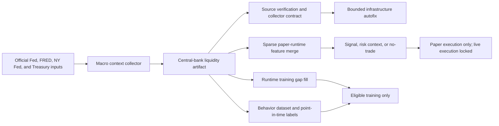

# Central Bank And Fed Liquidity Context

## Scope

This contract provides detailed U.S. Federal Reserve balance-sheet, money-market funding, financial-conditions, and official Fed/Treasury activity context for collection, paper decisions, and training. The separate global contract adds governed policy-rate and total-asset coverage for 32 important central banks, then synchronizes those observations with FX, sovereign macro, official events, USD liquidity, and cross-asset context. Neither contract has live-order or automatic-promotion authority.

## Official Inputs

| Domain | Series or feed | Purpose |
| --- | --- | --- |
| Fed balance sheet | `WALCL`, `WRESBAL`, `WTREGEN`, `SWPT`, `TREAST`, `WSHOMCB` | Total assets, reserves, Treasury cash, swap lines, Treasury holdings, and MBS holdings |
| Open-market facilities | `RRPONTSYD`, `RPONTSYD` | Overnight reverse-repo drain and repo injection |
| Funding and policy | `SOFR`, `EFFR`, `OBFR`, `IORB`, `DFEDTARL`, `DFEDTARU` | Secured/unsecured overnight funding, reserve remuneration, and target corridor |
| Financial conditions | `NFCI`, `ANFCI`, `STLFSI4` | Broad and adjusted conditions plus financial stress |
| Money stock | `BOGMBASE`, `M2SL` | Monetary-base and broad-money context |
| Official activity | Federal Reserve calendar/releases and Treasury releases/auctions | Policy speeches, decisions, releases, and fiscal-liquidity events |

The required fail-visible core is `WALCL,WRESBAL,RRPONTSYD,RPONTSYD,WTREGEN,SWPT,SOFR,EFFR,IORB,NFCI,ANFCI,STLFSI4`. Collection uses the official FRED API when configured and the official FRED public CSV endpoint as a bounded fallback.

## Derived Context

The normalized feature schema is defined once in `core/central_bank_liquidity.py` and contains 25 fields:

- Source availability and required-series coverage.
- Fed assets, reserve balances, RRP, repo, TGA, and swap usage levels or impulses.
- Net-liquidity impulse, expansion, and tightening.
- SOFR, EFFR, IORB, SOFR-EFFR, EFFR-IORB, and corridor width.
- Funding stress, NFCI, adjusted NFCI, and St. Louis financial stress.

The net-liquidity proxy is:

`Fed total assets - Treasury General Account - overnight reverse repo usage`

H.4.1 values are normalized as millions of dollars; New York Fed repo and reverse-repo values are converted from billions to millions. The proxy is a heuristic market-liquidity feature, not an official accounting identity, causal claim, or instruction to trade.

## Point-In-Time Contract

1. The collection timestamp establishes the as-of date.
2. Any observation after that date is excluded before selecting latest values or calculating deltas.
3. Daily funding/facility series allow 7 calendar days, weekly H.4.1 series allow 10 days, weekly conditions indexes allow 12 days, and monthly money-stock series allow 75 days.
4. Required coverage counts only available and cadence-fresh observations.
5. The consumer artifact must be no more than 24 hours old.
6. All 25 features must be present, finite, and within `[0, 1]`.
7. Missing, stale, unusable, future-selected, malformed, or incomplete data fails the consumer contract closed.

Excluded future effective dates remain visible in `coverage.future_observations_excluded`; they are not silently discarded from diagnostics.

## Routing



Training metadata maps central-bank, macro, rates, funding, repo, liquidity, policy-corridor, and Treasury-cash context names to this verified source. Runtime context merging is sparse, so an unrelated source that lacks a field cannot overwrite a valid value with an implicit zero.

The global layer is deliberately separate from this detailed Fed contract. It uses BIS member-reported policy-rate and official national balance-sheet datasets for comparable international breadth, while this contract remains the higher-resolution authority for U.S. funding and liquidity mechanics. The point-in-time cross-source router joins the two without relabeling one as the other. See [GLOBAL_CENTRAL_BANK_CONTEXT.md](GLOBAL_CENTRAL_BANK_CONTEXT.md).

## Operations

Refresh and verify:

```bash
./scripts/ops/opsctl.sh macro-context-sync --json
./scripts/ops/opsctl.sh source-verification --json
./scripts/ops/opsctl.sh collector-contracts --json
```

Primary artifacts:

- `exports/external_context/central_bank_liquidity_latest.json`
- `exports/external_context/official_macro_context_latest.json`
- `governance/health/official_macro_context_sync_latest.json`
- `governance/health/source_verification_latest.json`
- `governance/health/collector_contracts_latest.json`

The infrastructure autofix owner reruns the full macro synchronization path so official series refresh precedes the merged official context. Failed refreshes remain visible and cannot inherit a healthy decision contract from an old artifact.

## Authority Boundary

These contexts may contribute observations, model features, labeling evidence, and conservative risk context. They cannot create an order, increase capital authority, promote a candidate, unlock live execution, or establish future profitability. Missing, stale, future-dated, or conflicted international dimensions are omitted and surfaced as coverage debt rather than inferred from the Fed-centered context.
