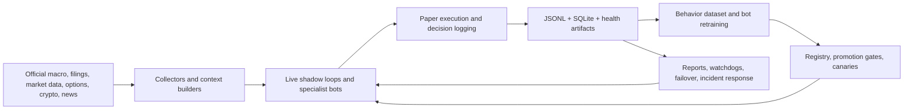

# Showcase Index

This repository can be presented as five portfolio-ready projects instead of one giant monolith. Each page below isolates a clear engineering story, a clean architecture diagram, and the repo areas that support that story.

## Project Split

1. [Live Multi-Asset Paper Trading Platform](projects/01-live-multi-asset-paper-platform.md)
2. [Quant Research and Model Training System](projects/02-quant-research-and-model-training.md)
3. [Data Fusion and Verification Pipeline](projects/03-data-fusion-and-verification-pipeline.md)
4. [Reliability, Safety, and Ops Automation](projects/04-reliability-safety-and-ops-automation.md)
5. [Cross-Market Crypto and Macro Intelligence](projects/05-cross-market-crypto-and-macro-intelligence.md)

## Whole-Platform View

## Auto-Refreshed Snapshot

- Generated highlights: [generated/highlights_latest.md](generated/highlights_latest.md)
- Generated JSON snapshot: [generated/highlights_latest.json](generated/highlights_latest.json)

## Best GitHub Narrative

If you want the cleanest public-facing story:

- lead with the live multi-asset platform page
- use the training page to show ML and evaluation depth
- use the data pipeline page to show breadth and verification discipline
- use the ops page to prove reliability and systems thinking
- use the crypto/macro page to show research expansion and current sophistication
