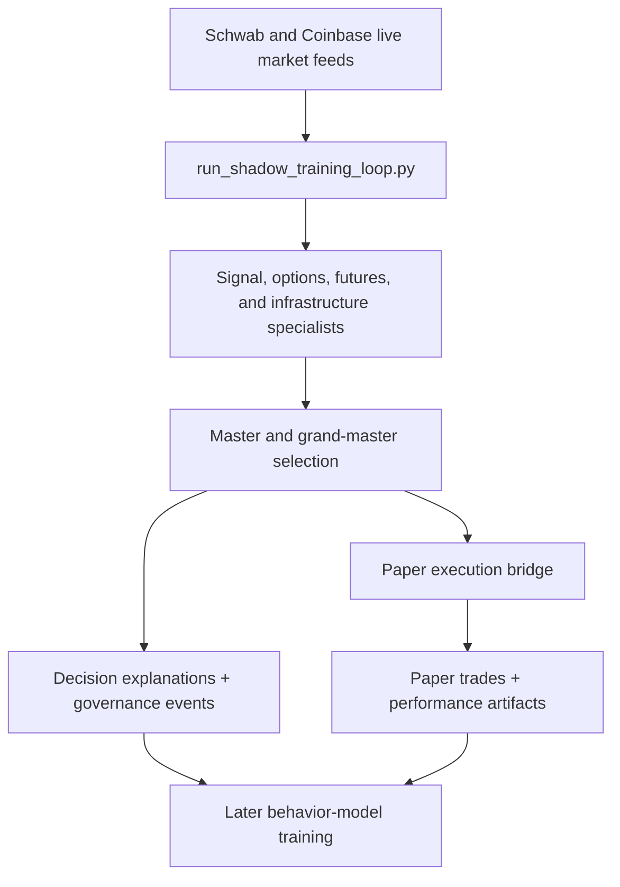

# Live Multi-Asset Paper Trading Platform

## What This Showcases

- Live multi-sleeve shadow trading across Schwab equities, Schwab futures, Coinbase spot, and Coinbase futures
- Paper trading locked in parallel with decision generation and logging
- Specialist, master, and grand-master decision layers
- Continuous health tracking around live loops

## Architecture

## Repo Areas

- `scripts/run_shadow_training_loop.py`
- `scripts/run_all_sleeves.py`
- `scripts/run_parallel_shadows.py`
- `scripts/run_parallel_aggressive_modes.py`
- `core/base_trader.py`
- `core/live_execution_controls.py`
- `governance/health/data_ingress_latest_*.json`

## Talking Points

- The platform is designed to keep execution in paper mode by default while still collecting real decision traces.
- Options and dividend collection lanes are intentionally protected so they keep gathering data unless they materially underperform.
- Multiple live sleeves can run in parallel without sharing one brittle execution path.
