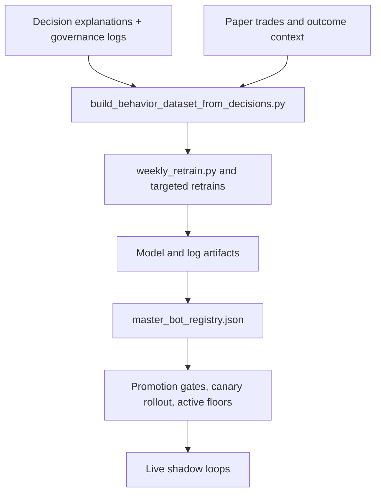

# Quant Research and Model Training System

## What This Showcases

- Registry-managed bot lineup with active, inactive, and deleted lifecycle states
- Behavior dataset generation from logged decisions and paper outcomes
- Targeted and full retraining flows
- Promotion, canary, and quality-gate controls instead of blind model swaps

## Architecture

## Repo Areas

- `scripts/build_behavior_dataset_from_decisions.py`
- `scripts/weekly_retrain.py`
- `scripts/retrain_orchestrator.py`
- `scripts/train_trade_behavior_bot.py`
- `core/indicator_bot_common.py`
- `core/master_bot.py`
- `master_bot_registry.json`

## Talking Points

- The system does not optimize only for raw accuracy; it tracks acted accuracy, precision balance, label balance, and majority-baseline lift.
- Runtime-trained bots can use live external context, paper-trade outcomes, and later behavior overlays.
- Promotion is separated from training so a successful retrain still has to clear quality and registry gates before it matters live.
