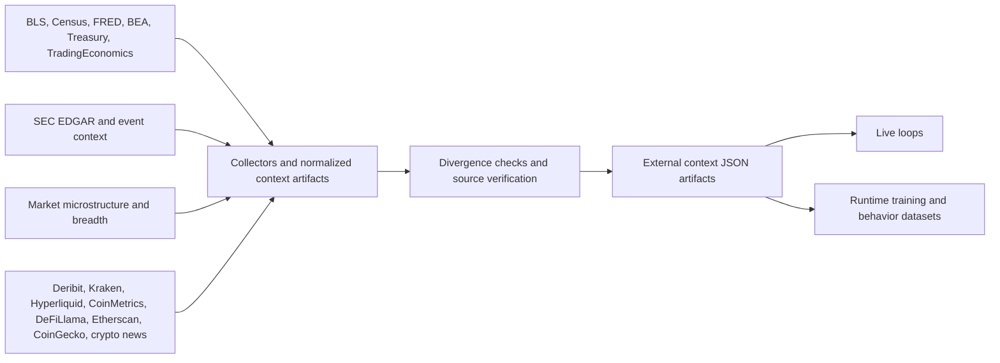

# Data Fusion and Verification Pipeline

## What This Showcases

- Official macro and filings ingestion alongside market microstructure and crypto context
- Source verification, divergence checking, and cross-provider agreement logic
- Normalized external context artifacts that feed both live decisioning and later training

## Architecture

## Repo Areas

- `scripts/collect_bls_census_data.py`
- `scripts/collect_official_macro_context.py`
- `scripts/collect_market_micro_context.py`
- `scripts/collect_sec_edgar_context.py`
- `scripts/collect_extended_quant_context.py`
- `scripts/collect_crypto_market_context.py`
- `scripts/data_source_divergence_bot.py`
- `scripts/ops/source_verification_report.py`

## Talking Points

- The platform treats official and primary sources as the first layer of truth and secondary overlays as contextual enrichments.
- Cross-source checks are explicit artifacts, not hidden assumptions inside feature code.
- The same context pipeline is reused for live inference, dataset generation, and GitHub-facing health summaries.
