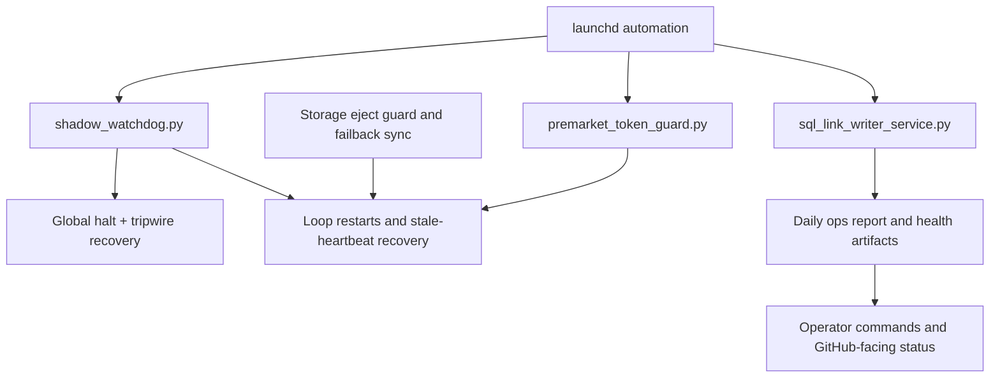

# Reliability, Safety, and Ops Automation

## What This Showcases

- Watchdogs, preflight checks, token guard, and launchd automation
- Safe failover from external storage to internal storage and back
- Global halt, incident recovery, SQL writer health, and observability
- Ops tooling that treats data freshness and route safety as first-class concerns

## Architecture

## Repo Areas

- `scripts/shadow_watchdog.py`
- `scripts/ops/process_watchdog.py`
- `scripts/ops/premarket_token_guard.py`
- `scripts/ops/schwab_auth_refresh.py`
- `scripts/ops/install_ops_automation_launchd.sh`
- `scripts/ops/storage_eject_guard.swift`
- `scripts/ops/storage_failback_sync.py`
- `exports/reports/daily_ops_report_latest.json`

## Talking Points

- The project handles operational risk like a real service: stale feeds, expiring auth, storage route changes, and lock contention all have dedicated control paths.
- The system can move collection from external storage to local storage automatically and later sync back safely.
- Health artifacts are machine-readable and operator-friendly at the same time.
