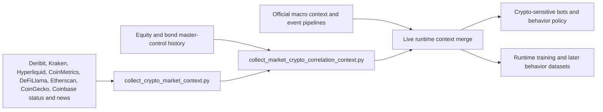

# Cross-Market Crypto and Macro Intelligence

## What This Showcases

- Crypto market context from multiple exchanges, derivatives venues, on-chain proxies, and news feeds
- Stock/crypto correlation overlays that feed runtime features and behavior training
- Macro, options, and cross-asset context layered into specialist bots

## Architecture

## Repo Areas

- `scripts/collect_crypto_market_context.py`
- `scripts/collect_market_crypto_correlation_context.py`
- `core/runtime_training_common.py`
- `core/market_context_features.py`
- `scripts/run_shadow_training_loop.py`
- `governance/health/crypto_market_context_sync_latest.json`
- `governance/health/market_crypto_correlation_sync_latest.json`

## Talking Points

- The crypto stack is not just one exchange feed; it blends price, derivatives, on-chain-ish, liquidity, and news context.
- Correlation context is treated as a live feature family and a training feature family, not just an offline report.
- The system now supports exact overlap, approximate overlap, and carry-forward modes for market/crypto correlation so off-hours still produce usable context.
